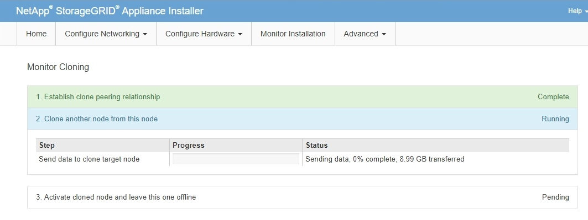

= 複製應用裝置節點
:allow-uri-read: 
:icons: font
:imagesdir: ../media/

[role="lead"]
複製程序可能需要數天的時間、才能在來源節點（正在更換的應用裝置）和目標（新）應用裝置之間傳輸資料。

.開始之前
* 您已將相容的目標應用裝置安裝在機櫃或機架中、連接所有纜線並接上電力。
* 您已確認替換應用裝置上的 StorageGRID 應用裝置安裝程式版本與 StorageGRID 系統的軟體版本相符、如有必要、請升級及降級 StorageGRID 應用裝置安裝程式韌體。
* 您已設定目標應用裝置、包括設定StorageGRID 支援鏈路、SANtricity 支援系統管理程式（僅限儲存應用裝置）和BMC介面。
+
** 設定StorageGRID 靜態連線時、請使用暫用IP位址。
** 設定網路連結時、請使用最終的連結組態。

NOTE: 完成初始目標應用裝置組態後、請保持StorageGRID 開啟不動。開始節點複製程序後、您將返回目標應用裝置的安裝程式頁面。

* 您已選擇性啟用目標應用裝置的節點加密。
* 您也可以選擇設定目標應用裝置的RAID模式（僅限儲存應用裝置）。
* 您已檢閱 link:considerations-and-requirements-for-appliance-node-cloning.html["設備節點複製的考量與需求"]。

您一次只能複製一個應用裝置節點、以維持StorageGRID 穩定的網路效能和資料可用度。

.步驟
. link:../commonhardware/placing-appliance-into-maintenance-mode.html["將您要複製的來源節點置於維護模式"]。
. 從StorageGRID 來源節點上的「供應器安裝程式」、在首頁的「安裝」區段中、選取「*啟用複製*」。
+
「主要管理節點連線」區段會取代為「Clone target節點連線」區段。

+
image::../media/clone_peer_node_connection_section.png[複製目標節點連線區段]

. 對於* Clone目標節點IP*、輸入指派給網路目標節點的暫用IP位址、以供複製資料傳輸流量使用、然後選取* Save*。
+
一般而言、您可以輸入Grid Network的IP位址、但如果您需要使用不同的網路來進行實體資料傳輸流量、請輸入該網路上目標節點的IP位址。

+

NOTE: 使用1-GbE管理網路進行複製資料傳輸、會導致複製速度變慢。

+
在設定並驗證目標應用裝置之後、在「安裝」區段中、會在來源節點上啟用*開始複製*。

+
如果存在妨礙複製的問題、*開始複製*不會啟用、您必須解決的問題會列為*連線狀態*。這些問題會列在StorageGRID 來源節點和目標應用裝置的「支援中心安裝程式」首頁上。一次只會顯示一個問題、狀態會隨著情況變更而自動更新。解決所有的複製問題以啟用*開始複製*。

+
當*開始複製*啟用時、*目前狀態*會指出StorageGRID 選擇用於複製流量的物件網路、以及使用該網路連線的相關資訊。請參閱 link:considerations-and-requirements-for-appliance-node-cloning.html["應用裝置節點複製的考量與要求"]。

. 在來源節點上選取*開始複製*。
. 在StorageGRID 來源節點或目標節點上、使用《不實設備安裝程式」來監控複製進度。
+
來源節點和目標節點上的 StorageGRID 應用裝置安裝程式會指示類似的狀態。

+

+
「監控複製」頁面提供複製程序每個階段的詳細進度：

+
** *建立複製對等關係*可顯示複製設定與組態的進度。
** *從此節點複製另一個節點*會顯示資料傳輸的進度。（複製程序的這一部分可能需要數天才能完成。）
** *啟動複製的節點、並讓此節點離線*會顯示在資料傳輸完成後、將控制權傳輸到目標節點、並將來源節點置於預先安裝狀態的進度。

. 如果您需要終止複製程序、並在複製完成之前將來源節點恢復服務、請在來源節點上前往StorageGRID 「整套應用程式安裝程式」首頁、選擇「*進階*」>「*重新啟動控制器*」、然後選取「*重新啟動至StorageGRID REWS*」。
+
如果複製程序終止：

+
** 來源節點會退出維護模式並重新加入StorageGRID
** 目標節點仍處於安裝前狀態。
若要重新開始複製來源節點、請從步驟1重新開始複製程序。

成功完成複製時：

* 來源和目標節點交換IP位址：
+
** 現在、目標節點會使用原本指派給Grid、Admin和Client Networks來源節點的IP位址。
** 來源節點現在使用最初指派給目標節點的暫用IP位址。

* 目標節點會退出維護模式並加入StorageGRID 以取代來源節點的功能。
* 來源應用裝置處於預先安裝狀態、如同您已安裝 https://docs.netapp.com/us-en/storagegrid-118/maintain/preparing-appliance-for-reinstallation-platform-replacement-only.html["已準備好重新安裝"^]。

NOTE: 如果目標應用裝置未加入網格、請前往來源節點的 StorageGRID 應用裝置安裝程式首頁、選取 * 進階 * > * 重新開機控制器 * 、然後選取 * 重新開機至維護模式 * 。在維護模式下重新啟動來源節點之後、請重複執行節點複製程序。

* 如果目標節點發生非預期的問題、使用者資料仍會保留在來源應用裝置上作為還原選項。在目標節點成功加入 StorageGRID 之後、來源應用裝置上的使用者資料已過期、不再需要。
+
當您將來源應用裝置安裝或擴充為其他網格中的新節點時、過時的使用者資料會被覆寫。

+
您也可以重設來源應用裝置上的控制器組態、使此資料無法存取：

+
.. 開啟 link:../installconfig/accessing-storagegrid-appliance-installer.html["應用程式安裝程式StorageGRID"] 對於使用最初指派給目標節點的暫用 IP 位址的來源應用裝置。
.. 選取 * 說明 * > * 支援與除錯工具 * 。
.. 選取 * 重設儲存控制器組態 * 。
+

NOTE: 如有需要、請聯絡技術支援部門、以協助重設儲存控制器組態。

+

NOTE: 覆寫資料或重設控制器組態會使過時的資料難以擷取或無法擷取；不過、這兩種方法都不會安全地從來源應用裝置移除資料。如果需要安全清除、請使用資料抹除工具或服務、從來源應用裝置永久且安全地移除資料。

您可以：

* 將來源應用裝置當作其他複製作業的目標：不需要額外的組態。此應用裝置已指派第一個複製目標原本指定的暫用IP位址。
* 將來源應用裝置安裝並設定為新的應用裝置節點。
* 如果來源應用裝置不再搭配StorageGRID 使用、請將其丟棄。

