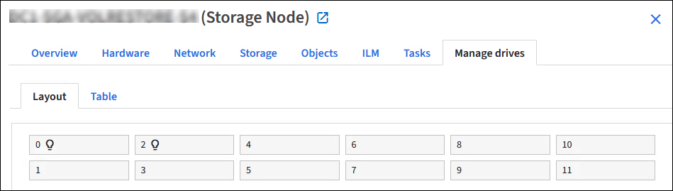
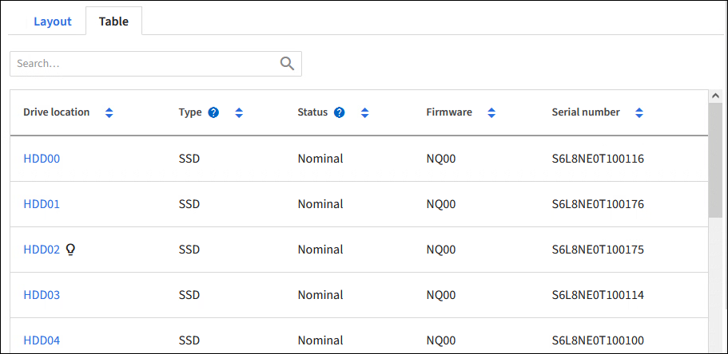
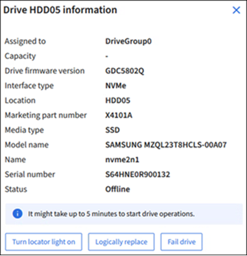

= 使用管理磁碟機索引標籤（ SG110 、 SG1100 、 SGF6112 和 SG6160 ）
:allow-uri-read: 
:icons: font
:imagesdir: ../media/

[role="lead"]
您可以使用 Grid Manager 中的「管理磁碟機」索引標籤、針對支援此功能的應用裝置、在磁碟機上執行疑難排解和維護工作。

.開始之前
您已使用登入 Grid Manager https://docs.netapp.com/us-en/storagegrid/admin/web-browser-requirements.html["支援的網頁瀏覽器"^] 。

.關於這項工作
如果您的應用裝置支援此功能、而且 https://docs.netapp.com/us-en/storagegrid/admin/admin-group-permissions.html["儲存設備管理員或根存取權限"^]設備詳細資料頁面上會出現「管理磁碟機」索引標籤。

NOTE: 對於 StorageGRID 11.8 、只有 SGF6112 應用裝置支援「管理磁碟機」標籤。

管理磁碟機索引標籤包含下列檢視：

配置:: 應用裝置中的資料儲存磁碟機配置。選取磁碟機以檢視磁碟機詳細資料。
+
--

--
表:: 列出每個磁碟機的資訊。選取磁碟機以檢視磁碟機詳細資料。
+
--

--
磁碟機詳細資料:: 每個磁碟機的摘要。選取適當的工作按鈕、如下面的步驟所述。
+
--

--

== 開啟或關閉定位燈

若要在應用裝置中實際找到磁碟機：

. 從 Grid Manager 中、選取 * 節點 * > * 資料中心 * 。
. 選擇 *_appliance 儲存節點 _* > * 管理磁碟機 * > * 配置 * > *_drive_* 。
+
出現磁碟機詳細資料面板。

. 選擇 * 開啟定位燈 * 。
+
** 驅動器會出現一個燈泡圖示image:../media/icon_drive-light-bulb.png["駕駛燈泡"]。
** 實體磁碟機上的琥珀色 LED 會閃爍。

. 若要關閉定位燈、請選取 * 關閉定位燈 * 。

== [[邏輯 置換式磁碟機 ]] 邏輯置換磁碟機

如果需要重建或重新初始化儲存設備中的磁碟機：

. 從 Grid Manager 中、選取 * 節點 * > * 資料中心 * 。
. 選擇 *_appliance 儲存節點 _* > * 管理磁碟機 * > * 配置 * > *_drive_* 。
+
出現磁碟機詳細資料面板。

. 選擇 * 邏輯置換 * 。
+
在磁碟機詳細資料面板上、磁碟機的狀態會顯示 _rebuilding_ 。重建磁碟機可能需要 5 分鐘的時間。

== 故障磁碟機

若要進行疑難排解、您可以手動將懷疑故障的磁碟機「故障」。然後系統將在沒有該磁碟機的情況下執行。

. 從 Grid Manager 中、選取 * 節點 * > * 資料中心 * 。
. 選擇 *_appliance 儲存節點 _* > * 管理磁碟機 * > * 配置 * > *_drive_* 。
+
出現磁碟機詳細資料面板。

. 選擇 * 故障磁碟機 * 。

磁碟機故障後、您必須實際更換磁碟機或 <<logically-replace-drive,以邏輯方式更換磁碟機>>。
