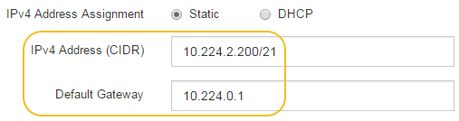

= 設定 SANtricity 系統管理員（ SG6000 和 SG5700 ）
:allow-uri-read: 
:icons: font
:imagesdir: ../media/

[role="lead"]
您可以使用SANtricity NetApp系統管理程式來監控儲存控制器櫃中的儲存控制器、儲存磁碟及其他硬體元件狀態。您也可以設定E系列AutoSupport 支援的Proxy、讓您不AutoSupport 需使用管理連接埠、就能從應用裝置傳送靜態訊息。

== 設定及存取SANtricity 《整套系統管理程式》

您可能需要存取SANtricity 儲存控制器上的「靜態系統管理程式」、才能監控儲存控制器機櫃中的硬體、或是設定E系列AutoSupport 支援。

.開始之前
* 您使用的是 https://docs.netapp.com/us-en/storagegrid-118/admin/web-browser-requirements.html["支援的網頁瀏覽器"^]。
* 若要透過 Grid Manager 存取 SANtricity 系統管理員、您已安裝 StorageGRID 、且擁有儲存設備管理員權限或根存取權限。
* 若要使用 StorageGRID 應用裝置安裝程式存取 SANtricity 系統管理員、您必須擁有 SANtricity 系統管理員的使用者名稱和密碼。
* 若要使用網頁瀏覽器直接存取 SANtricity 系統管理員、您必須擁有 SANtricity 系統管理員的使用者名稱和密碼。

NOTE: 您必須擁有SANtricity 更新版本的韌體8.70或更新版本、SANtricity 才能使用Grid Manager或StorageGRID NetApp設備安裝程式來存取《更新版》。您可以使用StorageGRID 《支援》*《支援*》>*《關於*》來檢查韌體版本。

NOTE: 從SANtricity Grid Manager或應用裝置安裝程式存取「支援系統管理程式」、通常只能用來監控硬體及設定E系列AutoSupport 支援。SANtricity 系統管理員中的許多功能和作業（例如升級韌體）不適用於監控 StorageGRID 應用裝置。為避免發生問題、請務必遵循設備的硬體安裝與維護指示。

.關於這項工作
根據SANtricity 您所處的安裝與組態程序階段、有三種方法可以存取「支援系統管理程式」：

* 如果應用裝置尚未在StorageGRID 您的系統中部署為節點、您應該使用StorageGRID 「還原應用裝置安裝程式」中的「進階」索引標籤。
+

NOTE: 部署節點之後、StorageGRID 您就無法再使用「叢集設備安裝程式」來存取SANtricity 「叢集系統管理程式」。

* 如果應用裝置已部署為StorageGRID 您的一套系統的節點、請使用SANtricity Grid Manager節點頁面上的「還原系統管理程式」索引標籤。
* 如果您無法使用 StorageGRID 應用裝置安裝程式或網格管理程式、則可以使用連線至管理連接埠的網頁瀏覽器、直接存取 SANtricity 系統管理程式。

此程序包括初始存取SANtricity 《不適用的系統管理程式》的步驟。如果您已經設定SANtricity 了「不全系統管理程式」、請前往  <<config_hardware_alerts_sg6000,設定硬體警示步驟>>。

NOTE: 使用Grid Manager或StorageGRID NetApp應用裝置安裝程式、您無需SANtricity 設定或連接應用裝置的管理連接埠、即可存取《支援系統管理程式》。

您可以使用SANtricity 「系統管理程式」來監控下列項目：

* 效能資料、例如儲存陣列層級效能、I/O延遲、CPU使用率及處理量
* 硬體元件狀態
* 支援功能、包括檢視診斷資料

您可以使用SANtricity 「靜態系統管理員」來設定下列設定：

* 儲存控制器機櫃中元件的電子郵件警示、SNMP警示或系統記錄警示
* 儲存AutoSupport 控制器機櫃中元件的E系列支援設定。
+
如需E系列AutoSupport 的更多詳細資料、請參閱 http://mysupport.netapp.com/info/web/ECMP1658252.html["NetApp E系列系統文件網站"^]。

* 磁碟機安全金鑰、用於解除鎖定安全磁碟機（如果啟用磁碟機安全功能、則需要此步驟）
* 管理員密碼、用於存取SANtricity 《系統管理程式》

.步驟
. 執行下列其中一項：
+
** 使用StorageGRID 《Suse安裝程式》、然後選取*進階*>* SANtricity 《系統管理員*》
** 使用 Grid Manager 並選取 * 節點 * > `*_appliance Storage Node_*` >* SANtricity 《系統管理程式》*

+

NOTE: 如果這些選項無法使用、或登入頁面未出現、請使用 <<使用StorageGRID 一套解決方法安裝程式來設定儲存控制器的IP位址,儲存控制器的IP位址>>。瀏覽至儲存控制器IP以存取SANtricity 「系統管理程式」。

. 設定或輸入管理員密碼。
+
系統管理程式使用單一管理員密碼、所有使用者皆可共用。SANtricity

+
image::../media/san_setup_wizard.gif[顯示設定精靈「取消」按鈕的螢幕擷取畫面]

. 選擇*取消*以關閉精靈。
+

NOTE: 請勿完成 StorageGRID 應用裝置的設定精靈。

+
image::../media/sam_home_page.gif[《系統管理程式》首頁的螢幕擷取畫面SANtricity]

. [[config_hardware _alerts_sg6000、start=4]]設定硬體警示。
+
.. 選擇*「說明」*即可存取SANtricity 《支援系統管理員》的線上說明。
.. 使用線上說明的*設定*>*警示*區段、即可瞭解警示。
.. 依照「How to」指示設定電子郵件警示、SNMP警示或系統記錄警示。

. 管理AutoSupport 儲存控制器機櫃中的元件。
+
.. 選擇*「說明」*即可存取SANtricity 《支援系統管理員》的線上說明。
.. 請使用線上說明的*支援*>*支援中心*區段、瞭解AutoSupport 有關此功能的資訊。
.. 請依照「操作方法」指示來管理AutoSupport 。
+
如需設定 StorageGRID Proxy 以傳送 E 系列 AutoSupport 訊息而不使用管理連接埠的特定指示、請前往 https://docs.netapp.com/us-en/storagegrid-118/admin/configuring-storage-proxy-settings.html["設定儲存Proxy設定的說明"^]。

. 如果裝置已啟用磁碟機安全功能、請建立並管理安全金鑰。
+
.. 選擇*「說明」*即可存取SANtricity 《支援系統管理員》的線上說明。
.. 使用線上說明的*設定*>*系統*>*安全金鑰管理*區段、即可瞭解磁碟機安全性。
.. 依照「使用方法」指示建立及管理安全金鑰。

. 您也可以選擇變更系統管理員密碼。
+
.. 選擇*「說明」*即可存取SANtricity 《支援系統管理員》的線上說明。
.. 請使用線上說明的「*首頁*>*儲存陣列管理*」區段、瞭解系統管理員密碼。
.. 依照「使用方法」指示變更密碼。

== 在SANtricity 《Sytricity System Manager》中檢視硬體狀態

您可以使用SANtricity 「支援系統管理程式」來監控及管理儲存控制器機櫃中的個別硬體元件、並檢閱硬體診斷與環境資訊、例如元件溫度、以及與磁碟機相關的問題。

.開始之前
* 您使用的是 https://docs.netapp.com/us-en/storagegrid-118/admin/web-browser-requirements.html["支援的網頁瀏覽器"^]。
* 若要透過 Grid Manager 存取 SANtricity 系統管理員、您擁有儲存設備管理員權限或根存取權限。
* 若要使用 StorageGRID 應用裝置安裝程式存取 SANtricity 系統管理員、您必須擁有 SANtricity 系統管理員的使用者名稱和密碼。
* 若要使用網頁瀏覽器直接存取 SANtricity 系統管理員、您必須擁有 SANtricity 系統管理員的使用者名稱和密碼。

NOTE: 您必須擁有SANtricity 更新版本的韌體8.70或更新版本、SANtricity 才能使用Grid Manager或StorageGRID NetApp設備安裝程式來存取《更新版》。

NOTE: 從SANtricity Grid Manager或應用裝置安裝程式存取「支援系統管理程式」、通常只能用來監控硬體及設定E系列AutoSupport 支援。SANtricity 系統管理員中的許多功能和作業（例如升級韌體）不適用於監控 StorageGRID 應用裝置。為避免發生問題、請務必遵循設備的硬體安裝與維護指示。

.步驟
. <<設定及存取SANtricity 《整套系統管理程式》,存取SANtricity 《系統管理程式》>>。
. 如有需要、請輸入管理員使用者名稱和密碼。
. 按一下*「取消」*關閉「設定精靈」並顯示SANtricity 「系統管理程式」首頁。
+
出現「系統管理程式」首頁。SANtricity在「系統管理程式」中SANtricity 、控制器機櫃稱為儲存陣列。

+
image::../media/sam_home_page.gif[《系統管理程式》首頁的螢幕擷取畫面SANtricity]

. 檢閱顯示的應用裝置硬體資訊、並確認所有硬體元件的狀態均為「最佳」。
+
.. 按一下「*硬體*」索引標籤。
.. 按一下*顯示機櫃背面*。
+
image::../media/sam_hardware_controllers_a_and_b.gif[Hardware Status（硬體狀態）選項卡SANtricity]

+
從機櫃背面、您可以檢視兩個儲存控制器、每個儲存控制器中的電池、兩個電源容器、兩個風扇容器和擴充櫃（如果有）。您也可以檢視元件溫度。

.. 若要查看每個儲存控制器的設定、請選取控制器、然後從內容功能表中選取*檢視設定*。
.. 若要查看機櫃背面其他元件的設定、請選取您要檢視的元件。
.. 按一下*顯示機櫃正面*、然後選取您要檢視的元件。
+
從機櫃正面、您可以檢視儲存控制器機櫃或擴充櫃（如果有）的磁碟機和磁碟機抽取器。

如果需要注意任何元件的狀態、請依照Recovery Guru中的步驟解決問題、或聯絡技術支援部門。

== 使用StorageGRID 一套解決方法安裝程式來設定儲存控制器的IP位址

每個儲存控制器上的管理連接埠1會將應用裝置連線至管理網路、以利SANtricity 執行《系統管理程式》。如果您無法從 StorageGRID 應用裝置安裝程式存取 SANtricity 系統管理員、請為每個儲存控制器設定靜態 IP 位址、以確保您不會失去與控制器機櫃中硬體和控制器韌體的管理連線。

.開始之前
* 您正在使用任何可連線StorageGRID 至「管理員網路」的管理用戶端、或是您有一台服務用筆記型電腦。
* 用戶端或服務筆記型電腦具有支援的網頁瀏覽器。

.關於這項工作
DHCP指派的位址可以隨時變更。為控制器指派靜態IP位址、以確保存取一致。

NOTE: 只有當您無法從 StorageGRID 應用裝置安裝程式（ * 進階 * > * SANtricity 系統管理員 * ）或網格管理程式（ * 節點 * > * SANtricity 系統管理程式 * ）存取 SANtricity 系統管理程式時、才需遵循此程序。

.步驟
. 從用戶端輸入StorageGRID URL以供使用、例如：+
`*https://_Appliance_Controller_IP_:8443*`
+
適用於 `_Appliance_Controller_IP_`、在StorageGRID 任何一個不支援的網路上使用應用裝置的IP位址。

+
畫面會出現「the不再安裝StorageGRID 程式」首頁。

. 選擇*設定硬體*>*儲存控制器網路組態*。
+
此時將顯示Storage Controller Network Configuration（儲存控制器網路組態）頁面

. 根據您的網路組態、選取*「已啟用」*、適用於IPV4、IPV6或兩者。
. 記下自動顯示的IPV4位址。
+
DHCP是將IP位址指派給儲存控制器管理連接埠的預設方法。

+

NOTE: 可能需要幾分鐘時間才能顯示DHCP值。

+
image::../media/storage_controller_network_config_ipv4.gif[儲存控制器網路組態IPV4]

. 您也可以為儲存控制器管理連接埠設定靜態IP位址。
+

NOTE: 您應該為管理連接埠指派靜態IP、或為DHCP伺服器上的位址指派永久租用。

+
.. 選擇* Static *（靜態*）。
.. 輸入使用CIDR表示法的IPV4位址。
.. 輸入預設閘道。
+

.. 按一下「 * 儲存 * 」。
+
您可能需要幾分鐘的時間才能套用變更。

+
當您連線SANtricity 至「靜態系統管理程式」時、您將使用新的靜態IP位址作為URL：+
`*https://_Storage_Controller_IP_*`

