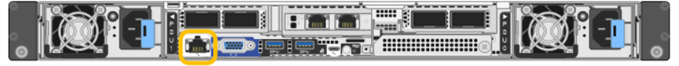

= 存取BMC介面
:allow-uri-read: 
:icons: font
:imagesdir: ../media/

[role="lead"]
您可以使用 DHCP 或靜態 IP 位址、在下列應用裝置機型上存取 BMC 介面：

* SG100
* SG110
* SG1000
* SG1100
* SG6000
* SG6100

.開始之前
* 管理用戶端使用 https://docs.netapp.com/us-en/storagegrid-118/admin/web-browser-requirements.html["支援的網頁瀏覽器"^]。
* 應用裝置上的 BMC 管理連接埠會連線至您打算使用的管理網路。
+
[role="tabbed-block"]
====
.SG100
--
image::../media/sg100_bmc_management_port.png[SG100 BMC 管理連接埠]

--
.SG110
--
image::../media/sgf6112_cn_bmc_management_port.png[BMC 管理連接埠 SG110]

--
.SG1000
--
image::../media/sg1000_bmc_management_port.png[SG1000 BMC管理連接埠]

--
.SG1100
--

--
.SG6000
--
image::../media/sg6000_cn_bmc_management_port.gif[SG6000-CN 控制器 BMC 管理連接埠]

--
.SG6100
--
image::../media/sgf6112_cn_bmc_management_port.png[SGF6112 BMC 管理連接埠]

--
====

.步驟
. 輸入BMC介面的URL：+
`*https://_BMC_Port_IP_*`
+
適用於 `_BMC_Port_IP_`中的DHCP或靜態IP位址。

+
此時會出現BMC登入頁面。

+

NOTE: 如果您尚未設定 `BMC_Port_IP`、請依照中的指示進行 link:configuring-bmc-interface.html["設定 BMC 介面"]。  如果由於硬體問題而無法執行該程序、而且尚未設定BMC IP位址、您可能仍能存取BMC。根據預設、BMC會使用DHCP取得IP位址。如果在 BMC 網路上啟用 DHCP 、網路管理員可以提供指派給 BMC MAC 的 IP 位址、該位址會列印在應用裝置正面的標籤上。如果 BMC 網路上未啟用 DHCP 、 BMC 將在幾分鐘後不回應、並自行指派預設靜態 IP `192.168.0.120`。您可能需要將筆記型電腦直接連接至 BMC 連接埠、並變更網路設定、以便為筆記型電腦指派 IP 、例如 `192.168.0.200/24`，以便瀏覽 `192.168.0.120`。

. 使用您在設定時設定的密碼、輸入管理員或 root 使用者名稱和密碼 link:changing-root-password-for-bmc-interface.html["已變更預設密碼"]：
+

NOTE: 預設使用者取決於您何時安裝 StorageGRID 應用裝置。新安裝的預設使用者為 * 管理 * 、舊版安裝的預設使用者為 * 根目錄 * 。

. 選取*登入*。
+
image::../media/bmc_dashboard.gif[BMC儀表板]

. 或者、選取*設定*>*使用者管理*、然後按一下任何「停用」使用者、即可建立其他使用者。
+

NOTE: 使用者第一次登入時、系統可能會提示他們變更密碼、以提高安全性。

