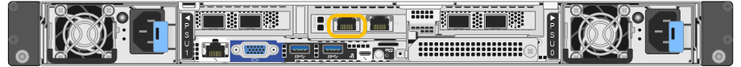
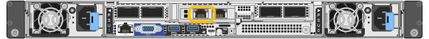
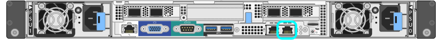
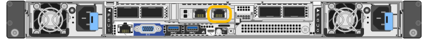

= 存取StorageGRID 產品安裝程式
:allow-uri-read: 
:icons: font
:imagesdir: ../media/

[role="lead"]
您必須存取StorageGRID 《RidsAppliance安裝程式》、以驗證安裝程式版本、並設定應用裝置與StorageGRID 三個「Ridworks」（網格網路）、「Admin Network」（管理網路）（選用）和「Client Network」（用戶端網路）（選用）之間的連線。

.開始之前
* 您正在使用任何可連線StorageGRID 至「管理員網路」的管理用戶端、或是您有一台服務用筆記型電腦。
* 用戶端或服務筆記型電腦有 https://docs.netapp.com/us-en/storagegrid-118/admin/web-browser-requirements.html["支援的網頁瀏覽器"^]。
* 服務應用裝置或儲存設備控制器會連線至您打算使用的所有 StorageGRID 網路。
* 您知道這些網路上服務應用裝置或儲存設備控制器的 IP 位址、閘道和子網路。
* 您已設定要使用的網路交換器。

.關於這項工作
若要開始存取 StorageGRID 應用裝置安裝程式、您可以在服務應用裝置或儲存設備控制器上、使用 DHCP 指派的管理網路連接埠 IP 位址（假設已連線至管理網路）、 或者、您也可以將服務筆記型電腦直接連接至服務應用裝置或儲存設備控制器。

.步驟
. 如果可能、請使用 DHCP 位址作為服務應用裝置或儲存設備控制器上的管理網路連接埠。管理網路連接埠會在下圖中反白顯示。（如果管理網路未連線、請使用網格網路上的 IP 位址。）
+
[role="tabbed-block"]
====
.SG100
--
image::../media/sg100_admin_network_port.png[SG100上的管理網路連接埠]

--
.SG110
--

--
.SG1000
--
image::../media/sg1000_admin_network_port.png[SG1000 上的管理網路連接埠]

--
.SG1100
--

--
.E5700SG
--
對於 E5700SG 、您可以執行下列其中一項：

** 查看E5700SG控制器上的七段顯示器。如果E5700SG控制器上的管理連接埠1和10/25-GbE連接埠2和4連接至具有DHCP伺服器的網路、則當您開啟機箱電源時、控制器會嘗試取得動態指派的IP位址。控制器完成開機程序後、其七段顯示器會顯示* HO*、接著會重複顯示兩個數字的順序。
+
[listing]
----
HO -- IP address for Admin Network -- IP address for Grid Network HO
----
+
依序：

+
*** 第一組數字是管理網路上應用裝置儲存節點的DHCP位址（如果已連線）。此IP位址會指派給E5700SG控制器上的管理連接埠1。
*** 第二組數字是Grid Network上應用裝置儲存節點的DHCP位址。當您第一次為應用裝置供電時、此IP位址會指派給10/25-GbE連接埠2和4。
+

NOTE: 如果無法使用DHCP指派IP位址、則會顯示0．0．0．0。

--
.SG6000-CN
--
image::../media/sg6000_cn_admin_network_port.png[SG6000-CN-控制器上的管理網路連接埠]

--
.SGF6112
--

--
====
+
.. 請向網路管理員索取管理網路上應用裝置的 DHCP 位址。
.. 從用戶端輸入StorageGRID 此URL以取得《The URL for the Choice Appliance Installer》（《The URL for the》）：+
`*https://_Appliance_IP_:8443*`
+
適用於 `_Appliance_IP_`使用 DHCP 位址（如果有的話、請使用管理網路的 IP 位址）。

.. 如果系統提示您輸入安全性警示、請使用瀏覽器的安裝精靈來檢視及安裝憑證。
+
下次存取此URL時、警示不會出現。

+
畫面會出現「the不再安裝StorageGRID 程式」首頁。第一次存取此頁面時顯示的資訊和訊息、取決於您的應用裝置目前如何連線StorageGRID 至各個網站。可能會出現錯誤訊息、稍後將予以解決。

+
image::../media/appliance_installer_home_5700_5600.png[《關於》的頁面擷取畫面：StorageGRID 《關於》的頁面]

. 如果您無法使用 DHCP 取得 IP 位址、則可以使用連結本機連線。
+
[role="tabbed-block"]
====
.SG100
--
使用乙太網路纜線、將服務型筆記型電腦直接連接至服務應用裝置最右側的RJ-45連接埠。

--
.SG110
--
使用乙太網路纜線、將服務筆記型電腦直接連接至應用裝置最右側的 RJ-45 連接埠。

image::../media/sg6100_link_local_port.png[SG110 連結本機連線]

--
.SG1000
--
使用乙太網路纜線、將服務型筆記型電腦直接連接至服務應用裝置最右側的RJ-45連接埠。

image::../media/sg1000_link_local_port.png[SG1000 連結本機連線]

--
.SG1100
--
使用乙太網路纜線、將服務筆記型電腦直接連接至應用裝置最右側的 RJ-45 連接埠。

--
.E5700SG
--
使用乙太網路纜線、將服務筆記型電腦連接至E5700SG控制器上的管理連接埠2。

image::../media/e5700sg_mgmt_port_2.gif[管理連接埠2在E5700SG控制器上的位置]

--
.SG6000-CN
--
使用乙太網路纜線、將服務型筆記型電腦直接連接至SG6000-CN-控制器最右側的RJ-45連接埠。

image::../media/sg6000_cn_link_local_port.png[SG6000-CN.管理連接埠的位置]

--
.SGF6112
--
使用乙太網路纜線、將服務筆記型電腦直接連接至應用裝置最右側的 RJ-45 連接埠。

image::../media/sg6100_link_local_port.png[SGF6112 連結本機連線]

--
====
+
.. 在服務筆記型電腦上開啟網頁瀏覽器。
.. 輸入StorageGRID 此URL以取得《The URL for the Choice Appliance Installer：+（《The URL for the不適用於
`*\https://169.254.0.1:8443*`
+
畫面會出現「the不再安裝StorageGRID 程式」首頁。第一次存取此頁面時顯示的資訊和訊息、取決於您的應用裝置目前如何連線StorageGRID 至各個網站。可能會出現錯誤訊息、稍後將予以解決。

+

NOTE: 如果您無法透過連結本機連線存取首頁、請將服務筆記型電腦 IP 位址設定為 `169.254.0.2`、然後再試一次。

.完成後
存取StorageGRID 完《不再使用的應用程式安裝程式：

* 請確認StorageGRID 應用裝置上的《產品安裝程式版本與StorageGRID 安裝在您的系統上的軟體版本相符。如有必要、請升級StorageGRID 應用程式安裝程式。
+
link:verifying-and-upgrading-storagegrid-appliance-installer-version.html["驗StorageGRID 證並升級版本的應用程式"]

* 請檢閱StorageGRID 顯示在「畫面中心設備安裝程式」首頁上的任何訊息、並視需要設定連結組態和IP組態。
+
image::../media/appliance_installer_home_services_appliance.png[應用裝置安裝程式首頁]

