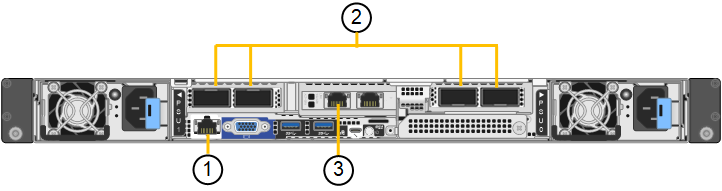
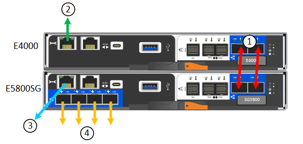
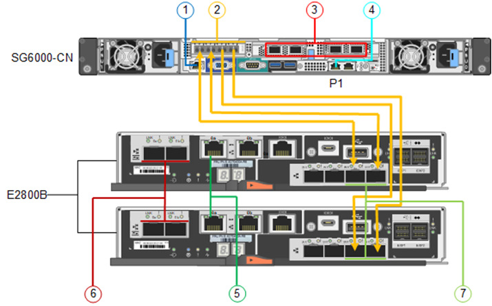
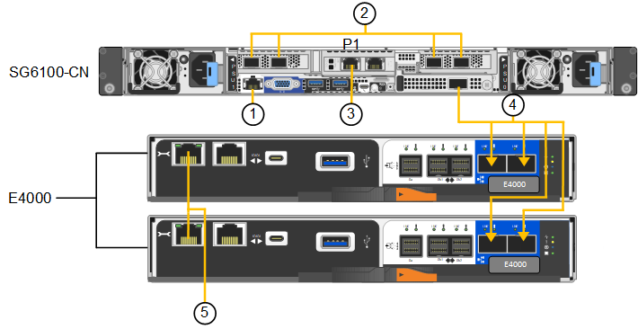

= 纜線應用裝置
:allow-uri-read: 
:icons: font
:imagesdir: ../media/

[role="lead"]
將應用裝置或控制器上的網路連接埠連接至 Grid Network 和選用的 Client Network for StorageGRID 。對於某些應用裝置、您也可以將應用裝置上的管理連接埠連接到服務筆記型電腦、或在控制器管理連接埠之間建立連線。

[role="tabbed-block"]
====
.SG100 與 SG1000
--
您必須將應用裝置上的管理連接埠連接至服務筆記型電腦、並將應用裝置上的網路連接埠連接至Grid Network和選用的Client Network for StorageGRID the Sun。

.開始之前
* 您有一條RJ-45乙太網路纜線可用來連接管理連接埠。
* 您有下列其中一個網路連接埠選項。本產品並未隨附這些項目。
+
** 一至四條雙軸纜線、用於連接四個網路連接埠。
** 對於SG100、如果您計畫使用光纖纜線連接埠、則可使用一至四個SFP+或SFP28收發器。
** 對於SG1000、如果您打算使用光纖纜線連接埠、則可使用一至四個QSFP+或QSFP28收發器。

CAUTION: * 暴露於雷射輻射的風險 * - 請勿拆解或移除 SFP 或 QSFP 收發器的任何部分。您可能會暴露在雷射輻射下。

.關於這項工作
下圖顯示設備背面的連接埠。

SG100 連接埠連線：

image::../media/sg100_connections.png[SG100後端連接器]

SG1000 連接埠連線：

image::../media/sg1000_connections.png[SG1000連接埠連線]

[cols="1a,2a,2a,3a"]
|===
| 標註 | 連接埠 | 連接埠類型 | 使用 

 a| 
1.
 a| 
設備上的BMC管理連接埠
 a| 
1-GbE（RJ-45）
 a| 
連線至您存取BMC介面的網路。

 a| 
2.
 a| 
設備上有四個網路連接埠
 a| 
* SG100：10/25-GbE
* SG1000：10/25/40/100-GbE

 a| 
連線到Grid Network和Client Network for StorageGRID the  請參閱 link:../installconfig/gathering-installation-information-sg100-and-sg1000.html#port-bond-modes["連接埠連結模式（連接埠連結模式（ SG100 和 SG1000 ）"]。

 a| 
3.
 a| 
應用裝置上的管理網路連接埠（圖中標示為 P1 ）
 a| 
1-GbE（RJ-45）

* 注意： * 此連接埠僅以 1000 BaseT/Full 運作、不支援 10 或 100 Mb 速度。
 a| 
將應用裝置連接至管理網路StorageGRID 以供其使用。

 a| 
 a| 
設備上最適當的RJ-45連接埠
 a| 
1-GbE（RJ-45）

* 注意： * 此連接埠僅以 1000 BaseT/Full 運作、不支援 10 或 100 Mb 速度。
 a| 
* 如果您想要與管理網路建立備援連線、可以與管理連接埠1連結。
* 可保持中斷連線、並可用於暫用本機存取（IP 169.254.0.1）。
* 在安裝期間、如果 DHCP 指派的 IP 位址無法使用、則可用於將應用裝置連線至服務筆記型電腦。

|===
.步驟
. 使用乙太網路纜線、將應用裝置上的BMC管理連接埠連接至管理網路。
+
雖然此連線是選用的、但建議您協助支援。

. 使用雙軸纜線或光纖纜線和收發器、將設備上的網路連接埠連接至適當的網路交換器。
+
請參閱下表、瞭解硬體和連結速度所需的設備。

+
[cols="2a,2a"]
|===
| SG100連結速度（GbE） | 必要設備 

 a| 
10.
 a| 
SFP+收發器

 a| 
25.
 a| 
SFP28收發器

| SG1000 連結速度（ GbE ） | 必要設備 

 a| 
10.
 a| 
QSA和SFP+收發器

 a| 
25.
 a| 
QSA和SFP28收發器

 a| 
40.
 a| 
QSFP+ 收發器

 a| 
100
 a| 
QFSP28 收發器

|===
+
** 在支援「自動協商為連接埠速度」選項的機型上、如果選取「固定連接埠連結」模式、您可以以不同於「用戶端網路」專用連接埠的速度來執行 StorageGRID Grid 網路專用連接埠。
** 在不支援自動協商作為連接埠速度選項的機型上、所有四個網路連接埠都必須使用相同的連結速度。
** 如果您計畫使用固定連接埠連結模式（預設）、請將連接埠連接StorageGRID 至表格所示的「資訊網」和「用戶端網路」。
+
[cols="1a,2a"]
|===
| 連接埠 | 連線至... 

 a| 
連接埠 1
 a| 
用戶端網路（選用）

 a| 
連接埠 2
 a| 
網格網路

 a| 
連接埠 3
 a| 
用戶端網路（選用）

 a| 
連接埠4.
 a| 
網格網路

|===
** 如果您打算使用Aggregate連接埠連結模式、請將一個或多個網路連接埠連接至一或多個交換器。您應該至少連接四個連接埠中的兩個、以避免單點故障。如果將多個交換器用於單一LACP連結、則交換器必須支援MLAG或等效的交換器。

. 如果您打算使用管理網路StorageGRID 來執行效能、請使用乙太網路纜線、將應用裝置上的管理網路連接埠連接至管理網路。

--
.SG110 和 SG1100
--
您可以將應用裝置上的管理連接埠連接到服務筆記型電腦、並將應用裝置上的網路連接埠連接到 Grid Network 和選用的 Client Network for StorageGRID 。

.開始之前
* 您有一條RJ-45乙太網路纜線可用來連接管理連接埠。
* 您有下列其中一個網路連接埠選項。本產品並未隨附這些項目。
+
** 一至四條雙軸纜線、用於連接四個網路連接埠。
** 對於 SG110 、如果您打算使用光纖纜線連接埠、則需要一至四個 SFP+ 或 SFP28 收發器。
** 對於 SG1100 、如果您打算將光纖纜線用於連接埠、請使用一至四個 QSFP+ 或 QSFP28 收發器。

CAUTION: * 暴露於雷射輻射的風險 * - 請勿拆解或移除 SFP 或 QSFP 收發器的任何部分。您可能會暴露在雷射輻射下。

.關於這項工作
下圖顯示設備背面的連接埠。

SG110 連接埠連線：

image::../media/sgf6112_connections.png[SG110 後置連接器]

SG1100 連接埠連線：

[cols="1a,2a,2a,3a"]
|===
| 標註 | 連接埠 | 連接埠類型 | 使用 

 a| 
1.
 a| 
設備上的BMC管理連接埠
 a| 
1-GbE（RJ-45）
 a| 
連線至您存取BMC介面的網路。

 a| 
2.
 a| 
設備上有四個網路連接埠
 a| 
* SG110 ： 10/25-GbE
* SG1100 ： 10/25/40/100-GbE

 a| 
連線到Grid Network和Client Network for StorageGRID the請參閱 link:gathering-installation-information-sg110-and-sg1100.html#port-bond-modes["連接埠連結模式（ SG110 和 SG1100 ）"]

 a| 
3.
 a| 
應用裝置上的管理網路連接埠
 a| 
1-GbE（RJ-45）

* 重要： * 此連接埠僅以 1/10-GbE （ RJ-45 ）運作、不支援 100 Mb 速度。
 a| 
將應用裝置連接至管理網路StorageGRID 以供其使用。

 a| 
 a| 
設備上最適當的RJ-45連接埠
 a| 
1-GbE（RJ-45）

* 重要： * 此連接埠僅以 1/10-GbE （ RJ-45 ）運作、不支援 100 Mb 速度。
 a| 
* 如果您想要與管理網路建立備援連線、可以與管理連接埠1連結。
* 可保持中斷連線、並可用於暫用本機存取（IP 169.254.0.1）。
* 在安裝期間、如果 DHCP 指派的 IP 位址無法使用、則可用於將應用裝置連線至服務筆記型電腦。

|===
.步驟
. 使用乙太網路纜線、將應用裝置上的BMC管理連接埠連接至管理網路。
+
雖然此連線是選用的、但建議您協助支援。

. 使用雙軸纜線或光纖纜線和收發器、將設備上的網路連接埠連接至適當的網路交換器。
+
請參閱下表、瞭解硬體和連結速度所需的設備。

+
[cols="2a,2a"]
|===
| SG110 連結速度（ GbE ） | 必要設備 

 a| 
10.
 a| 
SFP+收發器

 a| 
25.
 a| 
SFP28收發器

| SG1100 連結速度（ GbE ） | 必要設備 

 a| 
10.
 a| 
QSA和SFP+收發器

 a| 
25.
 a| 
QSA和SFP28收發器

 a| 
40.
 a| 
QSFP+ 收發器

 a| 
100
 a| 
QFSP28 收發器

|===
+
** 在支援「自動協商為連接埠速度」選項的機型上、如果選取「固定連接埠連結」模式、您可以以不同於「用戶端網路」專用連接埠的速度來執行 StorageGRID Grid 網路專用連接埠。
** 在不支援自動協商作為連接埠速度選項的機型上、所有四個網路連接埠都必須使用相同的連結速度。
** 如果您計畫使用固定連接埠連結模式（預設）、請將連接埠連接StorageGRID 至表格所示的「資訊網」和「用戶端網路」。
+
[cols="1a,2a"]
|===
| 連接埠 | 連線至... 

 a| 
連接埠 1
 a| 
用戶端網路（選用）

 a| 
連接埠 2
 a| 
網格網路

 a| 
連接埠 3
 a| 
用戶端網路（選用）

 a| 
連接埠4.
 a| 
網格網路

|===
** 如果您打算使用Aggregate連接埠連結模式、請將一個或多個網路連接埠連接至一或多個交換器。您應該至少連接四個連接埠中的兩個、以避免單點故障。如果將多個交換器用於單一LACP連結、則交換器必須支援MLAG或等效的交換器。

. 如果您打算使用管理網路StorageGRID 來執行效能、請使用乙太網路纜線、將應用裝置上的管理網路連接埠連接至管理網路。

--
.SG5700
--
您可以將兩個控制器彼此連接、連接每個控制器上的管理連接埠、並將 E5700SG 控制器上的 10/25-GbE 連接埠連接至 Grid Network 和選用的 Client Network for StorageGRID 。

.開始之前
* 您已解壓縮產品隨附的下列項目：
+
** 兩條電源線。
** 兩條光纖纜線用於控制器上的FC互連連接埠。
** 八個SFP+收發器、支援10-GbE或16-Gbps FC。這些收發器可與兩個控制器上的兩個互連連接埠搭配使用、並可與E5700SG控制器上的四個10/25-GbE網路連接埠搭配使用、前提是您希望網路連接埠使用10-GbE連結速度。

* 您已取得產品未隨附的下列項目：
+
** 一到四條光纖纜線、適用於您打算使用的10/25-GbE連接埠。
** 一到四個SFP28收發器、如果您打算使用25-GbE連結速度。
** 用於連接管理連接埠的乙太網路纜線。

CAUTION: * 暴露於雷射輻射的風險 * - 請勿拆解或移除 SFP 收發器的任何部分。您可能會暴露在雷射輻射下。

.關於這項工作
圖中顯示SG5760和SG5760X中的兩個控制器、E2800系列儲存控制器位於頂端、E5700SG控制器位於底部。在SG5712和SG5712X中、從背面檢視E5700SG控制器時、E2800系列儲存控制器位於E5700SG控制器左側。

SG5760 連線：

image::../media/sg5760_connections.gif[連接SG5760應用裝置]

SG5760X 連線：

image::../media/sg5760X_connections.png[SG5760X 應用裝置上的連線]

[cols="1a,2a,2a,2a"]
|===
| 標註 | 連接埠 | 連接埠類型 | 使用 

 a| 
1.
 a| 
每個控制器上有兩個互連連接埠
 a| 
16Gb/s FC光纖SFP+
 a| 
將兩個控制器彼此連接。

 a| 
2.
 a| 
E2800系列控制器上的管理連接埠1
 a| 
1-GbE（RJ-45）
 a| 
連線至您存取SANtricity 《系統管理程式》的網路。您可以將管理網路用於StorageGRID 不受影響的管理網路、或是獨立的管理網路。

 a| 
2.
 a| 
E2800 系列控制器上的管理連接埠 2
 a| 
1-GbE（RJ-45）
 a| 
保留以供技術支援使用。

 a| 
3.
 a| 
E5700SG 控制器上的管理連接埠 1
 a| 
1-GbE（RJ-45）
 a| 
將E5700SG控制器連線至管理網路以供StorageGRID 執行。

 a| 
3.
 a| 
E5700SG 控制器上的管理連接埠 2
 a| 
1-GbE（RJ-45）
 a| 
* 如果您想要與管理網路建立備援連線、可以與管理連接埠1連結。
* 可保持無線連線、並可用於暫用本機存取（IP 169.254.0.1）。
* 在安裝期間、如果無法使用 DHCP 指派的 IP 位址、則可用來將 E5700SG 控制器連線至服務筆記型電腦。

 a| 
4.
 a| 
E5700SG控制器上的10/25-GbE連接埠1-4
 a| 
10-GbE或25-GbE

*附註：*隨附於應用裝置的SFP+收發器支援10-GbE連結速度。如果您想要在四個網路連接埠使用25-GbE連結速度、則必須提供SFP28收發器。
 a| 
連線到Grid Network和Client Network for StorageGRID the請參閱 link:gathering-installation-information-sg5700.html#port-bond-modes["連接埠連結模式（ E5700SG 控制器）"]。

|===
.步驟
. 使用兩條光纖纜線和八個SFP+收發器中的四條、將E2800控制器連接至E5700SG控制器。
+
[cols="1a,1a"]
|===
| 連接此連接埠... | 至此連接埠... 

 a| 
互連E2800控制器上的連接埠1
 a| 
E5700SG 控制器上的互連連接埠 1

 a| 
E2800 控制器上的互連連接埠 2
 a| 
E5700SG 控制器上的互連連接埠 2

|===
. 如果您打算使用SANtricity 「支援系統管理程式」、SANtricity 請使用乙太網路纜線、將E2800控制器（左側RJ-45連接埠）上的管理連接埠1（P1）連接至管理網路、以利執行「支援系統管理程式」。
+
請勿在 E2800 控制器（右側的 RJ-45 連接埠）上使用管理連接埠 2 （ P2 ）。此連接埠保留供技術支援使用。

. 如果您打算使用管理網路StorageGRID 來進行支援、請使用乙太網路纜線、將E5700SG控制器（左側RJ-45連接埠）上的管理連接埠1連接至管理網路。
+
如果您計畫使用管理網路的主動備份網路連結模式、請使用乙太網路纜線、將E5700SG控制器（右側RJ-45連接埠）上的管理連接埠2連接至管理網路。

. 使用光纖纜線和SFP+或SFP28收發器、將E5700SG控制器上的10/25-GbE連接埠連接至適當的網路交換器。
+

NOTE: 如果您打算使用10-GbE連結速度、請安裝SFP+收發器。如果您打算使用25-GbE連結速度、請安裝SFP28收發器。

+
** 在支援「自動協商為連接埠速度」選項的機型上、如果選取「固定連接埠連結」模式、您可以以不同於「用戶端網路」專用連接埠的速度來執行 StorageGRID Grid 網路專用連接埠。
** 在不支援自動協商作為連接埠速度選項的機型上、所有四個網路連接埠都必須使用相同的連結速度。
** 如果您計畫使用固定連接埠連結模式（預設）、請將連接埠連接StorageGRID 至表格所示的「資訊網」和「用戶端網路」。
+
[cols="1a,1a"]
|===
| 連接埠 | 連線至... 

 a| 
連接埠 1
 a| 
用戶端網路（選用）

 a| 
連接埠 2
 a| 
網格網路

 a| 
連接埠 3
 a| 
用戶端網路（選用）

 a| 
連接埠4.
 a| 
網格網路

|===
** 如果您打算使用Aggregate連接埠連結模式、請將一個或多個網路連接埠連接至一或多個交換器。您應該至少連接四個連接埠中的兩個、以避免單點故障。如果將多個交換器用於單一LACP連結、則交換器必須支援MLAG或等效的交換器。

--
.SG5800
--
您可以將兩個控制器彼此連接、連接每個控制器上的管理連接埠、並將 SG5800 控制器上的 10/25-GbE 連接埠連接到 Grid Network 和 StorageGRID 的選用用戶端網路。

.開始之前
* 您已解壓縮產品隨附的下列項目：
+
** 兩條電源線。
** 控制器上 iSCSI 互連連接埠的兩條纜線。

* 您已取得產品未隨附的下列項目：
+
** 一至四條光纖或銅線、用於您計畫使用的 10/25-GbE 連接埠。
** 一至八個 SFP+ 收發器、如果您打算使用光纖纜線和 10-GbE 連結速度。
** 一至八個 SFP28 收發器、如果您打算使用光纖纜線和 25-GbE 連結速度。
** 用於連接管理連接埠的乙太網路纜線。

CAUTION: * 暴露於雷射輻射的風險 * - 請勿拆解或移除 SFP 收發器的任何部分。您可能會暴露在雷射輻射下。

.關於這項工作
圖中顯示 SG5860 中的兩個控制器、其中 E4000 系列儲存控制器位於頂端、而 SG5800 控制器位於底部。在 SG5812 中、從背面觀看時、 E4000 系列儲存控制器位於 SG5800 控制器的左側。

SG5860 連線：

[cols="1a,2a,2a,2a"]
|===
| 標註 | 連接埠 | 連接埠類型 | 使用 

 a| 
1.
 a| 
每個控制器上有兩個互連連接埠
 a| 
25GbE iSCSI （ SFP28 ）
 a| 
將兩個控制器彼此連接。

 a| 
2.
 a| 
E4000 系列控制器上的管理連接埠 1
 a| 
1-GbE（RJ-45）
 a| 
連線至您存取SANtricity 《系統管理程式》的網路。您可以將管理網路用於StorageGRID 不受影響的管理網路、或是獨立的管理網路。

 a| 
3.
 a| 
SG5800 控制器上的管理連接埠 1
 a| 
1-GbE（RJ-45）
 a| 
將 SG5800 控制器連接至 StorageGRID 的管理網路。

 a| 
4.
 a| 
SG5800 控制器上的 10/25-GbE 連接埠 1-4
 a| 
10-GbE或25-GbE
 a| 
連線到Grid Network和Client Network for StorageGRID the請參閱 link:gathering-installation-information-sg5800.html#port-bond-modes["連接埠連結模式（ SG5800 控制器）"]。

|===
.步驟
. 使用提供的兩條纜線、將 E4000 控制器連接至 SG5800 控制器。
+
[cols="1a,1a"]
|===
| 連接此連接埠... | 至此連接埠... 

 a| 
E4000 控制器上的互連連接埠 1
 a| 
SG5800 控制器上的互連連接埠 1

 a| 
E4000 控制器上的互連連接埠 2
 a| 
SG5800 控制器上的互連連接埠 2

|===
. 或者、使用乙太網路纜線、將 E4000 控制器（左側的 RJ-45 連接埠）上的管理連接埠 1 （ P1 ）連接到 SANtricity 系統管理員的管理網路。
. 如果您打算使用 StorageGRID 管理網路、請使用乙太網路纜線、將 SG5800 控制器上的管理連接埠 1 （左側的 RJ-45 連接埠）連接到管理網路。
. 使用銅線或光纖纜線、 SFP+ 或 SFP28 收發器、將 SG5800 控制器上的 10/25-GbE 連接埠連接至適當的網路交換器。
+

NOTE: 如果您打算使用10-GbE連結速度、請安裝SFP+收發器。如果您打算使用25-GbE連結速度、請安裝SFP28收發器。

+
** 在支援「自動協商為連接埠速度」選項的機型上、如果選取「固定連接埠連結」模式、您可以以不同於「用戶端網路」專用連接埠的速度來執行 StorageGRID Grid 網路專用連接埠。
** 在不支援自動協商作為連接埠速度選項的機型上、所有四個網路連接埠都必須使用相同的連結速度。
** 如果您計畫使用固定連接埠連結模式（預設）、請將連接埠連接StorageGRID 至表格所示的「資訊網」和「用戶端網路」。
+
[cols="1a,1a"]
|===
| 連接埠 | 連線至... 

 a| 
連接埠 1
 a| 
用戶端網路（選用）

 a| 
連接埠 2
 a| 
網格網路

 a| 
連接埠 3
 a| 
用戶端網路（選用）

 a| 
連接埠4.
 a| 
網格網路

|===
** 如果您打算使用Aggregate連接埠連結模式、請將一個或多個網路連接埠連接至一或多個交換器。您應該至少連接四個連接埠中的兩個、以避免單點故障。如果將多個交換器用於單一LACP連結、則交換器必須支援MLAG或等效的交換器。

--
.SG6000
--
您可以將儲存控制器連接到 SG6000-CN 控制器、連接所有三個控制器上的管理連接埠、並將 SG6000-CN 控制器上的網路連接埠連接到 Grid Network 和選用的 Client Network for StorageGRID 。

.開始之前
* 設備隨附四條光纖纜線、可將兩個儲存控制器連接至SG6000-CN.控制器。
* 您有RJ-45乙太網路纜線（至少四條）可用來連接管理連接埠。
* 您有下列其中一個網路連接埠選項。本產品並未隨附這些項目。
+
** 一至四條雙軸纜線、用於連接四個網路連接埠。
** 一至四個SFP+或SFP28收發器、如果您打算將光纖纜線用於連接埠。
+

CAUTION: * 暴露於雷射輻射的風險 * - 請勿拆解或移除 SFP 收發器的任何部分。您可能會暴露在雷射輻射下。

.關於這項工作
下圖顯示 SG6060 和 SG6060X 設備中的三個控制器、其中 SG6000-CN 運算控制器位於上方、兩個 E2800 儲存控制器位於底部。SG6060 使用 E2800A 控制器、而 SG6060X 則使用兩種 E2800B 控制器版本中的其中一種。

NOTE: E2800控制器的兩個版本都有相同的規格和功能、但互連連接埠的位置除外。

CAUTION: 請勿在同一個應用裝置中使用 E2800A 和 E2800B 控制器。

SG6060 連線：

image::../media/sg6000_e2800_connections.png[SG6060 至 E2800A 連線]

SGXX 連線：

* 版本 1
+
image::../media/sg6000x_e2800B_connections.png[SG6060 至 E2800B 連線]

* 版本 2
+

NOTE: 如果 E2800B 控制器中的 FC 收發器安裝在上方 FC 連線連接埠（ 6 ）中、請將其移至右下方 FC 連線連接埠（ 7 ）。

+

下圖顯示SGF6024應用裝置中的三個控制器、其中SG6000-CN-運算控制器位於頂端、而兩個EF570儲存控制器位於運算控制器下方。

SGF6024 連線：

image::../media/sg6000_ef570_connections.png[SG6000 至 SGF570 連線]

[cols="1a,2a,2a,3a"]
|===
| 標註 | 連接埠 | 連接埠類型 | 使用 

 a| 
1.
 a| 
SG6000-CN-控制器上的BMC管理連接埠
 a| 
1-GbE（RJ-45）
 a| 
連線至您存取BMC介面的網路。

 a| 
2.
 a| 
FC連線連接埠：

* 4在SG6000-CN.控制器上
* 每個儲存控制器2個

 a| 
16-Gb/s FC光纖SFP+
 a| 
將每個儲存控制器連接至SG6000-CN.控制器。

 a| 
3.
 a| 
SG6000-CN-控制器上有四個網路連接埠
 a| 
10/25-GbE
 a| 
連線到Grid Network和Client Network for StorageGRID the請參閱 link:../installconfig/gathering-installation-information-sg6000.html#port-bond-modes["連接埠連結模式（ SG6000-CN 控制器）"]。

 a| 
4.
 a| 
SG6000-CN 控制器上的管理網路連接埠（圖中標有 P1 ）
 a| 
1-GbE（RJ-45）

* 注意： * 此連接埠僅以 1000 BaseT/Full 運作、不支援 10 或 100 Mb 速度。
 a| 
將SG6000-CN-控制器連接至管理網路以StorageGRID 供實現

 a| 
 a| 
SG6000-CN-控制器上最右側的RJ-45連接埠
 a| 
1-GbE（RJ-45）

* 注意： * 此連接埠僅以 1000 BaseT/Full 運作、不支援 10 或 100 Mb 速度。
 a| 
* 如果您想要與管理網路建立備援連線、可以與管理連接埠1連結。
* 可保持無線連線、並可用於暫用本機存取（IP 169.254.0.1）。
* 安裝期間、如果無法使用 DHCP 指派的 IP 位址、則可用來將 SG6000-CN 控制器連接至服務筆記型電腦。

 a| 
5.
 a| 
每個儲存控制器上的管理連接埠1
 a| 
1-GbE（RJ-45）
 a| 
連線至您存取SANtricity 《系統管理程式》的網路。

 a| 
 a| 
每個儲存控制器上的管理連接埠 2
 a| 
1-GbE（RJ-45）
 a| 
保留以供技術支援使用。

|===
.步驟
. 使用乙太網路纜線、將SG6000-CN控制器上的BMC管理連接埠連接至管理網路。
+
雖然此連線是選用的、但建議您協助支援。

. 將每個儲存控制器上的兩個FC連接埠、連接至SG6000-CN-控制器上的FC連接埠、使用四條光纖纜線和四個SFP+收發器來連接儲存控制器。
. 使用雙軸纜線或光纖纜線以及SFP+或SFP28收發器、將SG6000-CN-控制器上的網路連接埠連接至適當的網路交換器。
+

NOTE: 如果您打算使用10-GbE連結速度、請安裝SFP+收發器。如果您打算使用25-GbE連結速度、請安裝SFP28收發器。

+
** 在支援「自動協商為連接埠速度」選項的機型上、如果選取「固定連接埠連結」模式、您可以以不同於「用戶端網路」專用連接埠的速度來執行 StorageGRID Grid 網路專用連接埠。
** 在不支援自動協商作為連接埠速度選項的機型上、所有四個網路連接埠都必須使用相同的連結速度。
** 如果您計畫使用固定連接埠連結模式（預設）、請將連接埠連接StorageGRID 至表格所示的「資訊網」和「用戶端網路」。
+
[cols="1a,2a"]
|===
| 連接埠 | 連線至... 

 a| 
連接埠 1
 a| 
用戶端網路（選用）

 a| 
連接埠 2
 a| 
網格網路

 a| 
連接埠 3
 a| 
用戶端網路（選用）

 a| 
連接埠4.
 a| 
網格網路

|===
+
*** 如果您打算使用Aggregate連接埠連結模式、請將一個或多個網路連接埠連接至一或多個交換器。您應該至少連接四個連接埠中的兩個、以避免單點故障。如果將多個交換器用於單一LACP連結、則交換器必須支援MLAG或等效的交換器。

. 如果您打算使用管理網路StorageGRID 來執行效能、請使用乙太網路纜線、將SG6000-CNN控制器上的管理網路連接埠連接至管理網路。
. 如果您打算使用管理網路來執行SANtricity 《支援不支援的系統管理程式》、SANtricity 請使用乙太網路纜線、將每個儲存控制器（左側RJ-45連接埠）上的管理連接埠1（P1）連接至管理網路、以利執行《支援系統管理程式》。
+
請勿在儲存控制器（右側的 RJ-45 連接埠）上使用管理連接埠 2 （ P2 ）。此連接埠保留供技術支援使用。

--
.SG6100
--
您可以將應用裝置上的管理連接埠連接到服務筆記型電腦、並將應用裝置上的網路連接埠連接到 Grid Network 和選用的 Client Network for StorageGRID 。

.開始之前
* 僅限 SG6160 ：本產品隨附 100GbE 至 4x25GbE 中斷纜線、可將兩個儲存控制器連接至 SG6100-CN 控制器。
* 您有 RJ-45 乙太網路纜線：
+
** 一條 RJ-45 纜線、用於連接管理連接埠。
** 僅限 SG6160 ：最多四條額外的 RJ-45 乙太網路纜線、用於您打算使用的選用連接埠、包括 SG6100-CN 上的第二個管理連接埠和 BMC 連接埠、以及兩個 E4000 控制器上的每個維護連接埠。

* 您有下列其中一個網路連接埠選項。本產品並未隨附這些項目。
+
** 一至四條雙軸纜線、用於連接四個網路連接埠。
** 如果您打算使用光纖纜線連接埠、則需要一至八個 SFP+ 或 SFP28 收發器。

CAUTION: * 暴露於雷射輻射的風險 * - 請勿拆解或移除 SFP 收發器的任何部分。您可能會暴露在雷射輻射下。

.關於這項工作
下圖顯示 SGF6112 背面的連接埠、以及 SG6160 應用裝置中的三個控制器。SG6160 應用裝置的頂端包含 SG6100-CN 運算控制器、底部則有兩個 E4000 儲存控制器。

SGF6112 連線：

image::../media/sgf6112_connections.png[SGF6112 後方接頭]

SG6160 連線：

[cols="1a,2a,2a,3a"]
|===
| 標註 | 連接埠 | 連接埠類型 | 使用 

 a| 
1.
 a| 
設備上的BMC管理連接埠
 a| 
1-GbE（RJ-45）
 a| 
連線至您存取BMC介面的網路。

 a| 
2.
 a| 
SG6100-CN控制器上有四個網路連接埠
 a| 
* 裝置上有四個 10/25-GbE 網路連接埠
* 四個 10/25/40/100-GbE 網路連接埠、可選購 100g NIC SKU （僅限 SG6160 ）

 a| 
連線到Grid Network和Client Network for StorageGRID the請參閱 link:gathering-installation-information-sg6100.html#port-bond-modes["連接埠連結模式（ SG6100 ）"]

 a| 
3.
 a| 
應用裝置上的管理網路連接埠（圖中標示為 P1 ）
 a| 
1/10-GbE （ RJ-45 ）

* 重要： * 此連接埠僅以 1/10-GbE （ RJ-45 ）運作、不支援 100 Mb 速度。
 a| 
將應用裝置連接至管理網路StorageGRID 以供其使用。

 a| 
 a| 
設備上最適當的RJ-45連接埠
 a| 
1/10-GbE （ RJ-45 ）

* 注意： * 此連接埠僅以 1/10-GbE （ RJ-45 ）運作、不支援 100 Mb 速度。
 a| 
* 如果您想要與管理網路建立備援連線、可以與管理連接埠1連結。
* 可保持中斷連線、並可用於暫用本機存取（IP 169.254.0.1）。
* 在安裝期間、如果 DHCP 指派的 IP 位址無法使用、則可用於將應用裝置連線至服務筆記型電腦。

 a| 
4 （僅限 SG6160 ）
 a| 
總共五個連線連接埠
 a| 
* SG6100-CN 上有一個 100GbE 連接埠
* 每個儲存控制器上有兩個 10/25GbE 連接埠

 a| 
將每個儲存控制器連接至 SG6100-CN 控制器。

 a| 
5 （僅限 SG6160 ）
 a| 
每個儲存控制器上的管理連接埠1
 a| 
1-GbE（RJ-45）
 a| 
連線至您存取SANtricity 《系統管理程式》的網路。

 a| 
 a| 
每個儲存控制器上的管理連接埠 2
 a| 
1-GbE（RJ-45）
 a| 
連線至您存取SANtricity 《系統管理程式》的網路。

|===
.步驟
. 使用乙太網路纜線、將應用裝置上的BMC管理連接埠連接至管理網路。
+
雖然此連線是選用的、但建議您協助支援。

. 使用一條 100-GbE QSFP28 至 4x25-GbE SFP28 纜線、將每個儲存控制器上的兩個互連連接埠連接到 SG6100-CN 控制器上的 100GbE 連接埠。
. 使用雙軸纜線或光纖纜線和收發器、將設備上的網路連接埠連接至適當的網路交換器。
+
[cols="2a,2a"]
|===
| 連結速度（GbE） | 必要設備 

 a| 
10.
 a| 
SFP+收發器

 a| 
25.
 a| 
SFP28收發器

|===
+
** 只有在選擇自動協商作為連結速度時、網格和用戶端網路連接埠才能以不同的速度執行、而固定則被選取為連接埠連結模式。否則、所有四個連接埠都會以相同的速度執行。
** 如果您計畫使用固定連接埠連結模式（預設）、請將連接埠連接StorageGRID 至表格所示的「資訊網」和「用戶端網路」。
+
[cols="1a,2a"]
|===
| 連接埠 | 連線至... 

 a| 
連接埠 1
 a| 
用戶端網路（選用）

 a| 
連接埠 2
 a| 
網格網路

 a| 
連接埠 3
 a| 
用戶端網路（選用）

 a| 
連接埠4.
 a| 
網格網路

|===
** 如果您打算使用Aggregate連接埠連結模式、請將一個或多個網路連接埠連接至一或多個交換器。您應該至少連接四個連接埠中的兩個、以避免單點故障。如果將多個交換器用於單一LACP連結、則交換器必須支援MLAG或等效的交換器。

. 如果您打算使用管理網路StorageGRID 來執行效能、請使用乙太網路纜線、將應用裝置上的管理網路連接埠連接至管理網路。
. 如果您的應用裝置包含擴充機櫃，請參閱link:../sg6100/adding-expansion-shelf-to-deployed-sg6160.html["將擴充機櫃新增至部署的 SG6160 的說明"]以取得纜線資訊。

--
====