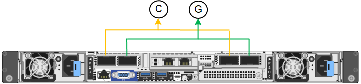
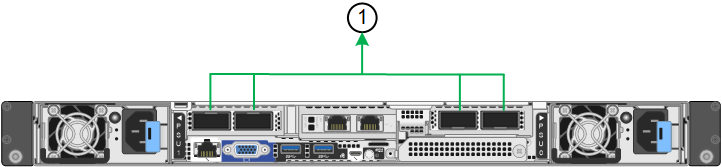
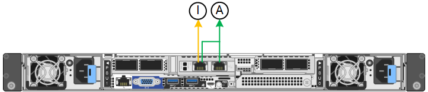
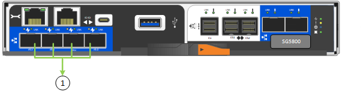
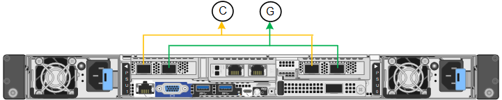
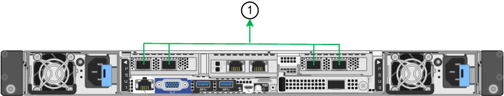
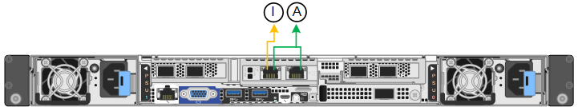

= 設定網路連結
:allow-uri-read: 
:icons: font
:imagesdir: ../media/

[role="lead"]
您可以設定用於將應用裝置連線至Grid Network、用戶端網路和管理網路的連接埠網路連結。您可以設定連結速度、連接埠和網路連結模式。

TIP: 如果您使用 ConfigBuilder 來產生 JSON 檔案、則可以自動設定網路連結。請參閱 link:automating-appliance-installation-and-configuration.html["自動化應用裝置的安裝與組態"]。

.開始之前
* 您有 link:obtaining-additional-equipment-and-tools.html["已取得額外設備"] 您的纜線類型和連結速度所需。
* 您已根據您打算使用的連結速度、在連接埠中安裝正確的收發器。
* 您已將網路連接埠連接至支援所選速度的交換器。

如果您打算使用Aggregate連接埠連結模式、LACP網路連結模式或VLAN標記：

* 您已將應用裝置上的網路連接埠連接至可支援VLAN和LACP的交換器。
* 如果有多個交換器參與LACP連結、交換器就會支援多機箱連結集合群組（MLAG）或等效群組。
* 您瞭解如何將交換器設定為使用VLAN、LACP及MLAG或同等功能。
* 您知道每個網路使用的獨特VLAN標記。此VLAN標記將新增至每個網路封包、以確保網路流量路由傳送至正確的網路。

.關於這項工作
如果您想要使用除以下值以外的值，則只需在「連結配置」頁面上配置設定<<default_values,預設設定>>。

NOTE: 按照這些說明進行的 LACP PDU 速率變更在StorageGRID環境中保持不變。若要在裝置中安裝的網路元件執行維護作業時暫時變更 LACP PDU 速率，請參閱 https://docs.netapp.com/us-en/storagegrid/maintain/changing-nodes-network-configuration.html#temporarily-changing-the-lacp-pdu-rate["暫時更改 LACP PDU 速率"^]。

[[port_config_tables]]圖表總結了每個裝置的連接埠綁定模式和網路綁定模式的選項。有關詳細信息，請參閱以下內容：

* link:gathering-installation-information-sg100-and-sg1000.html#port-bond-modes["連接埠連結模式（ SG1000 和 SG100 ）"]
* link:gathering-installation-information-sg110-and-sg1100.html#port-bond-modes["連接埠連結模式（ SG1100 和 SG110 ）"]
* link:gathering-installation-information-sg5700.html#port-bond-modes["連接埠連結模式（ E5700SG ）"]
* link:gathering-installation-information-sg5800.html#port-bond-modes["連接埠連結模式（ SG5800 ）"]
* link:gathering-installation-information-sg6000.html#port-bond-modes["連接埠連結模式（ SG6000-CN ）"]
* link:gathering-installation-information-sg6100.html#port-bond-modes["連接埠連結模式（ SGF6112 和 SG6100-CN ）"]

[role="tabbed-block"]
====
.SG100 與 SG1000
--
固定連接埠連結模式（預設）::
+
--
下圖顯示 SG1000 或 SG100 上的四個網路連接埠如何以固定連接埠連結模式（預設組態）連結。

SG1000 ：

image::../media/sg1000_fixed_port.png[SG1000 固定連接埠綁定模式]

SG100：

image::../media/sg100_fixed_port_draft.png[SG100固定連接埠綁定模式]

[cols="1a,3a"]
|===
| 標註 | 連結哪些連接埠 

 a| 
c
 a| 
如果使用此網路、用戶端網路的連接埠1和3會連結在一起。

 a| 
G
 a| 
連接埠2和4會連結至Grid Network。

|===
下表摘要說明設定四個網路連接埠的選項。如果您要使用非預設設定、只需要在「連結組態」頁面上設定設定。

[cols="1a,2a,2a"]
|===
| 網路連結模式 | 用戶端網路已停用 | 用戶端網路已啟用（預設） 

 a| 
雙主動備份（預設）
 a| 
* 連接埠2和4使用適用於Grid Network的主動備份連結。
* 不使用連接埠 1 和 3 。
* VLAN標記為選用項目。

 a| 
* 連接埠2和4使用適用於Grid Network的主動備份連結。
* 連接埠1和3使用用戶端網路的主動備份連結。
* 為方便網路管理員、可為兩個網路指定VLAN標記。

 a| 
LACP（802.3ad）
 a| 
* 連接埠2和4使用LACP連結來連接網格網路。
* 不使用連接埠 1 和 3 。
* VLAN標記為選用項目。
* 可以在網格網路部分指定 LACP PDU 速率和 LACP 傳輸雜湊策略值。

 a| 
* 連接埠2和4使用LACP連結來連接網格網路。
* 連接埠1和3使用LACP連結連接至用戶端網路。
* 為方便網路管理員、可為兩個網路指定VLAN標記。
* 可以在網格網路和客戶端網路部分指定 LACP PDU 速率和 LACP 傳輸雜湊策略值。

|===
--
Aggregate連接埠連結模式::
+
--
這些圖顯示四個網路連接埠如何以集合式連接埠連結模式連結。

SG1000 ：

image::../media/sg1000_aggregate_ports.png[Aggregate Port Bond Mode SG1000]

SG100：

image::../media/sg100_aggregate_ports.png[Aggregate連接埠綁定模式SG100]

[cols="1a,3a"]
|===
| 標註 | 連結哪些連接埠 

 a| 
1.
 a| 
所有四個連接埠都集中在單一LACP連結中、因此所有連接埠都可用於Grid Network和Client Network流量。

|===
下表摘要說明設定四個網路連接埠的選項。如果您要使用非預設設定、只需要在「連結組態」頁面上設定設定。

[cols="1a,2a,2a"]
|===
| 網路連結模式 | 用戶端網路已停用 | 用戶端網路已啟用（預設） 

 a| 
僅適用於LACP（802.3ad）
 a| 
* 連接埠1-4使用單一LACP連結來連接網格網路。
* 單一VLAN標記可識別Grid Network封包。
* 可以在連結設定部分指定 LACP PDU 速率和 LACP 傳輸雜湊策略值。

 a| 
* 連接埠1-4使用單一LACP連結來連接網格網路和用戶端網路。
* 兩個VLAN標記可讓Grid Network封包與Client Network封包隔離。
* 可以在連結設定部分指定 LACP PDU 速率和 LACP 傳輸雜湊策略值。

|===
--
管理連接埠的雙主動式備份網路連結模式::
+
--
這些圖顯示設備上的兩個 1-GbE 管理連接埠如何在管理網路的「主動式備份」網路連結模式中連結。

SG1000 ：

image::../media/sg1000_bonded_management_ports.png[管理網路連接埠連結 SG1000]

SG100：

image::../media/sg100_bonded_management_ports.png[管理網路連接埠已連結SG100]

--

--
.SG110 和 SG1100
--
固定連接埠連結模式（預設）::
+
--
下圖顯示 SG1100 或 SG110 上的四個網路連接埠如何以固定連接埠連結模式（預設組態）連結。

SG1100 ：

SG110 ：

image::../media/sgf6112_fixed_port.png[SG110 固定連接埠綁定模式]

[cols="1a,3a"]
|===
| 標註 | 連結哪些連接埠 

 a| 
c
 a| 
如果使用此網路、用戶端網路的連接埠1和3會連結在一起。

 a| 
G
 a| 
連接埠2和4會連結至Grid Network。

|===
下表摘要說明設定四個網路連接埠的選項。如果您要使用非預設設定、只需要在「連結組態」頁面上設定設定。

[cols="1a,2a,2a"]
|===
| 網路連結模式 | 用戶端網路已停用 | 用戶端網路已啟用（預設） 

 a| 
雙主動備份（預設）
 a| 
* 連接埠2和4使用適用於Grid Network的主動備份連結。
* 不使用連接埠 1 和 3 。
* VLAN標記為選用項目。

 a| 
* 連接埠2和4使用適用於Grid Network的主動備份連結。
* 連接埠1和3使用用戶端網路的主動備份連結。
* 為方便網路管理員、可為兩個網路指定VLAN標記。

 a| 
LACP（802.3ad）
 a| 
* 連接埠2和4使用LACP連結來連接網格網路。
* 不使用連接埠 1 和 3 。
* VLAN標記為選用項目。
* 可以在網格網路部分指定 LACP PDU 速率和 LACP 傳輸雜湊策略值。

 a| 
* 連接埠2和4使用LACP連結來連接網格網路。
* 連接埠1和3使用LACP連結連接至用戶端網路。
* 為方便網路管理員、可為兩個網路指定VLAN標記。
* 可以在網格網路和客戶端網路部分指定 LACP PDU 速率和 LACP 傳輸雜湊策略值。

|===
--
Aggregate連接埠連結模式::
+
--
這些圖顯示四個網路連接埠如何以集合式連接埠連結模式連結。

SG1100 ：

SG110 ：

image::../media/sgf6112_aggregate_ports.png[SG110 Aggregate 連接埠綁定模式]

[cols="1a,3a"]
|===
| 標註 | 連結哪些連接埠 

 a| 
1.
 a| 
所有四個連接埠都集中在單一LACP連結中、因此所有連接埠都可用於Grid Network和Client Network流量。

|===
下表摘要說明設定網路連接埠的選項。如果您要使用非預設設定、只需要在「連結組態」頁面上設定設定。

[cols="1a,2a,2a"]
|===
| 網路連結模式 | 用戶端網路已停用 | 用戶端網路已啟用（預設） 

 a| 
僅適用於LACP（802.3ad）
 a| 
* 連接埠1-4使用單一LACP連結來連接網格網路。
* 單一VLAN標記可識別Grid Network封包。
* 可以在連結設定部分指定 LACP PDU 速率和 LACP 傳輸雜湊策略值。

 a| 
* 連接埠1-4使用單一LACP連結來連接網格網路和用戶端網路。
* 兩個VLAN標記可讓Grid Network封包與Client Network封包隔離。
* 可以在連結設定部分指定 LACP PDU 速率和 LACP 傳輸雜湊策略值。

|===
--
管理連接埠的雙主動式備份網路連結模式::
+
--
這些圖顯示設備上的兩個 1-GbE 管理連接埠如何在管理網路的「主動式備份」網路連結模式中連結。

SG1100 ：

SG110 ：

image::../media/sgf6112_bonded_management_ports.png[管理網路連接埠連結 SG110]

--

--
.SG5700
--
固定連接埠連結模式（預設）::
+
--
此圖顯示四個10/25-GbE連接埠如何以固定連接埠繫結模式（預設組態）連結。

image::../media/e5700sg_fixed_port.gif[影像顯示E5700SG控制器上的10/25-GbE連接埠如何以固定模式連結]

[cols="1a,3a"]
|===
| 標註 | 連結哪些連接埠 

 a| 
c
 a| 
如果使用此網路、用戶端網路的連接埠1和3會連結在一起。

 a| 
G
 a| 
連接埠2和4會連結至Grid Network。

|===
下表摘要說明設定四個10/25-GbE連接埠的選項。如果您要使用非預設設定、只需要在「連結組態」頁面上設定設定。

[cols="1a,2a,2a"]
|===
| 網路連結模式 | 用戶端網路已停用 | 用戶端網路已啟用（預設） 

 a| 
雙主動備份（預設）
 a| 
* 連接埠2和4使用適用於Grid Network的主動備份連結。
* 不使用連接埠 1 和 3 。
* VLAN標記為選用項目。

 a| 
* 連接埠2和4使用適用於Grid Network的主動備份連結。
* 連接埠1和3使用用戶端網路的主動備份連結。
* 為方便網路管理員、可為兩個網路指定VLAN標記。

 a| 
LACP（802.3ad）
 a| 
* 連接埠2和4使用LACP連結來連接網格網路。
* 不使用連接埠 1 和 3 。
* VLAN標記為選用項目。
* 可以在網格網路部分指定 LACP PDU 速率和 LACP 傳輸雜湊策略值。

 a| 
* 連接埠2和4使用LACP連結來連接網格網路。
* 連接埠1和3使用LACP連結連接至用戶端網路。
* 為方便網路管理員、可為兩個網路指定VLAN標記。
* 可以在網格網路和客戶端網路部分指定 LACP PDU 速率和 LACP 傳輸雜湊策略值。

|===
--
Aggregate連接埠連結模式::
+
--
此圖顯示如何在Aggregate連接埠連結模式中連結四個10/25-GbE連接埠。

image::../media/e5700sg_aggregate_port.gif[影像顯示E5700SG控制器上的10/25-GbE連接埠如何以Aggregate模式連結]

[cols="1a,3a"]
|===
| 標註 | 連結哪些連接埠 

 a| 
1.
 a| 
所有四個連接埠都集中在單一LACP連結中、因此所有連接埠都可用於Grid Network和Client Network流量。

|===
下表摘要說明設定四個10/25-GbE連接埠的選項。如果您要使用非預設設定、只需要在「連結組態」頁面上設定設定。

[cols="1a,2a,2a"]
|===
| 網路連結模式 | 用戶端網路已停用 | 用戶端網路已啟用（預設） 

 a| 
僅適用於LACP（802.3ad）
 a| 
* 連接埠1-4使用單一LACP連結來連接網格網路。
* 單一VLAN標記可識別Grid Network封包。
* 可以在連結設定部分指定 LACP PDU 速率和 LACP 傳輸雜湊策略值。

 a| 
* 連接埠1-4使用單一LACP連結來連接網格網路和用戶端網路。
* 兩個VLAN標記可讓Grid Network封包與Client Network封包隔離。
* 可以在連結設定部分指定 LACP PDU 速率和 LACP 傳輸雜湊策略值。

|===
--
管理連接埠的雙主動式備份網路連結模式::
+
--
本圖顯示E5700SG控制器上的兩個1-GbE管理連接埠如何以主動備份網路連結模式連結至管理網路。

image::../media/e5700sg_bonded_management_ports.gif[E5700SG 連結式管理連接埠]

--

--
.SG5800
--
固定連接埠連結模式（預設）::
+
--
此圖顯示四個10/25-GbE連接埠如何以固定連接埠繫結模式（預設組態）連結。

[cols="1a,3a"]
|===
| 標註 | 連結哪些連接埠 

 a| 
c
 a| 
如果使用此網路、用戶端網路的連接埠1和3會連結在一起。

 a| 
G
 a| 
連接埠2和4會連結至Grid Network。

|===
下表摘要說明設定四個10/25-GbE連接埠的選項。如果您要使用非預設設定、只需要在「連結組態」頁面上設定設定。

[cols="1a,2a,2a"]
|===
| 網路連結模式 | 用戶端網路已停用 | 用戶端網路已啟用（預設） 

 a| 
雙主動備份（預設）
 a| 
* 連接埠2和4使用適用於Grid Network的主動備份連結。
* 不使用連接埠 1 和 3 。
* VLAN標記為選用項目。

 a| 
* 連接埠2和4使用適用於Grid Network的主動備份連結。
* 連接埠1和3使用用戶端網路的主動備份連結。
* 為方便網路管理員、可為兩個網路指定VLAN標記。

 a| 
LACP（802.3ad）
 a| 
* 連接埠2和4使用LACP連結來連接網格網路。
* 不使用連接埠 1 和 3 。
* VLAN標記為選用項目。
* 可以在網格網路部分指定 LACP PDU 速率和 LACP 傳輸雜湊策略值。

 a| 
* 連接埠2和4使用LACP連結來連接網格網路。
* 連接埠1和3使用LACP連結連接至用戶端網路。
* 為方便網路管理員、可為兩個網路指定VLAN標記。
* 可以在網格網路和客戶端網路部分指定 LACP PDU 速率和 LACP 傳輸雜湊策略值。

|===
--
Aggregate連接埠連結模式::
+
--
此圖顯示如何在Aggregate連接埠連結模式中連結四個10/25-GbE連接埠。

[cols="1a,3a"]
|===
| 標註 | 連結哪些連接埠 

 a| 
1.
 a| 
所有四個連接埠都集中在單一LACP連結中、因此所有連接埠都可用於Grid Network和Client Network流量。

|===
下表摘要說明設定四個10/25-GbE連接埠的選項。如果您要使用非預設設定、只需要在「連結組態」頁面上設定設定。

[cols="1a,2a,2a"]
|===
| 網路連結模式 | 用戶端網路已停用 | 用戶端網路已啟用（預設） 

 a| 
僅適用於LACP（802.3ad）
 a| 
* 連接埠1-4使用單一LACP連結來連接網格網路。
* 單一VLAN標記可識別Grid Network封包。
* 可以在連結設定部分指定 LACP PDU 速率和 LACP 傳輸雜湊策略值。

 a| 
* 連接埠1-4使用單一LACP連結來連接網格網路和用戶端網路。
* 兩個VLAN標記可讓Grid Network封包與Client Network封包隔離。
* 可以在連結設定部分指定 LACP PDU 速率和 LACP 傳輸雜湊策略值。

|===
--

--
.SG6000
--
固定連接埠連結模式（預設）::
+
--
此圖顯示四個網路連接埠如何以固定連接埠連結模式（預設組態）連結

image::../media/sg6000_cn_fixed_port.gif[影像顯示SG6000-CN-控制器上的網路連接埠如何以固定模式連結]

[cols="1a,3a"]
|===
| 標註 | 連結哪些連接埠 

 a| 
c
 a| 
如果使用此網路、用戶端網路的連接埠1和3會連結在一起。

 a| 
G
 a| 
連接埠2和4會連結至Grid Network。

|===
下表摘要說明設定網路連接埠的選項。如果您要使用非預設設定、只需要在「連結組態」頁面上設定設定。

[cols="1a,3a,3a"]
|===
| 網路連結模式 | 用戶端網路已停用 | 用戶端網路已啟用（預設） 

 a| 
雙主動備份（預設）
 a| 
* 連接埠2和4使用適用於Grid Network的主動備份連結。
* 不使用連接埠 1 和 3 。
* VLAN標記為選用項目。

 a| 
* 連接埠2和4使用適用於Grid Network的主動備份連結。
* 連接埠1和3使用用戶端網路的主動備份連結。
* 為方便網路管理員、可為兩個網路指定VLAN標記。

 a| 
LACP（802.3ad）
 a| 
* 連接埠2和4使用LACP連結來連接網格網路。
* 不使用連接埠 1 和 3 。
* VLAN標記為選用項目。
* 可以在網格網路部分指定 LACP PDU 速率和 LACP 傳輸雜湊策略值。

 a| 
* 連接埠2和4使用LACP連結來連接網格網路。
* 連接埠1和3使用LACP連結連接至用戶端網路。
* 為方便網路管理員、可為兩個網路指定VLAN標記。
* 可以在網格網路和客戶端網路部分指定 LACP PDU 速率和 LACP 傳輸雜湊策略值。

|===
--
Aggregate連接埠連結模式::
+
--
此圖顯示如何在Aggregate連接埠繫結模式下繫結四個網路連接埠。

image::../media/sg6000_cn_aggregate_port.gif[影像顯示SG6000-CN-控制器上的網路連接埠如何以Aggregate模式連結]

[cols="1a,3a"]
|===
| 標註 | 連結哪些連接埠 

 a| 
1.
 a| 
所有四個連接埠都集中在單一LACP連結中、因此所有連接埠都可用於Grid Network和Client Network流量。

|===
下表摘要說明設定網路連接埠的選項。如果您要使用非預設設定、只需要在「連結組態」頁面上設定設定。

[cols="1a,3a,3a"]
|===
| 網路連結模式 | 用戶端網路已停用 | 用戶端網路已啟用（預設） 

 a| 
僅適用於LACP（802.3ad）
 a| 
* 連接埠1-4使用單一LACP連結來連接網格網路。
* 單一VLAN標記可識別Grid Network封包。
* 可以在連結設定部分指定 LACP PDU 速率和 LACP 傳輸雜湊策略值。

 a| 
* 連接埠1-4使用單一LACP連結來連接網格網路和用戶端網路。
* 兩個VLAN標記可讓Grid Network封包與Client Network封包隔離。
* 可以在連結設定部分指定 LACP PDU 速率和 LACP 傳輸雜湊策略值。

|===
--
管理連接埠的雙主動式備份網路連結模式::
+
--
本圖顯示SG6000-CN-控制器上的兩個1-GbE管理連接埠如何以主動備份網路連結模式連結至管理網路。

image::../media/sg6000_cn_bonded_managemente_ports.png[已連結管理網路連接埠]

--

--
.SG6100
--
固定連接埠連結模式（預設）::
+
--
圖中顯示四個網路連接埠如何以固定連接埠連結模式（預設組態）連結。

*SGF6112* ：

image::../media/sgf6112_fixed_port.png[SGF6112 固定連接埠綁定模式]

*SG6100* ：

[cols="1a,3a"]
|===
| 標註 | 連結哪些連接埠 

 a| 
c
 a| 
如果使用此網路、用戶端網路的連接埠1和3會連結在一起。

 a| 
G
 a| 
連接埠2和4會連結至Grid Network。

|===
下表摘要說明設定網路連接埠的選項。如果您要使用非預設設定、只需要在「連結組態」頁面上設定設定。

[cols="1a,2a,2a"]
|===
| 網路連結模式 | 用戶端網路已停用 | 用戶端網路已啟用（預設） 

 a| 
雙主動備份（預設）
 a| 
* 連接埠2和4使用適用於Grid Network的主動備份連結。
* 不使用連接埠 1 和 3 。
* VLAN標記為選用項目。

 a| 
* 連接埠2和4使用適用於Grid Network的主動備份連結。
* 連接埠1和3使用用戶端網路的主動備份連結。
* 為方便網路管理員、可為兩個網路指定VLAN標記。

 a| 
LACP（802.3ad）
 a| 
* 連接埠2和4使用LACP連結來連接網格網路。
* 不使用連接埠 1 和 3 。
* VLAN標記為選用項目。
* 可以在網格網路部分指定 LACP PDU 速率和 LACP 傳輸雜湊策略值。

 a| 
* 連接埠2和4使用LACP連結來連接網格網路。
* 連接埠1和3使用LACP連結連接至用戶端網路。
* 為方便網路管理員、可為兩個網路指定VLAN標記。
* 可以在網格網路和客戶端網路部分指定 LACP PDU 速率和 LACP 傳輸雜湊策略值。

|===
--
Aggregate連接埠連結模式::
+
--
圖中顯示四個網路連接埠如何以集合連接埠連結模式連結。

*SGF6112* ：

image::../media/sgf6112_aggregate_ports.png[SGF6112 Aggregate 連接埠綁定模式]

*SG6100* ：

[cols="1a,3a"]
|===
| 標註 | 連結哪些連接埠 

 a| 
1.
 a| 
所有四個連接埠都集中在單一LACP連結中、因此所有連接埠都可用於Grid Network和Client Network流量。

|===
下表摘要說明設定網路連接埠的選項。如果您要使用非預設設定、只需要在「連結組態」頁面上設定設定。

[cols="1a,2a,2a"]
|===
| 網路連結模式 | 用戶端網路已停用 | 用戶端網路已啟用（預設） 

 a| 
僅適用於LACP（802.3ad）
 a| 
* 連接埠1-4使用單一LACP連結來連接網格網路。
* 單一VLAN標記可識別Grid Network封包。
* 可以在連結設定部分指定 LACP PDU 速率和 LACP 傳輸雜湊策略值。

 a| 
* 連接埠1-4使用單一LACP連結來連接網格網路和用戶端網路。
* 兩個VLAN標記可讓Grid Network封包與Client Network封包隔離。
* 可以在連結設定部分指定 LACP PDU 速率和 LACP 傳輸雜湊策略值。

|===
--
管理連接埠的雙主動式備份網路連結模式::
+
--
此圖顯示兩個 1-GbE 管理連接埠如何在管理網路的「主動式備份」網路連結模式中連結。

*SGF6112* ：

image::../media/sgf6112_bonded_management_ports.png[管理網路連接埠連結 SGF6112]

*SG6100* ：

--

--
====
.步驟
. 從「SectionAppliance安裝程式」的功能表列StorageGRID 中、按一下「*組態網路*」>「*連結組態*」。
+
「網路連結組態」頁面會顯示設備的圖表、其中的網路和管理連接埠編號為。

+
「連結狀態」表格會列出編號連接埠的連結狀態、連結速度及其他統計資料。

+

NOTE: 對於 SG5800，連接埠 1 的連結狀態在軟體中不可用，必須使用 SG5800 控制器上的狀態 LED 進行實體驗證。

+
[[default_values]]首次造訪此頁面時，預設值為：

+
** *連結速度*設為*自動*。
** *連接埠連結模式*設為*固定*。
** *LACP 傳輸哈希策略*設定為*Layer2+3*。
** *LACP PDU 速率*設定為*快速*。
** *網格網路的網路連結模式*設為*主動備份*。
** *管理網路*已啟用、網路連結模式設定為*獨立*。
** *客戶端網路*已啟用。

. 從「*連結速度*」下拉式清單中選取網路連接埠的連結速度。
+
您用於Grid Network和用戶端網路的網路交換器也必須支援並設定此速度。您必須使用適當的介面卡或收發器來設定連結速度。如果可能、請使用自動連結速度、因為此選項會與連結合作夥伴協調連結速度和轉送錯誤修正（FEC）模式。

+
如果您打算使用 25-GbE 連結速度來連接 SG6100 、 SG6000 、 SG5800 或 SG5700 網路連接埠：

+
** 使用 SFP28 收發器和 SFP28 雙軸纜線或光纖纜線。
** 對於 SG5700 ，請從 *Link spe* 下拉列表中選擇 *25GBE* 。
** 對於 SG5800 、 SG6000 或 SG6100 ，請從 *Link spee* 下拉列表中選擇 *Auto* 。

. 啟用或停用StorageGRID 您計畫使用的支援網。
+
網格網路為必填項目。您無法停用此網路。

+
.. 如果應用裝置未連線至管理網路、請清除管理網路的 * 啟用網路 * 核取方塊。
.. 如果設備已連線至用戶端網路、請選取用戶端網路的 * 啟用網路 * 核取方塊。
+
此時會顯示資料NIC連接埠的用戶端網路設定。

. 請參閱<<port_config_tables,固定和聚合連接埠綁定模式配置表>>對於每種裝置類型，並配置連接埠綁定模式和網路綁定模式以符合您的網路配置。
+
您必須為網格和用戶端網路指定唯一的 VLAN 標籤。您可以選擇 0 到 4095 之間的值。

. 當您對所選項目感到滿意時、請按一下「*儲存*」。
+

NOTE: 如果您變更所連線的網路或連結、可能會失去連線。如果您在 1 分鐘內未重新連線、請使用指派給應用裝置的其他 IP 位址之一、重新輸入 StorageGRID 應用裝置安裝程式的 URL ： +
`*https://_appliance_IP_:8443*`

