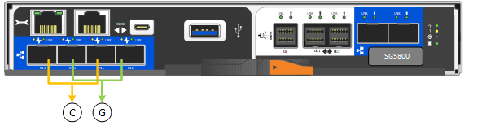

= 收集網路資訊（ SG5800 ）
:allow-uri-read: 
:icons: font
:imagesdir: ../media/

[role="lead"]
使用表格記錄您連線至應用裝置的每個網路所需的資訊。這些值是安裝和設定硬體所需的值。

TIP: 請使用 ConfigBuilder 隨附的活頁簿、而非使用表格。使用 ConfigBuilder 活頁簿可讓您上傳系統資訊並產生 JSON 檔案、以自動完成 StorageGRID 應用裝置安裝程式中的某些組態步驟。請參閱 link:automating-appliance-installation-and-configuration.html["自動化應用裝置的安裝與組態"]。

== 連線至 E4000 控制器上的 SANtricity 系統管理員所需的資訊

您將使用 SANtricity 系統管理員將 E4000 系列控制器連接至管理網路。

[cols="2a,1a"]
|===
| 所需資訊 | 您的價值 

 a| 
您將連接至管理連接埠1的乙太網路交換器連接埠
 a| 

 a| 
管理連接埠1的Mac位址（印在連接埠P1附近的標籤上）
 a| 

 a| 
DHCP指派的管理連接埠1 IP位址（如果在開機後可用）

* 注意： * 如果您要連線至 E4000 控制器的網路包含 DHCP 伺服器、網路管理員可以使用 MAC 位址來判斷 DHCP 伺服器指派的 IP 位址。
 a| 

 a| 
速度與雙工模式

*附註：*您必須確定SANtricity 適用於「系統管理程式」管理網路的乙太網路交換器已設定為自動協調。
 a| 
必須：

* 自動協商（預設）

 a| 
IP位址格式
 a| 
請選擇一項：

* IPV4
* IPv6

 a| 
您計畫用於管理網路上應用裝置的靜態IP位址
 a| 
對於IPV4：

* IPV4位址：
* 子網路遮罩：
* 閘道：

對於IPv6：

* IPv6位址：
* 可路由的IP位址：
* E4000 控制器路由器 IP 位址：

|===

== 將 SG5800 控制器連接到管理網路所需的資訊

管理員網路for支援功能是選用的網路、可用於系統管理和維護。StorageGRID此應用裝置使用 SG5800 控制器上的 1-GbE 管理連接埠、連接到管理網路。

[cols="2a,1a"]
|===
| 所需資訊 | 您的價值 

 a| 
管理網路已啟用
 a| 
請選擇一項：

* 否
* 是（預設）

 a| 
連接埠1的交換器連接埠
 a| 

 a| 
DHCP指派的管理連接埠1 IP位址（如果在開機後可用）

* 附註： * 如果管理網路包含 DHCP 伺服器、您可以使用 MAC 位址來查詢指派的 IP 、藉此判斷 DHCP 指派的 IP 位址。
 a| 
* IPV4位址（CIDR）：
* 閘道：

 a| 
您計畫用於管理網路上應用裝置儲存節點的靜態IP位址

*注意：*如果您的網路沒有閘道、請為閘道指定相同的靜態IPv4位址。
 a| 
* IPV4位址（CIDR）：
* 閘道：

 a| 
管理網路子網路（CIDR）
 a| 

|===

== 在 SG5800 控制器上連接和設定 10/25-GbE 連接埠所需的資訊

SG5800 控制器上的四個 10/25-GbE 連接埠可連接至 StorageGRID 網格網路和用戶端網路。

NOTE: 請參閱 link:gathering-installation-information-sg5800.html#port-bond-modes["連接埠連結模式（ SG5800 控制器）"]。

[cols="2a,1a"]
|===
| 所需資訊 | 您的價值 

 a| 
連結速度
 a| 
請選擇一項：

* 自動（預設）
* 10 GbE
* 25 GbE

 a| 
連接埠連結模式
 a| 
請選擇一項：

* 固定（預設）
* Aggregate

 a| 
連接埠1的交換器連接埠（用戶端網路）
 a| 

 a| 
連接埠2的交換器連接埠（網格網路）
 a| 

 a| 
連接埠 3 的交換器連接埠（用戶端網路）
 a| 

 a| 
連接埠4的交換器連接埠（Grid Network）
 a| 

|===

== 將 SG5800 控制器連接至網格網路所需的資訊

Grid Network for StorageGRID 效能不只是一項必要的網路、可用於所有內部StorageGRID 的資訊流量。此應用裝置使用 SG5800 控制器上的 10/25-GbE 連接埠、連接至 Grid Network 。

NOTE: 請參閱 link:gathering-installation-information-sg5800.html#port-bond-modes["連接埠連結模式（ SG5800 控制器）"]。

[cols="2a,1a"]
|===
| 所需資訊 | 您的價值 

 a| 
網路連結模式
 a| 
請選擇一項：

* 雙主動備份（預設）
* LACP（802.3ad）

 a| 
已啟用VLAN標記
 a| 
請選擇一項：

* 否（預設）
* 是的

 a| 
VLAN 標記（如果已啟用 VLAN 標記）
 a| 
輸入介於0和4095之間的值：

 a| 
網格網路的DHCP指派IP位址（如果在開機後可用）
 a| 
* IPV4位址（CIDR）：
* 閘道：

 a| 
您計畫在Grid Network上用於應用裝置儲存節點的靜態IP位址

*注意：*如果您的網路沒有閘道、請為閘道指定相同的靜態IPv4位址。
 a| 
* IPV4位址（CIDR）：
* 閘道：

 a| 
網格網路子網路（CIDR）

*注意：*如果未啟用用戶端網路、則控制器上的預設路由將使用此處指定的閘道。
 a| 

|===

== 將 SG5800 控制器連接至用戶端網路所需的資訊

Client Network for StorageGRID 推銷是選用的網路、通常用於提供用戶端傳輸協定存取網格。此應用裝置使用 SG5800 控制器上的 10/25-GbE 連接埠連接至用戶端網路。

NOTE: 請參閱 link:gathering-installation-information-sg5800.html#port-bond-modes["連接埠連結模式（ SG5800 控制器）"]。

[cols="2a,1a"]
|===
| 所需資訊 | 您的價值 

 a| 
用戶端網路已啟用
 a| 
請選擇一項：

* 否（預設）
* 是的

 a| 
網路連結模式
 a| 
請選擇一項：

* 雙主動備份（預設）
* LACP（802.3ad）

 a| 
已啟用VLAN標記
 a| 
請選擇一項：

* 否（預設）
* 是的

 a| 
VLAN標記

（如果已啟用VLAN標記）
 a| 
輸入介於0和4095之間的值：

 a| 
用戶端網路的DHCP指派IP位址（如果在開機後可用）
 a| 
* IPV4位址（CIDR）：
* 閘道：

 a| 
您計畫用於用戶端網路上應用裝置儲存節點的靜態IP位址

*附註：*如果已啟用用戶端網路、則控制器上的預設路由將使用此處指定的閘道。
 a| 
* IPV4位址（CIDR）：
* 閘道：

|===

== 連接埠連結模式

何時 link:configuring-network-links.html["設定網路連結"] 對於 SG5800 控制器、您可以將連接埠連結用於連接至 Grid Network 和選用用戶端網路的 10/25-GbE 連接埠。連接埠連結功能可在StorageGRID 各個解決方案之間提供備援路徑、協助您保護資料。SG5800 控制器上的 10/25-GbE 網路連接埠支援固定連接埠連結模式或網格網路和用戶端網路連線的集合連接埠連結模式。

=== 固定連接埠連結模式

固定模式是10/25-GbE網路連接埠的預設組態。

[cols="1a,3a"]
|===
| 標註 | 連結哪些連接埠 

 a| 
c
 a| 
如果使用此網路、用戶端網路的連接埠1和3會連結在一起。

 a| 
G
 a| 
連接埠2和4會連結至Grid Network。

|===
使用固定連接埠連結模式時、您可以使用兩種網路連結模式之一：主動備份或連結集合控制傳輸協定（LACP）。

* 在主動備份模式（預設）中、一次只有一個連接埠處於作用中狀態。如果作用中連接埠故障、其備份連接埠會自動提供容錯移轉連線。連接埠4提供連接埠2（Grid Network）的備份路徑、連接埠3則提供連接埠1（用戶端網路）的備份路徑。
* 在LACP模式中、每對連接埠會形成控制器與網路之間的邏輯通道、以提高處理量。如果一個連接埠故障、另一個連接埠會繼續提供該通道。處理量減少、但連線能力不受影響。

NOTE: 如果您不需要備援連線、則每個網路只能使用一個連接埠。不過請注意StorageGRID 、安裝完功能後、Grid Manager會發出警示、表示纜線已拔下。您可以安全地確認此警報以清除警報。

=== Aggregate連接埠連結模式

Aggregate連接埠連結模式可大幅增加每StorageGRID 個支援網的整體效能、並提供額外的容錯移轉路徑。

image::../media/sg5800_aggregate_port.png[用於Aggregate連接埠連結模式的連接埠]

[cols="1a,3a"]
|===
| 標註 | 連結哪些連接埠 

 a| 
1.
 a| 
所有連接的連接埠都集中在單一LACP連結中、允許所有連接埠用於Grid Network和Client Network流量。

|===
如果您打算使用Aggregate連接埠連結模式：

* 您必須使用LACP網路連結模式。
* 您必須為每個網路指定唯一的VLAN標記。此VLAN標記將新增至每個網路封包、以確保網路流量路由傳送至正確的網路。
* 連接埠必須連接至可支援VLAN和LACP的交換器。如果有多個交換器參與LACP連結、交換器必須支援多機箱連結集合群組（MLAG）或等效群組。
* 您將瞭解如何設定交換器以使用 VLAN 、 LACP 和 MLAG 或同等功能。

如果您不想使用全部四個 10/25-GbE 連接埠、可以使用一個、兩個或三個連接埠。使用一個以上的連接埠、可大幅提高當10/25-GbE連接埠故障時、部分網路連線仍可繼續使用的機率。

NOTE: 如果您選擇使用少於四個連接埠、請注意StorageGRID 、安裝完效益分析之後、Grid Manager會發出一或多個警示、表示纜線已拔下。您可以安全地確認警報以清除警報。

.相關資訊
* link:cabling-appliance.html["纜線應用裝置（ SG5800 ）"]
* link:configuring-hardware.html["設定硬體（ SG5800 ）"]

