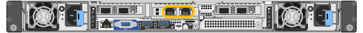
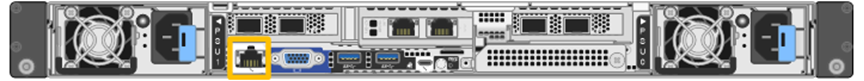
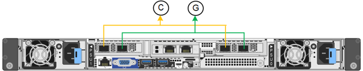
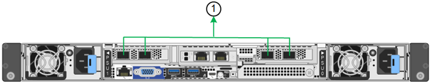

= 收集網路資訊（ SG6100 ）
:allow-uri-read: 
:icons: font
:imagesdir: ../media/

[role="lead"]
使用下表記錄您連線至應用裝置的每個網路所需的資訊。這些值是安裝和設定硬體所需的值。

TIP: 請使用 ConfigBuilder 隨附的活頁簿、而非使用表格。使用 ConfigBuilder 活頁簿可讓您上傳系統資訊並產生 JSON 檔案、以自動完成 StorageGRID 應用裝置安裝程式中的某些組態步驟。請參閱 link:automating-appliance-installation-and-configuration.html["自動化應用裝置的安裝與組態"]。

== 檢查 StorageGRID 版本

安裝 SGF6112 應用裝置之前、請先確認您的 StorageGRID 系統使用的是所需版本的 StorageGRID 軟體。

[cols="1a,2a"]
|===
| 應用裝置 | 必要StorageGRID 的版本 

 a| 
SGF6112
 a| 
11.7 或更新版本（建議使用最新的 Hotfix ）

|===

== 系統管理與維護連接埠

管理員網路for支援功能是選用的網路、可用於系統管理和維護。StorageGRID此應用裝置使用應用裝置上的下列 1/10-GbE 連接埠連線至管理網路。

下圖顯示 SGF6112 應用裝置上的 RJ-45 連接埠。

[cols="2a,1a"]
|===
| 所需資訊 | 您的價值 

 a| 
管理網路已啟用
 a| 
請選擇一項：

* 否
* 是（預設）

 a| 
網路連結模式
 a| 
請選擇一項：

* Independent（預設）
* 主動備份

 a| 
圖中圈選左連接埠的交換器連接埠（獨立網路連結模式的預設作用中連接埠）
 a| 

 a| 
圖中圈選的右側連接埠的交換器連接埠（僅限主動備份網路連結模式）
 a| 

 a| 
DHCP指派給管理網路連接埠的IP位址（如果在開機後可用）

* 注意： * 請聯絡您的網路管理員、以取得管理網路連接埠 DHCP 指派的 IP 位址。
 a| 
* IPV4位址（CIDR）：
* 閘道：

 a| 
您計畫用於管理網路上應用裝置節點的靜態IP位址

*注意：*如果您的網路沒有閘道、請為閘道指定相同的靜態IPv4位址。
 a| 
* IPV4位址（CIDR）：
* 閘道：

 a| 
管理網路子網路（CIDR）
 a| 

|===

== 網路連接埠

應用裝置上的四個網路連接埠可連接StorageGRID 至「知識網」和選用的「用戶端網路」。

[cols="2a,1a"]
|===
| 所需資訊 | 您的價值 

 a| 
連結速度
 a| 
對於 SGF6112 、請選擇下列其中一項：

* 自動（預設）
* 10 GbE
* 25 GbE

 a| 
連接埠連結模式
 a| 
請選擇一項：

* 固定（預設）
* Aggregate

 a| 
連接埠1的交換器連接埠（固定模式的用戶端網路）
 a| 

 a| 
連接埠2的交換器連接埠（適用於固定模式的Grid Network）
 a| 

 a| 
連接埠 3 的交換器連接埠（固定模式的用戶端網路）
 a| 

 a| 
連接埠 4 的交換器連接埠（固定模式的網格網路）
 a| 

|===

== 網格網路連接埠

Grid Network for StorageGRID 效能不只是一項必要的網路、可用於所有內部StorageGRID 的資訊流量。應用裝置使用四個網路連接埠連線至Grid Network。

[cols="2a,1a"]
|===
| 所需資訊 | 您的價值 

 a| 
網路連結模式
 a| 
請選擇一項：

* 雙主動備份（預設）
* LACP（802.3ad）

 a| 
已啟用VLAN標記
 a| 
請選擇一項：

* 否（預設）
* 是的

 a| 
VLAN 標記（如果已啟用 VLAN 標記）
 a| 
輸入介於0和4095之間的值：

 a| 
網格網路的DHCP指派IP位址（如果在開機後可用）
 a| 
* IPV4位址（CIDR）：
* 閘道：

 a| 
您計畫用於Grid Network上應用裝置節點的靜態IP位址

*注意：*如果您的網路沒有閘道、請為閘道指定相同的靜態IPv4位址。
 a| 
* IPV4位址（CIDR）：
* 閘道：

 a| 
網格網路子網路（CIDR）
 a| 

 a| 
最大傳輸單元（ MTU ）設定（選用）。您可以使用預設值 1500 、或是將 MTU 設定為適用於巨型框架的值、例如 9000 。
 a| 

|===

== 用戶端網路連接埠

Client Network for StorageGRID 推銷是選用的網路、通常用於提供用戶端傳輸協定存取網格。應用裝置使用四個網路連接埠連線至用戶端網路。

[cols="2a,1a"]
|===
| 所需資訊 | 您的價值 

 a| 
用戶端網路已啟用
 a| 
請選擇一項：

* 否（預設）
* 是的

 a| 
網路連結模式
 a| 
請選擇一項：

* 雙主動備份（預設）
* LACP（802.3ad）

 a| 
已啟用VLAN標記
 a| 
請選擇一項：

* 否（預設）
* 是的

 a| 
VLAN標記（如果啟用VLAN標記）
 a| 
輸入介於0和4095之間的值：

 a| 
用戶端網路的DHCP指派IP位址（如果在開機後可用）
 a| 
* IPV4位址（CIDR）：
* 閘道：

 a| 
您計畫用於用戶端網路上應用裝置節點的靜態IP位址

*附註：*如果已啟用用戶端網路、則應用裝置上的預設路由將使用此處指定的閘道。
 a| 
* IPV4位址（CIDR）：
* 閘道：

|===

== BMC管理網路連接埠

您可以使用圖中圓圈內的 1-GbE 管理連接埠、存取應用裝置上的 BMC 介面。此連接埠支援使用智慧型平台管理介面（IPMI）標準、透過乙太網路遠端管理控制器硬體。

NOTE: 您可以為所有包含 BMC 的應用裝置啟用或停用遠端 IPMI 存取。遠端 IPMI 介面可讓任何擁有 BMC 帳戶和密碼的人、對您的 StorageGRID 應用裝置進行低階硬體存取。如果您不需要遠端 IPMI 存取 BMC 、請使用下列其中一種方法停用此選項： +
在 Grid Manager 中、移至 * 組態 * > * 安全性 * > * 安全性設定 * > * 設備 * 、然後清除 * 啟用遠端 IPMI 存取 * 核取方塊。+
在 Grid 管理 API 中、使用私有端點： `PUT /private/bmc`。

下圖顯示 SGF6112 應用裝置上的 BMC 管理連接埠。

[cols="2a,1a"]
|===
| 所需資訊 | 您的價值 

 a| 
乙太網路交換器連接埠、您將連接至BMC管理連接埠（圖中圈出）
 a| 

 a| 
BMC管理網路的DHCP指派IP位址（如果在開機後可用）
 a| 
* IPV4位址（CIDR）：
* 閘道：

 a| 
您計畫用於BMC管理連接埠的靜態IP位址
 a| 
* IPV4位址（CIDR）：
* 閘道：

|===

== 連接埠連結模式

何時 link:configuring-network-links.html["設定網路連結"] 對於 SGF6112 應用裝置、您可以將連接埠連結用於連接至 Grid Network 和選用 Client Network 的連接埠、以及連接至選用管理網路的 1/10-GbE 管理連接埠。連接埠連結功能可在StorageGRID 各個解決方案之間提供備援路徑、協助您保護資料。

=== 網路連結模式

應用裝置上的網路連接埠支援網格網路和用戶端網路連線的固定連接埠連結模式或集合連接埠連結模式。

==== 固定連接埠連結模式

固定連接埠連結模式是網路連接埠的預設組態。

[cols="1a,3a"]
|===
| 標註 | 連結哪些連接埠 

 a| 
c
 a| 
如果使用此網路、用戶端網路的連接埠1和3會連結在一起。

 a| 
G
 a| 
連接埠2和4會連結至Grid Network。

|===
使用固定連接埠連結模式時、可使用主動備份模式或連結集合控制傳輸協定模式（LACP 802.3ad）連結連接埠。

* 在主動備份模式（預設）中、一次只有一個連接埠處於作用中狀態。如果作用中連接埠故障、其備份連接埠會自動提供容錯移轉連線。連接埠4提供連接埠2（Grid Network）的備份路徑、連接埠3則提供連接埠1（用戶端網路）的備份路徑。
* 在 LACP 模式中、每對連接埠都會在應用裝置和網路之間形成邏輯通道、以提高處理量。如果一個連接埠故障、另一個連接埠會繼續提供該通道。處理量減少、但連線能力不受影響。

NOTE: 如果您不需要備援連線、則每個網路只能使用一個連接埠。不過、請注意、 * 儲存設備連結中斷 * 警示可能會在安裝 StorageGRID 後在 Grid Manager 中觸發、表示纜線已拔下。您可以安全地停用此警示規則。

==== Aggregate連接埠連結模式

Aggregate連接埠連結模式可大幅增加每StorageGRID 個支援網的處理量、並提供額外的容錯移轉路徑。

[cols="1a,3a"]
|===
| 標註 | 連結哪些連接埠 

 a| 
1.
 a| 
所有連接的連接埠都集中在單一LACP連結中、允許所有連接埠用於Grid Network和Client Network流量。

|===
如果您打算使用Aggregate連接埠連結模式：

* 您必須使用LACP網路連結模式。
* 您必須為每個網路指定唯一的VLAN標記。此VLAN標記將新增至每個網路封包、以確保網路流量路由傳送至正確的網路。
* 連接埠必須連接至可支援VLAN和LACP的交換器。如果有多個交換器參與LACP連結、交換器必須支援多機箱連結集合群組（MLAG）或等效群組。
* 您將瞭解如何設定交換器以使用 VLAN 、 LACP 和 MLAG 或同等功能。

如果您不想使用全部四個連接埠、可以使用一個、兩個或三個連接埠。使用一個以上的連接埠、可大幅提高當其中一個連接埠故障時、部分網路連線仍可繼續使用的可能性。

NOTE: 如果您選擇使用少於四個網路連接埠、請注意、安裝應用裝置節點後、可能會在Grid Manager中觸發*服務應用裝置連結中斷*警示、表示纜線已拔下。您可以安全地停用觸發警示的此警示規則。

=== 管理連接埠的網路連結模式

對於兩個 1/10-GbE 管理連接埠、您可以選擇「自主網路連結」模式或「主動式備份」網路連結模式、以連線至選用的管理網路。

image::../media/sgf6112_bonded_management_ports.png[網路管理連接埠]

[cols="1a,3a"]
|===
| 標註 | 網路連結模式 

 a| 
答
 a| 
主動備份模式。這兩個管理連接埠都連結至連接至管理網路的一個邏輯管理連接埠。

 a| 
我
 a| 
獨立模式。左側連接埠已連線至管理網路。右側連接埠可用於暫用本機連線（IP位址169.254.0.1）。

|===
在獨立模式中、只有左側的管理連接埠會連線至管理網路。此模式不提供備援路徑。右側的管理連接埠為未連線、可用於暫時的本機連線（使用 IP 位址 169.254.0.1 ）。

在主動備份模式中、兩個管理連接埠都會連線至管理網路。一次只有一個連接埠處於作用中狀態。如果作用中連接埠故障、其備份連接埠會自動提供容錯移轉連線。將這兩個實體連接埠結合成一個邏輯管理連接埠、可提供通往管理網路的備援路徑。

NOTE: 如果您需要在將 1/10-GbE 管理連接埠設定為「主動式備份」模式時、暫時與應用裝置建立本機連線、請從兩個管理連接埠拔下纜線、將暫時纜線插入右側的管理連接埠、然後使用 IP 位址 169.254.0.1 存取應用裝置。

.相關資訊
* link:cabling-appliance.html["纜線應用裝置"]
* link:setting-ip-configuration.html["設定StorageGRID 靜態IP位址"]

