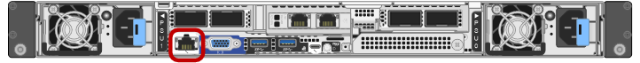
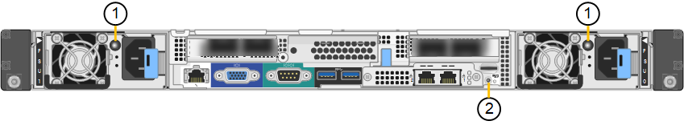
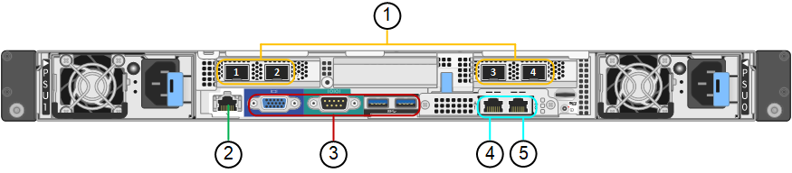
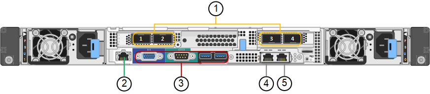

= SG100與SG1000應用裝置：總覽
:allow-uri-read: 
:icons: font
:imagesdir: ../media/

[role="lead"]
功能完善的SG100服務應用裝置和SG1000服務應用裝置可做為閘道節點和管理節點、在一個不穩定的系統中提供高可用度負載平衡服務。StorageGRID StorageGRID這兩種設備可同時做為閘道節點和管理節點（主要或非主要）運作。

== 應用裝置功能

服務應用裝置的兩種機型都提供下列功能：

* 閘道節點或管理節點功能StorageGRID 適用於一個不全系統。
* 旨在簡化節點部署與組態的《產品安裝程式（the StorageGRID
* 部署後、即可從StorageGRID 現有的管理節點或從下載到本機磁碟機的軟體存取此功能。為了進一步簡化部署程序、最新版軟體會在製造期間預先載入應用裝置。
* 用於監控和診斷部分應用裝置硬體的基礎板管理控制器（BMC）。
* 連線到所有三StorageGRID 個不完整網路的能力、包括Grid Network、管理網路和用戶端網路：
+
** SG100最多可支援四個10或25 GbE連線至Grid Network和Client Network。
** SG1000最多可支援四個10、25、40或100-GbE連線至Grid Network和Client Network。

== SG100和SG1000圖表

此圖顯示SG100和SG1000的正面、並已卸下擋板。從正面來說、除了擋板上的產品名稱之外、這兩種產品完全相同。

兩個固態硬碟（ SSD ）以橘色外框表示、用於儲存 StorageGRID 作業系統、並使用 RAID 1 進行鏡射以提供備援。當 SG100 或 SG1000 服務應用裝置設定為管理節點時、這些磁碟機可能會用於儲存稽核記錄、度量和資料庫表格。

其餘磁碟機插槽為空白。

此圖顯示電源供應器的位置、並識別 SG100 和 SG1000 背面的 LED 。其他狀態和活動 LED 位於應用裝置連接埠上。這些 LED 可能會因產品型號而異。

[cols="1a,2a,3a"]
|===
| 標註 | LED | 州/省 

 a| 
1.
 a| 
電源供應器 LED
 a| 
* 綠色、持續亮起：電源供應至產品、電源按鈕開啟。
* 綠色、閃爍：電源供應至產品、電源按鈕關閉。
* 熄滅：產品未通電。
* 琥珀色：電源供應器故障。

 a| 
2.
 a| 
識別 LED
 a| 
* 藍色、閃爍：表示設備位於機櫃或機架中。
* 藍色、恆亮：識別機櫃或機架中的設備。
* 不亮：機櫃或機架中無法識別產品的外觀。

|===

== SG100 連接器

此圖顯示SG100背面的連接器。

[cols="1a,2a,2a,2a"]
|===
| 標註 | 連接埠 | 類型 | 使用 

 a| 
1.
 a| 
網路連接埠1-4
 a| 
10/25-GbE、根據纜線或SFP收發器類型（支援SFP28和SFP+模組）、交換器速度和設定的連結速度
 a| 
連線到Grid Network和Client Network for StorageGRID the

 a| 
2.
 a| 
BMC管理連接埠
 a| 
1-GbE（RJ-45）
 a| 
連接至應用裝置基板管理控制器。

 a| 
3.
 a| 
診斷與支援連接埠
 a| 
* VGA
* 序列、115200 8-N-1
* USB

 a| 
保留以供技術支援使用。

 a| 
4.
 a| 
管理網路連接埠1
 a| 
1-GbE（RJ-45）
 a| 
將應用裝置連接至管理網路StorageGRID 以供其使用。

 a| 
5.
 a| 
管理網路連接埠2.
 a| 
1-GbE（RJ-45）
 a| 
選項：

* 與管理連接埠1連結、以建立與管理網路StorageGRID 的備援連線、以利執行支援。
* 保持中斷連線、可用於暫用本機存取（IP 169.254.0.1）。
* 安裝期間、如果 DHCP 指派的 IP 位址無法使用、請使用連接埠 2 進行 IP 組態。

|===

== SG1000 連接器

此圖顯示 SG1000 背面的連接器。

[cols="1a,2a,2a,2a"]
|===
| 標註 | 連接埠 | 類型 | 使用 

 a| 
1.
 a| 
網路連接埠1-4
 a| 
10/25/40/100-GbE、取決於纜線或收發器類型、交換器速度及設定的連結速度。原生支援QSFP28和QSFP+（40/100GbE）、而SFP28/SFP+收發器可搭配QSA（另售）使用10/25GbE速度。
 a| 
連線到Grid Network和Client Network for StorageGRID the

 a| 
2.
 a| 
BMC管理連接埠
 a| 
1-GbE（RJ-45）
 a| 
連接至應用裝置基板管理控制器。

 a| 
3.
 a| 
診斷與支援連接埠
 a| 
* VGA
* 序列、115200 8-N-1
* USB

 a| 
保留以供技術支援使用。

 a| 
4.
 a| 
管理網路連接埠1
 a| 
1-GbE（RJ-45）
 a| 
將應用裝置連接至管理網路StorageGRID 以供其使用。

 a| 
5.
 a| 
管理網路連接埠2.
 a| 
1-GbE（RJ-45）
 a| 
選項：

* 與管理連接埠1連結、以建立與管理網路StorageGRID 的備援連線、以利執行支援。
* 保持中斷連線、可用於暫用本機存取（IP 169.254.0.1）。
* 安裝期間、如果 DHCP 指派的 IP 位址無法使用、請使用連接埠 2 進行 IP 組態。

|===

== SG100與SG1000應用程式

您可以StorageGRID 透過多種方式設定支援服務應用裝置、以提供閘道服務、以及某些網格管理服務的備援功能。

應用裝置的部署方式如下：

* 將新的或現有的網格新增為閘道節點
* 將新網格新增為主要或非主要管理節點、或新增至現有網格作為非主要管理節點
* 同時以閘道節點和管理節點（主要或非主要）的形式運作

應用裝置可協助使用高可用度（HA）群組、並為S3或Swift資料路徑連線提供智慧型負載平衡。

下列範例說明如何最大化應用裝置的功能：

* 使用兩個SG100或兩個SG1000設備、將閘道服務設定為閘道節點、以提供閘道服務。
+

NOTE: 在相同站台中混合使用不同效能等級的服務應用裝置、例如 SG100 或 SG110 搭配 SG1000 或 SG1100 、可能會在高可用度群組中使用多個節點、或在多個服務應用裝置之間平衡用戶端負載時、導致無法預測且不一致的結果。

* 使用兩個SG100或兩個SG1000應用裝置來提供某些網格管理服務的備援功能。請將每個應用裝置設定為管理節點、以達成此目標。
* 使用兩個SG100或兩個SG1000應用裝置、透過一個或多個虛擬IP位址來提供高可用度的負載平衡和流量調整服務。將設備設定為管理節點或閘道節點的任意組合、並將兩個節點新增至同一個HA群組、即可達成此目標。
+

NOTE: 如果您在同一個 HA 群組中使用管理節點和閘道節點、則僅管理節點連接埠不會容錯移轉。請參閱的說明 https://docs.netapp.com/us-en/storagegrid/admin/configure-high-availability-group.html["設定 HA 群組"^]。

SG100與SG1000服務應用裝置搭配使用時StorageGRID 、可部署僅限應用裝置的網格、不需依賴外部Hypervisor或運算硬體。
