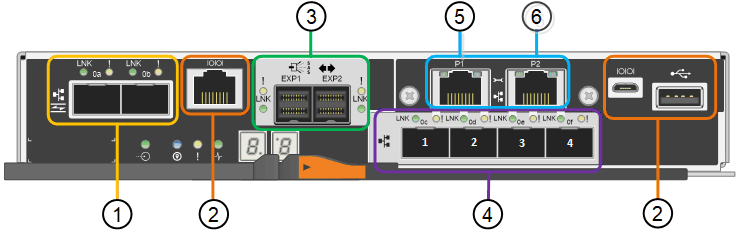

= SG5700應用裝置：總覽
:allow-uri-read: 
:icons: font
:imagesdir: ../media/

[role="lead"]
SG5700 StorageGRID 產品是整合式儲存與運算平台、可在StorageGRID 整個網格中作為儲存節點運作。此應用裝置可在混合式網格環境中使用、此環境結合了應用裝置儲存節點和虛擬（軟體型）儲存節點。

SSG5700系列應用裝置提供下列功能：StorageGRID

* 整合StorageGRID 適用於整個過程的儲存與運算元素。
* 包含StorageGRID 用來簡化儲存節點部署和組態的《不再》應用裝置安裝程式。
* 包含E系列SANtricity 的《支援硬體管理與監控的系統管理程式》。
* 支援最多四個10-GbE或25-GbE連線至StorageGRID 「支援網格網」和「用戶端網路」。
* 支援全磁碟加密（ FDE ）磁碟機或 FIPS 磁碟機。當這些磁碟機搭配SANtricity 使用時、無法在未經授權的情況下存取資料。

SG5700應用裝置共有四種機型：SG5712和SG5712X、以及SG5760和SG5760X。除了儲存控制器上互連連接埠的位置、SG5712與SG5712X之間沒有任何規格或功能差異。同樣地、 SG5760 與 SG5760X 之間也沒有規格或功能上的差異、但儲存控制器上的互連連接埠位置除外。

== SG5700 元件

SG5700 機型包含下列元件：

[role="tabbed-block"]
====
.SG5712
--
運算控制器:: E5700SG控制器
儲存控制器:: E2800A 控制器
機箱:: E系列DE212C機箱、雙機架單元（2U）機箱
磁碟機:: 12個NL-SAS磁碟機（3.5吋）
備援電源供應器與風扇:: 兩個電源風扇迴廊

--
.SG5712X
--
運算控制器:: E5700SG控制器
儲存控制器:: E2800B 控制器
機箱:: E系列DE212C機箱、雙機架單元（2U）機箱
磁碟機:: 12個NL-SAS磁碟機（3.5吋）
備援電源供應器與風扇:: 兩個電源風扇迴廊

--
.SG5760
--
運算控制器:: E5700SG控制器
儲存控制器:: E2800A 控制器
機箱:: E系列DE460C機箱、四個機架單元（4U）機箱
磁碟機:: 60 個 NL-SAS 磁碟機（ 3.5 吋）
備援電源供應器與風扇:: 兩個電源容器和兩個風扇容器

--
.SG5760X
--
運算控制器:: E5700SG控制器
儲存控制器:: E2800B 控制器
機箱:: E系列DE460C機箱、四個機架單元（4U）機箱
磁碟機:: 60 個 NL-SAS 磁碟機（ 3.5 吋）
備援電源供應器與風扇:: 兩個電源容器和兩個風扇容器

--
====
根據每個機箱內的磁碟機數量、可固定使用該產品的最大原始儲存容量StorageGRID 。您無法透過新增含有額外磁碟機的機櫃來擴充可用的儲存設備。

== SG5700 圖表

=== SG5712 前後視圖

圖中所示為 SG5712 的前後端、這是一款 2U 機箱、可容納 12 個磁碟機。

image::../media/sg5712_front_and_back_views.gif[SG5712應用裝置的正面和背面]

=== SG5712 元件

SG5712包含兩個控制器和兩個電源風扇迴管。

image::../media/sg5712_with_callouts.gif[SG5712應用裝置中的控制器和電源風扇容器]

[cols="1a,3a"]
|===
| 標註 | 說明 

 a| 
1.
 a| 
E2800A 控制器（儲存控制器）

 a| 
2.
 a| 
E5700SG控制器（運算控制器）

 a| 
3.
 a| 
電源風扇迴道

|===

=== SG5712X 前後視圖

圖中所示為 SG5712X 的前後端、這是一款 2U 機箱、可容納 12 個磁碟機。

image::../media/sg5712x_front_and_back_views.gif[SG5712X 應用裝置的前後方]

=== SG5712X 元件

SG5712X 包含兩個控制器和兩個電源風扇迴廊。

image::../media/sg5712x_with_callouts.gif[SG5712X 應用裝置中的控制器和電源風扇迴廊]

[cols="1a,3a"]
|===
| 標註 | 說明 

 a| 
1.
 a| 
E2800B 控制器（儲存控制器）

 a| 
2.
 a| 
E5700SG控制器（運算控制器）

 a| 
3.
 a| 
電源風扇迴道

|===

=== SG5760 前後視圖

圖中所示為 SG5760 機型的前後方、 4U 機箱可在 5 個磁碟機抽屜中容納 60 個磁碟機。

image::../media/sg5760_front_and_back_views.gif[SG5760應用裝置的正面和背面]

=== SG5760 元件

SG5760包含兩個控制器、兩個風扇迴管和兩個電源迴管。

image::../media/sg5760_with_callouts.gif[控制器,fan canisters,and power canisters in SG5760 appliance]

[cols="1a,2a"]
|===
| 標註 | 說明 

 a| 
1.
 a| 
E2800A 控制器（儲存控制器）

 a| 
2.
 a| 
E5700SG控制器（運算控制器）

 a| 
3.
 a| 
風扇容器（第1個、共2個）

 a| 
4.
 a| 
電力箱（第1頁、共2頁）

|===

=== SG5760X 前後視圖

圖中所示為 SG5760X 機型的前後方、 4U 機箱可在 5 個磁碟機抽屜中容納 60 個磁碟機。

image::../media/sg5760x_front_and_back_views.gif[SG5760X 應用裝置的前後方]

=== SG5760X 元件

SG5760X 包含兩個控制器、兩個風扇迴廊和兩個電源迴廊。

image::../media/sg5760x_with_callouts.gif[控制器,fan canisters,and power canisters in SG5760X appliance]

[cols="1a,3a"]
|===
| 標註 | 說明 

 a| 
1.
 a| 
E2800B 控制器（儲存控制器）

 a| 
2.
 a| 
E5700SG控制器（運算控制器）

 a| 
3.
 a| 
風扇容器（第1個、共2個）

 a| 
4.
 a| 
電力箱（第1頁、共2頁）

|===

== SG5700 控制器

12個磁碟機的SG5712和SG5712X、以及60個磁碟機的SG5760和SG5760X機型StorageGRID 、均包含E5700SG運算控制器和E系列E2800儲存控制器。

* SG5712和SG5760使用E2800A控制器。
* SG5712X和SG5760X使用E2800B控制器。

E2800A 和 E2800B 控制器的規格和功能完全相同、但互連連接埠的位置除外。

=== E5700SG 運算控制器

* 做為應用裝置的運算伺服器。
* 包含StorageGRID 《不再使用的應用程式安裝程式」。
+

NOTE: 應用裝置上未預先安裝此軟體。StorageGRID當您部署應用裝置時、可從管理節點存取此軟體。

* 可連線至所有三StorageGRID 個資訊網路、包括Grid Network、管理網路和用戶端網路。
* 連接至E2800控制器、並以啟動器的形式運作。

==== E5700SG 連接器

[cols="1a,2a,2a,2a"]
|===
| 標註 | 連接埠 | 類型 | 使用 

 a| 
1.
 a| 
互連連接埠1和2
 a| 
16Gb/s 光纖通道（ FC ）、光纖 SFP
 a| 
將E5700SG控制器連接至E2800控制器。

 a| 
2.
 a| 
診斷與支援連接埠
 a| 
* RJ-45序列連接埠
* Micro USB序列連接埠
* USB 連接埠

 a| 
保留以供技術支援使用。

 a| 
3.
 a| 
磁碟機擴充連接埠
 a| 
12Gb/s SAS
 a| 
未使用。

 a| 
4.
 a| 
網路連接埠1-4
 a| 
10-GbE或25-GbE、取決於SFP收發器類型、交換器速度及設定的連結速度
 a| 
連線到Grid Network和Client Network for StorageGRID the

 a| 
5.
 a| 
管理連接埠1
 a| 
1-GB（RJ-45）乙太網路
 a| 
連線至管理網路StorageGRID 以供使用。

 a| 
6.
 a| 
管理連接埠2.
 a| 
1-GB（RJ-45）乙太網路
 a| 
選項：

* 與管理連接埠1連結、以建立與管理網路StorageGRID 的備援連線、以利執行支援。
* 保留無線連線、可用於暫時的本機存取（IP 169.254.0.1）。
* 安裝期間、如果 DHCP 指派的 IP 位址無法使用、請使用連接埠 2 進行 IP 組態。

|===

=== E2800 儲存控制器

SG5700設備使用兩種版本的E2800儲存控制器：E2800A和E2800B。E2800A沒有HIC、E2800B則有四埠HIC。除了互連連接埠的位置之外、兩個控制器版本的規格和功能完全相同。

E2800系列儲存控制器規格如下：

* 作為應用裝置的儲存控制器運作。
* 管理磁碟機上的資料儲存。
* 在單工模式下、可作為標準E系列控制器使用。
* 包含SANtricity 作業系統軟體（控制器韌體）。
* 包含SANtricity 可監控應用裝置硬體、以及管理警示、AutoSupport 功能及磁碟機安全功能的《系統管理程式》。
* 連接至E5700SG控制器、並以目標方式運作。

==== E2800A 連接器

image::../media/e2800_controller_with_callouts.gif[E2800A 控制器上的連接器]

==== E2800B 連接器

image::../media/e2800B_controller_with_callouts.gif[E2800B 控制器上的連接器]

[cols="1a,2a,2a,2a"]
|===
| 標註 | 連接埠 | 類型 | 使用 

 a| 
1.
 a| 
互連連接埠1和2
 a| 
16Gb/s FC 光纖 SFP
 a| 
將 E2800 控制器連接至 E5700SG 控制器。

 a| 
2.
 a| 
管理連接埠1和2
 a| 
1-GB（RJ-45）乙太網路
 a| 
* 連接埠1選項：
+
** 連線至管理網路、即可直接從TCP/IP存取SANtricity 到「支援系統管理程式」
** 保留無線以儲存交換器連接埠和IP位址。  使用 Grid Manager 或 Storage Grid Appliance 安裝程式存取 SANtricity 系統管理員。

*附註*：當SANtricity 您選擇不有線連接連接埠1時、某些選用功能（例如NTP同步以取得準確的記錄時間戳記）無法使用。

*附註*：StorageGRID 若SANtricity 您離開連接埠1時、需要使用支援支援支援支援功能才能使用支援功能的支援功能。

* 連接埠2保留供技術支援使用。

 a| 
3.
 a| 
診斷與支援連接埠
 a| 
* RJ-45序列連接埠
* Micro USB序列連接埠
* USB 連接埠

 a| 
保留以供技術支援使用。

 a| 
4.
 a| 
磁碟機擴充連接埠。
 a| 
12Gb/s SAS
 a| 
未使用。

|===
.相關資訊
https://docs.netapp.com/us-en/e-series-family/index.html["NetApp E 系列文件"^]
