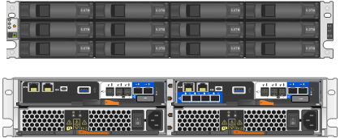
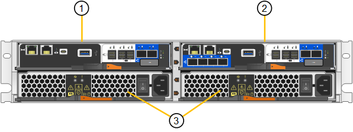
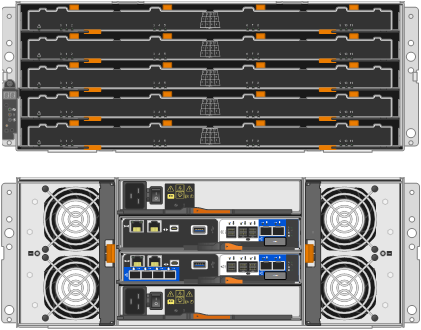
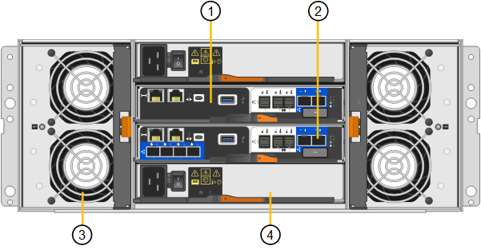
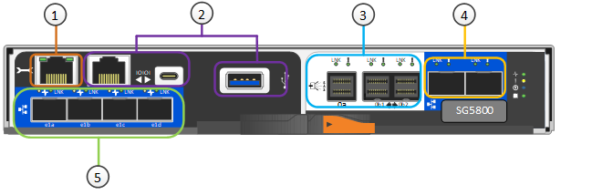

= SG5800 應用裝置：總覽
:allow-uri-read: 
:icons: font
:imagesdir: ../media/

[role="lead"]
SG5800 系列 StorageGRID 應用裝置是整合式儲存與運算平台、可在 StorageGRID 網格中作為儲存節點運作。

StorageGRID SG5800 系列應用裝置提供下列功能：

* 整合StorageGRID 適用於整個過程的儲存與運算元素。
* 包含StorageGRID 用來簡化儲存節點部署和組態的《不再》應用裝置安裝程式。
* 包括 E 系列 SANtricity 系統管理程式、用於硬體管理與監控。
* 支援最多四個10-GbE或25-GbE連線至StorageGRID 「支援網格網」和「用戶端網路」。
* 支援全磁碟加密（ FDE ）磁碟機或 FIPS 磁碟機。當這些磁碟機搭配SANtricity 使用時、無法在未經授權的情況下存取資料。

SG5800 應用裝置有兩種機型： SG5812 和 SG5860 。

== SG5800 元件

SG5800 機型包括下列元件：

[role="tabbed-block"]
====
.SG5812
--
運算控制器:: SG5800 控制器
儲存控制器:: E4000 控制器
機箱:: E系列DE212C機箱、雙機架單元（2U）機箱
磁碟機:: 12個NL-SAS磁碟機（3.5吋）
備援電源供應器與風扇:: 兩個電源風扇迴廊

--
.SG5860
--
運算控制器:: SG5800 控制器
儲存控制器:: E4000 控制器
機箱:: E系列DE460C機箱、四個機架單元（4U）機箱
磁碟機:: 60 個 NL-SAS 磁碟機（ 3.5 吋）
備援電源供應器與風扇:: 兩個電源容器和兩個風扇容器

--
====
根據每個機箱內的磁碟機數量、可固定使用該產品的最大原始儲存容量StorageGRID 。您無法透過新增含有額外磁碟機的機櫃來擴充可用的儲存設備。

== SG5800 圖表

=== SG5812 前後視圖

圖中顯示 SG5812 的前後方、這是一款 2U 機箱、可容納 12 個磁碟機。

=== SG5812 元件

SG5812 包含兩個控制器和兩個電源風扇迴廊。

[cols="1a,3a"]
|===
| 標註 | 說明 

 a| 
1.
 a| 
E4000 控制器（儲存控制器）

 a| 
2.
 a| 
SG5800 控制器（運算控制器）

 a| 
3.
 a| 
電源風扇迴道

|===

=== SG5860 前後視圖

圖中所示為 SG5860 機型的前後方、 4U 機箱可在 5 個磁碟機抽屜中容納 60 個磁碟機。

=== SG5860 元件

SG5860 包含兩個控制器、兩個風扇迴廊和兩個電源迴廊。

[cols="1a,2a"]
|===
| 標註 | 說明 

 a| 
1.
 a| 
E4000 控制器（儲存控制器）

 a| 
2.
 a| 
SG5800 控制器（運算控制器）

 a| 
3.
 a| 
風扇容器（第1個、共2個）

 a| 
4.
 a| 
電力箱（第1頁、共2頁）

|===

== SG5800 控制器

12 個磁碟機 SG5812 和 60 個磁碟機 SG5860 機型的 StorageGRID 應用裝置均包含 SG5800 運算控制器和 E 系列 E4000 儲存控制器。

=== SG5800 運算控制器

* 做為應用裝置的運算伺服器。
* 包含StorageGRID 《不再使用的應用程式安裝程式」。
+

NOTE: 應用裝置上未預先安裝此軟體。StorageGRID當您部署應用裝置時、可從管理節點存取此軟體。

* 可連線至所有三StorageGRID 個資訊網路、包括Grid Network、管理網路和用戶端網路。
* 連接至 E4000 控制器、並以啟動器的形式運作。

==== SG5800 連接器

[cols="1a,2a,2a,2a"]
|===
| 標註 | 連接埠 | 類型 | 使用 

 a| 
1.
 a| 
管理連接埠1
 a| 
1-GB（RJ-45）乙太網路
 a| 
連線至管理網路StorageGRID 以供使用。

 a| 
2.
 a| 
診斷與支援連接埠
 a| 
* RJ-45序列連接埠
* USB-C 序列連接埠
* USB 連接埠

 a| 
保留以供技術支援使用。

 a| 
3.
 a| 
磁碟機擴充連接埠
 a| 
12Gb/s SAS
 a| 
未使用。

 a| 
4.
 a| 
互連連接埠1和2
 a| 
25GbE iSCSI
 a| 
將 SG5800 控制器連接至 E4000 控制器。

 a| 
5.
 a| 
網路連接埠1-4
 a| 
10-GbE或25-GbE、取決於SFP收發器類型、交換器速度及設定的連結速度
 a| 
連線到Grid Network和Client Network for StorageGRID the

|===

=== E4000 儲存控制器

E4000 系列儲存控制器具有下列規格：

* 作為應用裝置的儲存控制器運作。
* 管理磁碟機上的資料儲存。
* 在單工模式下、可作為標準E系列控制器使用。
* 包含SANtricity 作業系統軟體（控制器韌體）。
* 包含SANtricity 可監控應用裝置硬體、以及管理警示、AutoSupport 功能及磁碟機安全功能的《系統管理程式》。
* 連接 SG5800 控制器並作為目標運作。

==== E4000 連接器

image::../media/e4000_controller_with_callouts.png[E4000 控制器上的連接器]

[cols="1a,2a,2a,2a"]
|===
| 標註 | 連接埠 | 類型 | 使用 

 a| 
1.
 a| 
管理連接埠
 a| 
1-GB（RJ-45）乙太網路
 a| 
連接埠選項：
** 連線至管理網路、以啟用對 SANtricity 系統管理員的直接 TCP/IP 存取
** 保留無線以儲存交換器連接埠和 IP 位址。  使用 Grid Manager 或 Storage Grid Appliance 安裝程式存取 SANtricity 系統管理員。

* 附註 * ：當您選擇不使用管理連接埠時、某些選擇性的 SANtricity 功能（例如 NTP 同步以取得準確的記錄時間戳記）將無法使用。

* 附註 * ：如果您不使用有線連線離開管理連接埠、則需要 StorageGRID 11.8 或更新版本、以及 SANtricity 11.8 或更新版本。

 a| 
2.
 a| 
診斷與支援連接埠
 a| 
* RJ-45序列連接埠
* USB-C 序列連接埠
* USB 連接埠

 a| 
保留以供技術支援使用。

 a| 
3.
 a| 
磁碟機擴充連接埠。
 a| 
12Gb/s SAS
 a| 
未使用。

 a| 
4.
 a| 
互連連接埠1和2
 a| 
25GbE iSCSI
 a| 
將 E4000 控制器連接至 SG5800 控制器。

|===
.相關資訊
http://mysupport.netapp.com/info/web/ECMP1658252.html["NetApp E系列系統文件網站"^]
