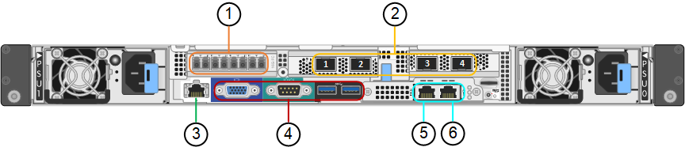
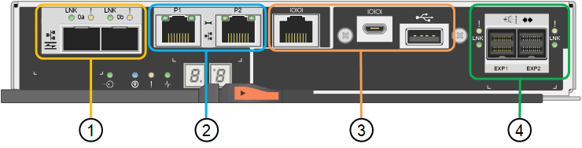
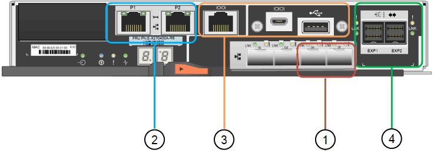

= SG6060 和 SG6060X 設備：總覽
:allow-uri-read: 
:icons: font
:imagesdir: ../media/

[role="lead"]
《SESSG6060與SG60X應用裝置：StorageGRID 運算控制器與儲存控制器櫃、包含兩個儲存控制器與60個磁碟機。

您也可以選擇將60個磁碟機擴充櫃新增至這兩個應用裝置。SG6060 與 SG6060X 之間沒有規格或功能上的差異、儲存控制器上的互連連接埠位置除外。

== SG6060與SG6060X元件

SG6060 和 SG6060X 設備包括下列元件：

運算控制器:: SG6000-CN 控制器是單機架單元（ 1U ）伺服器、包括：
+
--
* 40個核心（80個執行緒）
* 192 GB RAM
* 高達4 x 25 Gbps的Aggregate乙太網路頻寬
* 4 x 16 Gbps光纖通道（FC）互連
* 基礎板管理控制器（BMC）、可簡化硬體管理
* 備援電源供應器

--
儲存控制器機櫃:: E 系列 E2860 控制器機櫃（儲存陣列）是 4U 機櫃、包括：
+
--
* 兩個E2800系列控制器（雙工組態）、提供儲存控制器容錯移轉支援
+
** SG6060內含E2800A儲存控制器
** SG6060X包含E2800B儲存控制器

* 五個抽屜式磁碟機櫃、可容納60個3.5吋磁碟機（2個固態磁碟機或SSD、以及58個NL-SAS磁碟機）
* 備援電源供應器與風扇

--
選用：儲存擴充櫃:: 每個 SG6060 和 SG6060X 應用裝置都可以有一個或兩個擴充機櫃、總共可容納 180 個磁碟機（其中兩個磁碟機保留給 E 系列讀取快取記憶體）。
+
--
*附註：*擴充磁碟櫃可在初始部署期間安裝、或於稍後新增。

E 系列 DE460C 機櫃是 4U 機櫃、包括：

* 兩個輸入/輸出模組（IOM）
* 五個抽取器、每個抽取12個NL-SAS磁碟機、總共可容納60個磁碟機
* 備援電源供應器與風扇

--

== SG6060 和 SG6060X 圖表

SG6060 和 SG6060X 的正面完全相同。

=== SG6060 或 SG6060X 正面視圖

此圖顯示 SG6060 或 SG6060X 的正面、其中包括 1U 運算控制器、以及包含兩個儲存控制器和 60 個磁碟機的 4U 機櫃、位於五個磁碟機抽屜中。

image::../media/sg6060_front_view_with_and_without_bezels.gif[SG6060前視圖]

[cols="1a,2a"]
|===
| 標註 | 說明 

 a| 
1.
 a| 
SG6000-CN-含前擋板的運算控制器

 a| 
2.
 a| 
E2860控制器機櫃搭配前擋板（選購的擴充櫃看起來完全相同）

 a| 
3.
 a| 
SG6000-CN-移除前擋板的運算控制器

 a| 
4.
 a| 
E2860控制器機櫃（已卸下前擋板）（可選的擴充櫃看起來相同）

|===
此圖顯示電源供應器的位置、並識別 SG6060 和 SG6060X 所用 SG6000-CN 運算控制器後方的 LED 。其他狀態和活動 LED 位於應用裝置連接埠上。這些 LED 可能會因產品型號而異。

image::../media/q2023_rear_leds.png[後置 LED SG6000-CN]

[cols="1a,2a,3a"]
|===
| 標註 | LED | 州/省 

 a| 
1.
 a| 
電源供應器 LED
 a| 
* 綠色、持續亮起：電源供應至產品、電源按鈕開啟。
* 綠色、閃爍：電源供應至產品、電源按鈕關閉。
* 熄滅：產品未通電。
* 琥珀色：電源供應器故障。

 a| 
2.
 a| 
識別 LED
 a| 
* 藍色、閃爍：表示設備位於機櫃或機架中。
* 藍色、恆亮：識別機櫃或機架中的設備。
* 不亮：機櫃或機架中無法識別產品的外觀。

|===

=== SG6060 後視圖

此圖顯示SG6060的背面、包括運算與儲存控制器、風扇和電源供應器。

image::../media/sg6060_rear_view.gif[SG6060後視圖]

[cols="1a,2a"]
|===
| 標註 | 說明 

 a| 
1.
 a| 
SG6000-CN-運算控制器的電源供應器（圖1）

 a| 
2.
 a| 
SG6000-CN-運算控制器的連接器

 a| 
3.
 a| 
E2860控制器機櫃的風扇（圖1）

 a| 
4.
 a| 
E 系列 E2800A 儲存控制器（圖 1 ）和連接器

 a| 
5.
 a| 
E2860控制器機櫃的電源供應器（圖1）

|===

=== SGXX 後視圖

此圖顯示 SG6060X 的背面。

image::../media/sg6060x_rear_view.gif[SGS106 x 後視圖]

[cols="1a,2a"]
|===
| 標註 | 說明 

 a| 
1.
 a| 
SG6000-CN-運算控制器的電源供應器（圖1）

 a| 
2.
 a| 
SG6000-CN-運算控制器的連接器

 a| 
3.
 a| 
E2860控制器機櫃的風扇（圖1）

 a| 
4.
 a| 
E 系列 E2800B 儲存控制器（圖 1 ）和連接器

 a| 
5.
 a| 
E2860控制器機櫃的電源供應器（圖1）

|===

=== 擴充機櫃

此圖顯示SG6060和SG6060X選用擴充櫃的背面、包括輸入/輸出模組（IOM）、風扇和電源供應器。每個SG6060都可以安裝一個或兩個擴充櫃、這些擴充櫃可在初始安裝中隨附、或是稍後新增。

image::../media/de460c_expansion_shelf_rear_view.gif[擴充櫃後方]

[cols="1a,2a"]
|===
| 標註 | 說明 

 a| 
1.
 a| 
擴充櫃的風扇（圖1）

 a| 
2.
 a| 
用於擴充櫃的IOM（2之1）

 a| 
3.
 a| 
擴充櫃的電源供應器（圖1）

|===

== SG6000 控制器

根據機型而定、每種機型StorageGRID 的《SESSG6000應用》裝置都包含一個1U機箱中的SG6000-CN-CN-Compute Controller、以及2U或4U機箱中的雙工E系列儲存控制器。檢閱圖表以深入瞭解每種控制器類型。

=== SG6000-CN 運算控制器

* 提供應用裝置的運算資源。
* 包含StorageGRID 《不再使用的應用程式安裝程式」。
+

NOTE: 應用裝置上未預先安裝此軟體。StorageGRID當您部署應用裝置時、系統會從管理節點擷取此軟體。

* 可連線至所有三StorageGRID 個資訊網路、包括Grid Network、管理網路和用戶端網路。
* 連接至E系列儲存控制器、並以啟動器的形式運作。

==== SG6000-CN 連接器

[cols="1a,2a,2a,3a"]
|===
| 標註 | 連接埠 | 類型 | 使用 

 a| 
1.
 a| 
互連連接埠1-4
 a| 
16 Gb/s光纖通道（FC）、搭配整合式光纖
 a| 
將SG6000-CN-控制器連接至E2800控制器（每個E2800有兩個連線）。

 a| 
2.
 a| 
網路連接埠1-4
 a| 
10-GbE或25-GbE、取決於纜線或SFP收發器類型、交換器速度及設定的連結速度
 a| 
連線到Grid Network和Client Network for StorageGRID the

 a| 
3.
 a| 
BMC管理連接埠
 a| 
1-GbE（RJ-45）
 a| 
連接至SG6000-CN-基板管理控制器。

 a| 
4.
 a| 
診斷與支援連接埠
 a| 
* VGA
* 序列、115200 8-N-1
* USB

 a| 
保留以供技術支援使用。

 a| 
5.
 a| 
管理網路連接埠1
 a| 
1-GbE（RJ-45）
 a| 
將SG6000-CN-連接到管理網路StorageGRID 以供實現

 a| 
6.
 a| 
管理網路連接埠2.
 a| 
1-GbE（RJ-45）
 a| 
選項：

* 與管理連接埠1連結、以建立與管理網路StorageGRID 的備援連線、以利執行支援。
* 保留無線連線、可用於暫時的本機存取（IP 169.254.0.1）。
* 安裝期間、如果 DHCP 指派的 IP 位址無法使用、請使用連接埠 2 進行 IP 組態。

|===

=== SGF6024 ： EF570 儲存控制器

* 兩個控制器可支援容錯移轉。
* 管理磁碟機上的資料儲存。
* 可在雙工組態中作為標準E系列控制器。
* 包含SANtricity 作業系統軟體（控制器韌體）。
* 包含SANtricity 可監控儲存硬體及管理警示、AutoSupport 功能部件和磁碟機安全功能的《系統管理程式》。
* 連接至SG6000-CN-控制器、並提供Flash儲存設備的存取權。

==== EF570 連接器

image::../media/ef570_rear_connectors.gif[EF570後置連接器]

[cols="1a,2a,2a,3a"]
|===
| 標註 | 連接埠 | 類型 | 使用 

 a| 
1.
 a| 
互連連接埠1和2
 a| 
16 Gb/s FC 光纖 SFP
 a| 
將每個EF570控制器連接至SG6000-CN.

SG6000-CN 控制器有四個連線（每個 EF570 有兩個連線）。

 a| 
2.
 a| 
診斷與支援連接埠
 a| 
* RJ-45序列連接埠
* Micro USB序列連接埠
* USB 連接埠

 a| 
保留以供技術支援使用。

 a| 
3.
 a| 
磁碟機擴充連接埠
 a| 
12Gb/s SAS
 a| 
未使用。SGF6024應用裝置不支援擴充磁碟機櫃。

 a| 
4.
 a| 
管理連接埠1和2
 a| 
1-GB（RJ-45）乙太網路
 a| 
* 連接埠1會連線至網路、您可在SANtricity 瀏覽器上存取《支援系統管理程式》。
* 連接埠2保留供技術支援使用。

|===

=== SG6060 和 SG6060X ： E2800 儲存控制器

* 兩個控制器可支援容錯移轉。
* 管理磁碟機上的資料儲存。
* 可在雙工組態中作為標準E系列控制器。
* 包含SANtricity 作業系統軟體（控制器韌體）。
* 包含SANtricity 可監控儲存硬體及管理警示、AutoSupport 功能部件和磁碟機安全功能的《系統管理程式》。
* 連接至SG6000-CN-控制器、並提供儲存設備存取權。

SG6060 和 SG6060X 使用 E2800 儲存控制器。

[cols="1a,2a,2a"]
|===
| 應用裝置 | 控制器 | 控制器 HIC 

 a| 
SG6060
 a| 
兩個E2800A儲存控制器
 a| 
無

 a| 
SGXX
 a| 
兩個 E2800B 儲存控制器
 a| 
四埠 HIC

|===
除了互連連接埠的位置、E2800A和E2800B儲存控制器在規格和功能上完全相同。

CAUTION: 請勿在同一個產品中使用 E2800A 和 E2800B 。

==== E2800A 連接器

[cols="1a,2a,2a,3a"]
|===
| 標註 | 連接埠 | 類型 | 使用 

 a| 
1.
 a| 
互連連接埠1和2
 a| 
16 Gb/s FC 光纖 SFP
 a| 
將每個 E2800A 控制器連接至 SG6000-CN 控制器。

SG6000-CN-控制器有四個連線（每個E2800A各兩個）。

 a| 
2.
 a| 
管理連接埠1和2
 a| 
1-GB（RJ-45）乙太網路
 a| 
* 連接埠1選項：
+
** 連線至管理網路、即可直接從TCP/IP存取SANtricity 到「支援系統管理程式」
** 保留無線以儲存交換器連接埠和IP位址。  使用 Grid Manager 或 Storage Grid Appliance 安裝程式存取 SANtricity 系統管理員。

*附註*：當SANtricity 您選擇不有線連接連接埠1時、某些選用功能（例如NTP同步以取得準確的記錄時間戳記）無法使用。

*附註*：StorageGRID 若SANtricity 您離開連接埠1時、需要使用支援支援支援支援功能才能使用支援功能的支援功能。

* 連接埠2保留供技術支援使用。

 a| 
3.
 a| 
診斷與支援連接埠
 a| 
* RJ-45序列連接埠
* Micro USB序列連接埠
* USB 連接埠

 a| 
保留以供技術支援使用。

 a| 
4.
 a| 
磁碟機擴充連接埠1和2
 a| 
12Gb/s SAS
 a| 
將連接埠連接至擴充櫃中IOM上的磁碟機擴充連接埠。

|===

==== E2800B 連接器

[cols="1a,2a,2a,3a"]
|===
| 標註 | 連接埠 | 類型 | 使用 

 a| 
1.
 a| 
互連連接埠1和2
 a| 
16 Gb/s FC 光纖 SFP
 a| 
將每個 E2800B 控制器連接至 SG6000-CN 控制器。

SG6000-CN 控制器有四個連線（每個 E2800B 有兩個連線）。

 a| 
2.
 a| 
管理連接埠1和2
 a| 
1-GB（RJ-45）乙太網路
 a| 
* 連接埠1選項：
+
** 連線至管理網路、即可直接從TCP/IP存取SANtricity 到「支援系統管理程式」
** 保留無線以儲存交換器連接埠和IP位址。使用 Grid Manager 或 Storage Grid Appliance 安裝程式存取 SANtricity 系統管理員。

*附註*：當SANtricity 您選擇不有線連接連接埠1時、某些選用功能（例如NTP同步以取得準確的記錄時間戳記）無法使用。

*附註*：StorageGRID 若SANtricity 您離開連接埠1時、需要使用支援支援支援支援功能才能使用支援功能的支援功能。

* 連接埠2保留供技術支援使用。

 a| 
3.
 a| 
診斷與支援連接埠
 a| 
* RJ-45序列連接埠
* Micro USB序列連接埠
* USB 連接埠

 a| 
保留以供技術支援使用。

 a| 
4.
 a| 
磁碟機擴充連接埠1和2
 a| 
12Gb/s SAS
 a| 
將連接埠連接至擴充櫃中IOM上的磁碟機擴充連接埠。

|===

=== SG6060 和 SG6060X ：適用於選購擴充機櫃的 IOM

擴充櫃包含兩個輸入/輸出模組（IOM）、可連接至儲存控制器或其他擴充櫃。

==== IOM 連接器

image::../media/iom_connectors.gif[IOM背面]

[cols="1a,2a,2a,3a"]
|===
| 標註 | 連接埠 | 類型 | 使用 

 a| 
1.
 a| 
磁碟機擴充連接埠1-4
 a| 
12Gb/s SAS
 a| 
將每個連接埠連接至儲存控制器或其他擴充櫃（如果有）。

|===