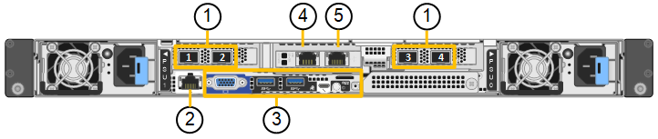
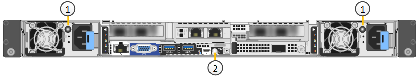
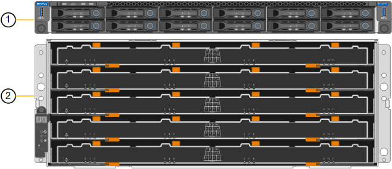
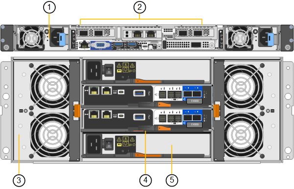
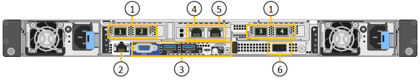
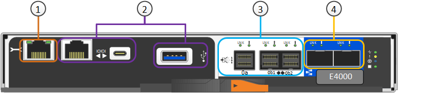

= SG6100 應用裝置：總覽
:allow-uri-read: 
:icons: font
:imagesdir: ../media/

[role="lead"]
StorageGRID SG6100 系列應用裝置在 StorageGRID 系統中作為儲存節點運作。  就像所有 StorageGRID 應用裝置一樣、它們可以在單一部署中自由地與其他應用裝置機型和純軟體節點混用。

StorageGRID SG6160 應用裝置包含一組 NVMe SSD 作為讀取快取的運算控制器、以及包含兩個儲存控制器和 60 個 NL-SAS 硬碟的儲存控制器機櫃。最多可新增兩個選購的擴充機櫃、擴充至最多 180 個 NL-SAS 硬碟。StorageGRID SGF6112 應用裝置是一款全快閃應用裝置、採用 12 個 NVMe SSD 的小型 1U 尺寸規格。

SGF6112 和 SG6160 應用裝置提供下列功能：

* 整合StorageGRID 了適用於整個過程的儲存與運算元素。
* 包含StorageGRID 旨在簡化儲存節點部署與組態的《不再》應用裝置安裝程式。
* 內含用於監控及診斷運算控制器硬體的基礎板管理控制器（ BMC ）。

SGF6112 提供下列資料保護功能：

* 在單一 SSD 故障後仍能運作、不會影響物件可用度。
* 可在多個 SSD 故障後運作、並將物件可用度降至最低（根據基礎 RAID 配置的設計）。
+

NOTE: 視您設定的 ILM 原則而定、對本機不可用物件的要求可由其他節點提供服務、因此可用度通常不會降低。

* 在服務期間、 SSD 故障不會對節點根磁碟區（ StorageGRID 作業系統）的 RAID 外殼造成嚴重損壞、因此可完全恢復。
* 如果多個 SSD 故障導致本機資料遺失、則可從其他節點上的複本或刪除編碼區塊自動還原物件資料。
* 能夠作為 https://docs.netapp.com/us-en/storagegrid/admin/managing-load-balancing.html["具有快取的網關節點"^]。

SG6160 提供下列資料保護功能：

* 在任何兩個硬碟機（ HDD ）故障後都能正常運作、不會影響物件可用度。
* 在故障和更換事件期間（在安裝期間為 DDP 或 DDP16 設定）、快速清空和重建 HDD 、以改善資料與標準 RAID6 的耐用度。
* 在服務期間、可完全從任何兩個 HDD 故障恢復。
* 如果多個 HDD 故障導致本機資料遺失、則可從其他節點上的複本或刪除編碼區塊自動還原物件資料。

== SG6100 硬體元件

=== SGF6112 應用裝置

SGF6112 應用裝置包含下列元件：

運算與儲存平台:: 單機架單元（ 1U ）伺服器、包括：
+
--
* 兩個 2.1/2.6 GHz 165 W 處理器、提供 48 核心（ 96 執行緒）
* 256 GB RAM
* 2 個 1/10 GBase-T 連接埠
* 4 個 10/25 GbE 乙太網路連接埠、用於網格 / 用戶端網路流量
* 1 個 256 GB 內部開機磁碟機（包括 StorageGRID 軟體）
* 基礎板管理控制器（BMC）、可簡化硬體管理
* 備援電源供應器與風扇

--

=== SG6160 應用裝置

SG6160 應用裝置包含下列元件：

運算控制器:: SG6100-CN 控制器是單機架單元（ 1U ）伺服器、其中包括：
+
--
* 48 核心（ 96 執行緒）
* 256 GB RAM
* 最高 4 × 25 GbE 聚合式乙太網路頻寬（或 4 x 100 GbE 搭配選購的 100 g NIC SKU ）
* 1 x 100 GbE 互連
* 兩個用於讀取快取的 NVMe SSD
* 基礎板管理控制器（BMC）、可簡化硬體管理
* 備援電源供應器與風扇

--
儲存控制器機櫃:: E 系列 E4000 控制器機櫃（儲存陣列）是 4U 機櫃、包括：
+
--
* 兩個 E4000 系列控制器（雙工組態）、可提供儲存控制器容錯移轉支援
* 五個抽屜的磁碟機櫃、可容納 60 個 3.5 吋 NL-SAS 磁碟機
* 備援電源供應器與風扇

--
選用：儲存擴充櫃:: 每個 SG6160 應用裝置都可以有一個或兩個擴充櫃、總共可容納 180 個磁碟機。
+
--

NOTE: 擴充機櫃可在初始部署期間安裝、或稍後再新增。

E 系列 DE460C 機櫃是 4U 機櫃、包括：

* 兩個輸入/輸出模組（IOM）
* 五個抽取器、每個抽取12個NL-SAS磁碟機、總共可容納60個磁碟機
* 備援電源供應器與風扇

--

== SGF6112 和 SG6160 圖表

=== SGF6112 正面視圖

此圖顯示 SGF6112 的正面、不含擋板。此應用裝置包含 1U 運算與儲存平台、內含 12 個 SSD 磁碟機。

image::../media/sgf6112_front_with_ssds.png[SGF6112 正面視圖]

=== SGF6112 後視圖

此圖顯示 SGF6112 的背面、包括連接埠、風扇和電源供應器。

[cols="1a,2a,2a,2a"]
|===
| 標註 | 連接埠 | 類型 | 使用 

 a| 
1.
 a| 
網路連接埠1-4
 a| 
10/25-GbE 、根據纜線或 SFP 收發器類型（支援 SFP28 和 SFP+ 模組）、交換器速度和設定的連結速度。
 a| 
連線到Grid Network和Client Network for StorageGRID the

 a| 
2.
 a| 
BMC管理連接埠
 a| 
1-GbE（RJ-45）
 a| 
連接至應用裝置基板管理控制器。

 a| 
3.
 a| 
診斷與支援連接埠
 a| 
* VGA
* USB
* Micro-USB 主控台連接埠
* Micro-SD 插槽模組

 a| 
保留以供技術支援使用。

 a| 
4.
 a| 
管理網路連接埠1
 a| 
1/10-GbE （ RJ-45 ）
 a| 
將應用裝置連接至管理網路StorageGRID 以供其使用。

 a| 
5.
 a| 
管理網路連接埠2.
 a| 
1/10-GbE （ RJ-45 ）
 a| 
選項：

* 與管理網路連接埠 1 連結、以建立與 StorageGRID 管理網路的備援連線。
* 保持中斷連線、可用於暫用本機存取（IP 169.254.0.1）。
* 安裝期間、如果 DHCP 指派的 IP 位址無法使用、請使用連接埠 2 進行 IP 組態。

|===
此圖顯示電源供應器的位置、並識別 SGF6112 背面的 LED 。其他狀態和活動 LED 位於應用裝置連接埠上。這些 LED 可能會因產品型號而異。

[cols="1a,2a,3a"]
|===
| 標註 | LED | 州/省 

 a| 
1.
 a| 
電源供應器 LED
 a| 
* 綠色、持續亮起：電源供應至產品、電源按鈕開啟。
* 綠色、閃爍：電源供應至產品、電源按鈕關閉。
* 熄滅：產品未通電。
* 琥珀色：電源供應器故障。

 a| 
2.
 a| 
識別 LED
 a| 
* 藍色、閃爍：表示設備位於機櫃或機架中。
* 藍色、恆亮：識別機櫃或機架中的設備。
* 不亮：機櫃或機架中無法識別產品的外觀。

|===

=== SG6160 正面視圖

此圖顯示 SG6160 的正面、其中包括 1U 運算控制器和 4U 機櫃、其中包含兩個儲存控制器和 60 個磁碟機、位於五個磁碟機抽屜中。

[cols="1a,2a"]
|===
| 標註 | 說明 

 a| 
1.
 a| 
SG6100-CN 運算控制器、前擋板已移除

 a| 
2.
 a| 
E4000 控制器機櫃、已卸下前擋板（選購的擴充機櫃看起來相同）

|===

=== SG6160 後視圖

此圖顯示 SG6160 的背面、包括運算與儲存控制器、風扇和電源供應器。

[cols="1a,2a"]
|===
| 標註 | 說明 

 a| 
1.
 a| 
SG6100-CN 運算控制器的電源供應器（第 1 / 2 ）

 a| 
2.
 a| 
SG6100-CN 運算控制器的連接器

 a| 
3.
 a| 
E4000 控制器機櫃的風扇（第 1 / 2 ）

 a| 
4.
 a| 
E 系列 E400 儲存控制器（圖 1 ）和連接器

 a| 
5.
 a| 
E4000 控制器機櫃的電源供應器（第 1 / 2 ）

|===

== SG6100 控制器

=== SG6100-CN 運算控制器

* 提供應用裝置的運算資源。
* 包含StorageGRID 《不再使用的應用程式安裝程式」。
+

NOTE: 應用裝置上未預先安裝此軟體。StorageGRID當您部署應用裝置時、系統會從管理節點擷取此軟體。

* 可連線至所有三StorageGRID 個資訊網路、包括Grid Network、管理網路和用戶端網路。
* 連接至E系列儲存控制器、並以啟動器的形式運作。

此圖顯示 SG6100-CN 運算控制器背面的連接埠。

[cols="1a,2a,2a,3a"]
|===
| 標註 | 連接埠 | 類型 | 使用 

 a| 
1.
 a| 
網路連接埠1-4
 a| 
* 以纜線或 SFP 收發器類型為基礎的 10/25-GbE （支援 SFP28 和 SFP+ 模組）、交換器速度和設定的連結速度。
* 搭配選購的 100g NIC SKU （僅限 SG6160 ）、以纜線或收發器類型、交換器速度及設定的連結速度為基礎、提供 10/25/40/100-GbE 。原生支援 QSFP56 （限於 100GbE/port ）、 QSFP28 （ 100GbE ）和 QSFP+ （ 40GbE ）。選購的 SFP+ （ 10GbE ）或 SFP28 （ 25GbE ）收發器可搭配 QSA （另售）使用。

 a| 
連線到Grid Network和Client Network for StorageGRID the

 a| 
2.
 a| 
BMC管理連接埠
 a| 
1-GbE（RJ-45）
 a| 
連線至 SG6100-CN 主機板管理控制器。

 a| 
3.
 a| 
診斷與支援連接埠
 a| 
* VGA
* USB
* Micro-USB 主控台連接埠
* Micro-SD 插槽模組

 a| 
保留以供技術支援使用。

 a| 
4.
 a| 
管理網路連接埠1
 a| 
1/10-GbE （ RJ-45 ）
 a| 
將 SG6100-CN 連接至 StorageGRID 的管理網路。

 a| 
5.
 a| 
管理網路連接埠2.
 a| 
1/10-GbE （ RJ-45 ）
 a| 
選項：

* 與管理連接埠1連結、以建立與管理網路StorageGRID 的備援連線、以利執行支援。
* 保留無線連線、可用於暫時的本機存取（IP 169.254.0.1）。
* 安裝期間、如果 DHCP 指派的 IP 位址無法使用、請使用連接埠 2 進行 IP 組態。

 a| 
6.
 a| 
互連連接埠
 a| 
100-GbE
 a| 
將 SG6100-CN 控制器連接至 E4000 控制器。

|===
此圖顯示電源供應器的位置、並識別 SG6100-CN 運算控制器後方的 LED 。其他狀態和活動 LED 位於應用裝置連接埠上。這些 LED 可能會因產品型號而異。

image::../media/q2023_rear_leds.png[後置 LED SG6100-CN]

[cols="1a,2a,3a"]
|===
| 標註 | LED | 州/省 

 a| 
1.
 a| 
電源供應器 LED
 a| 
* 綠色、持續亮起：電源供應至產品、電源按鈕開啟。
* 綠色、閃爍：電源供應至產品、電源按鈕關閉。
* 熄滅：產品未通電。
* 琥珀色：電源供應器故障。

 a| 
2.
 a| 
識別 LED
 a| 
* 藍色、閃爍：表示設備位於機櫃或機架中。
* 藍色、恆亮：識別機櫃或機架中的設備。
* 不亮：機櫃或機架中無法識別產品的外觀。

|===

=== SG6160 ： E4000 儲存控制器

* 兩個控制器可支援容錯移轉。
* 管理磁碟機上的資料儲存。
* 可在雙工組態中作為標準E系列控制器。
* 包含SANtricity 作業系統軟體（控制器韌體）。
* 包含SANtricity 可監控儲存硬體及管理警示、AutoSupport 功能部件和磁碟機安全功能的《系統管理程式》。
* 連接 SG6100-CN 控制器、即可存取儲存設備。

[cols="1a,2a,2a,3a"]
|===
| 標註 | 連接埠 | 類型 | 使用 

 a| 
1.
 a| 
管理連接埠1
 a| 
1-GB（RJ-45）乙太網路
 a| 
* 連接埠1選項：
+
** 連線至管理網路、即可直接從TCP/IP存取SANtricity 到「支援系統管理程式」
** 保留無線以儲存交換器連接埠和IP位址。  使用 Grid Manager 或 Storage Grid Appliance 安裝程式存取 SANtricity 系統管理員。

* 附註 * ：當您選擇不使用連接埠 1 時、某些選用的 SANtricity 功能（例如 NTP 同步以取得準確的記錄時間戳記）將無法使用。

 a| 
2.
 a| 
診斷與支援連接埠
 a| 
* RJ-45序列連接埠
* Micro USB序列連接埠
* USB 連接埠

 a| 
保留以供技術支援使用。

 a| 
3.
 a| 
磁碟機擴充連接埠1和2
 a| 
12Gb/s SAS
 a| 
將連接埠連接至擴充櫃中IOM上的磁碟機擴充連接埠。

 a| 
4.
 a| 
互連連接埠1和2
 a| 
25GbE iSCSI
 a| 
將每個 E4000 控制器連接到 SG6100-CN 控制器。

SG6100-CN 控制器有四個連線（每個 E4000 有兩個連線）。

|===

=== SG6160 ：適用於選購擴充機櫃的 IOM

擴充櫃包含兩個輸入/輸出模組（IOM）、可連接至儲存控制器或其他擴充櫃。

==== IOM 連接器

image::../media/iom_connectors.gif[IOM背面]

[cols="1a,2a,2a,3a"]
|===
| 標註 | 連接埠 | 類型 | 使用 

 a| 
1.
 a| 
磁碟機擴充連接埠1-4
 a| 
12Gb/s SAS
 a| 
將每個連接埠連接至儲存控制器或其他擴充櫃（如果有）。

|===