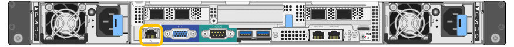
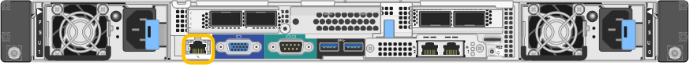
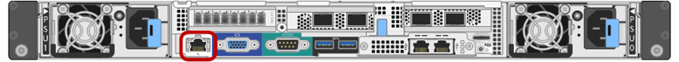
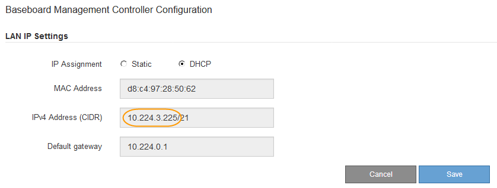

= 設定BMC管理連接埠的IP位址
:allow-uri-read: 
:icons: font
:imagesdir: ../media/

[role="lead"]
存取 BMC 介面之前、請先設定 SGF6112 、 SG6000-CN 控制器或服務應用裝置上 BMC 管理連接埠的 IP 位址。

如果您使用 ConfigBuilder 來產生 JSON 檔案、則可以自動設定 IP 位址。請參閱 link:automating-appliance-installation-and-configuration.html["自動化應用裝置的安裝與組態"]。

.開始之前
* 管理用戶端使用 https://docs.netapp.com/us-en/storagegrid-118/admin/web-browser-requirements.html["支援的網頁瀏覽器"^]。
* 您正在使用任何可連線StorageGRID 至該網路的管理用戶端。
* BMC管理連接埠會連線至您打算使用的管理網路。
+
[role="tabbed-block"]
====
.SG100
--

--
.SG1000
--

--
.SG6000
--

--
.SG6100
--
image::../media/sgf6112_cn_bmc_management_port.png[BMC 管理連接埠 SGF6112]

--
====

.關於這項工作
為了支援、BMC管理連接埠允許低層級的硬體存取。

NOTE: 您只能將此連接埠連接至安全、值得信賴的內部管理網路。如果沒有此類網路可用、請保持BMC連接埠未連線或封鎖、除非技術支援部門要求BMC連線。

.步驟
. 從用戶端輸入StorageGRID URL以供使用、例如：+
`*https://_Appliance_IP_:8443*`
+
適用於 `Appliance_IP`、在StorageGRID 任何一個不支援的網路上使用應用裝置的IP位址。

+
畫面會出現「the不再安裝StorageGRID 程式」首頁。

. 選擇*設定硬體*>* BMC組態*。
+
image::../media/bmc_configuration_page.gif[顯示「進階」>「BMC組態」選項的快照]

+
出現「Baseboard Management Controller Configuration（基礎板管理控制器組態）」

. 記下自動顯示的IPV4位址。
+
DHCP是指派IP位址給此連接埠的預設方法。

+

NOTE: 可能需要幾分鐘時間才能顯示DHCP值。

+

. （可選）設置BMC管理端口的靜態IP地址。
+

NOTE: 您應該為BMC管理連接埠指派靜態IP、或為DHCP伺服器上的位址指派永久租用。

+
.. 選擇* Static *（靜態*）。
.. 輸入使用CIDR表示法的IPV4位址。
.. 輸入預設閘道。
+
image::../media/bmc_configuration_static_ip.gif[基礎板管理控制器組態靜態選項]

.. 按一下「 * 儲存 * 」。
+
您可能需要幾分鐘的時間才能套用變更。

