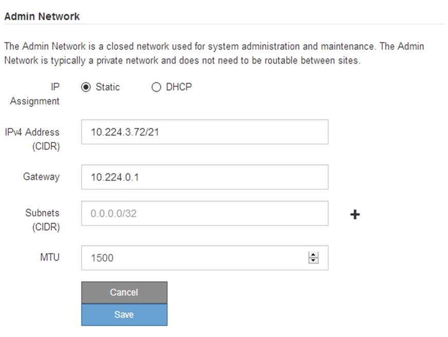
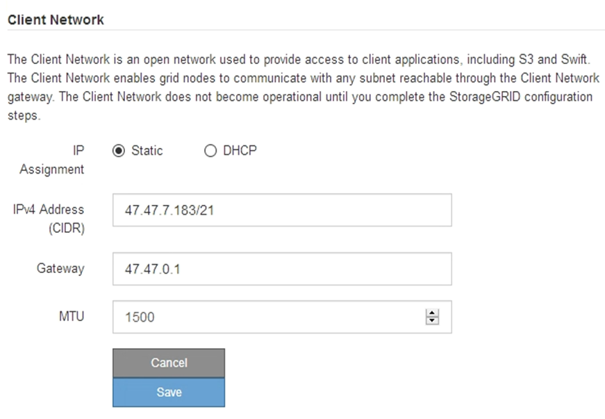

= 設定StorageGRID 靜態IP位址
:allow-uri-read: 
:icons: font
:imagesdir: ../media/

[role="lead"]
您可以使用 StorageGRID 應用裝置安裝程式來設定 StorageGRID Grid 、 Admin 和 Client Networks 上用於服務應用裝置或應用裝置儲存節點的 IP 位址和路由資訊。

如果您使用 ConfigBuilder 來產生 JSON 檔案、則可以自動設定 IP 位址。請參閱 link:automating-appliance-installation-and-configuration.html["自動化應用裝置的安裝與組態"]。

.關於這項工作
您必須為每個連線網路上的應用裝置指派靜態IP、或為DHCP伺服器上的位址指派永久租期。

若要變更連結組態、請參閱下列指示：

* link:../sg100-1000/changing-link-configuration-of-services-appliance.html["變更 SG100 或 SG1000 服務應用裝置的連結組態"]
* link:../sg110-1100/changing-link-configuration-of-sg110-and-sg1100-appliance.html["變更 SG110 或 SG1100 服務應用裝置的連結組態"]
* link:../sg5700/changing-link-configuration-of-e5700sg-controller.html["變更E5700SG控制器的連結組態"]
* link:../sg5800/changing-link-configuration-of-sg5800-controller.html["變更 SG5800 控制器的連結組態"]
* link:../sg6000/changing-link-configuration-of-sg6000-cn-controller.html["變更 SG6000-CN 控制器的連結組態"]
* link:../sg6100/changing-link-configuration-of-sgf6112-appliance.html["變更 SG6100 應用裝置的連結組態"]

.步驟
. 在《SectionAppliance安裝程式》StorageGRID 中、選取*「Configure Networking」（設定網路）*>「* IP Configuration」（* IP組態）*。
+
此時會顯示「IP組態」頁面。

. 若要設定網格網路、請在頁面的「*網格網路*」區段中選取*靜態*或* DHCP *。
. 如果您選取*靜態*、請依照下列步驟設定網格網路：
+
.. 使用CIDR表示法輸入靜態的IPV4位址。
.. 輸入閘道。
+
如果您的網路沒有閘道、請重新輸入相同的靜態IPv4位址。

.. 如果您要使用巨型框架、請將MTU欄位變更為適合巨型框架的值、例如9000。否則、請保留預設值1500。
+

CAUTION: 網路的MTU值必須符合節點所連接之交換器連接埠上所設定的值。否則、可能會發生網路效能問題或封包遺失。

+

NOTE: 為獲得最佳網路效能、所有節點都應在其Grid Network介面上設定類似的MTU值。如果個別節點上Grid Network的MTU設定有顯著差異、則會觸發* Grid Network MTU mismis*警示。所有網路類型的 MTU 值都不一定相同。

.. 按一下「 * 儲存 * 」。
+
當您變更IP位址時、閘道和子網路清單也可能會變更。

+
如果您失去StorageGRID 了與該產品安裝程式的連線、請使用剛指派的新靜態IP位址重新輸入URL。例如、+
`*https://_appliance_IP_:8443*`

.. 確認網格網路子網路清單正確無誤。
+
如果您有網格子網路、則需要網格網路閘道。指定的所有網格子網路都必須透過此閘道才能連線。當您開始StorageGRID 安裝時、也必須在主要管理節點的Grid Network Subnet List（網格網路子網路清單）中定義這些Grid Network子網路。

+

NOTE: 未列出預設路由。如果未啟用用戶端網路、則預設路由將使用Grid Network閘道。

+
*** 若要新增子網路、請按一下插入圖示 image:../media/icon_plus_sign_black_on_white.gif["插入圖示"] 最後一項的右側。
*** 若要移除未使用的子網路、請按一下刪除圖示 image:../media/icon_nms_delete_new.gif["刪除圖示"]。

.. 按一下「 * 儲存 * 」。

. 如果您選取* DHcp*、請依照下列步驟設定Grid Network：
+
.. 選擇* DHcp*單選按鈕後，單擊*保存*。
+
系統會自動填入「* IPV4位址*」、「*閘道*」及「*子網路*」欄位。如果DHCP伺服器設定為指派MTU值、則* MTU *欄位會填入該值、且欄位會變成唯讀。

+
您的網頁瀏覽器會自動重新導向StorageGRID 至全新的IP位址、以供使用。

.. 確認網格網路子網路清單正確無誤。
+
如果您有網格子網路、則需要網格網路閘道。指定的所有網格子網路都必須透過此閘道才能連線。當您開始StorageGRID 安裝時、也必須在主要管理節點的Grid Network Subnet List（網格網路子網路清單）中定義這些Grid Network子網路。

+

NOTE: 未列出預設路由。如果未啟用用戶端網路、則預設路由將使用Grid Network閘道。

+
*** 若要新增子網路、請按一下插入圖示 image:../media/icon_plus_sign_black_on_white.gif["插入圖示"] 最後一項的右側。
*** 若要移除未使用的子網路、請按一下刪除圖示 image:../media/icon_nms_delete_new.gif["刪除圖示"]。

.. 如果您要使用巨型框架、請將MTU欄位變更為適合巨型框架的值、例如9000。否則、請保留預設值1500。
+

CAUTION: 網路的MTU值必須符合節點所連接之交換器連接埠上所設定的值。否則、可能會發生網路效能問題或封包遺失。

+

NOTE: 為獲得最佳網路效能、所有節點都應在其Grid Network介面上設定類似的MTU值。如果個別節點上Grid Network的MTU設定有顯著差異、則會觸發* Grid Network MTU mismis*警示。所有網路類型的 MTU 值都不一定相同。

.. 按一下「 * 儲存 * 」。

. 若要設定管理網路、請在頁面的「*管理網路*」區段中選取「*靜態*」或「* DHCP *」。
+

NOTE: 若要設定管理網路、請在「連結組態」頁面上啟用管理網路。

+

. 如果您選取*靜態*、請依照下列步驟設定管理網路：
+
.. 在設備上的Management Port 1（管理連接埠1）中輸入靜態的IPv4位址、使用CIDR表示法。
+
管理連接埠1是設備右端兩個1-GbE RJ45連接埠的左側。

.. 輸入閘道。
+
如果您的網路沒有閘道、請重新輸入相同的靜態IPv4位址。

.. 如果您要使用巨型框架、請將MTU欄位變更為適合巨型框架的值、例如9000。否則、請保留預設值1500。
+

CAUTION: 網路的MTU值必須符合節點所連接之交換器連接埠上所設定的值。否則、可能會發生網路效能問題或封包遺失。

.. 按一下「 * 儲存 * 」。
+
當您變更IP位址時、閘道和子網路清單也可能會變更。

+
如果您失去StorageGRID 了與該產品安裝程式的連線、請使用剛指派的新靜態IP位址重新輸入URL。例如、+
`*https://_appliance_:8443*`

.. 確認管理網路子網路清單正確無誤。
+
您必須使用所提供的閘道來確認所有子網路都可以連線。

+

NOTE: 無法使用管理網路閘道來設定預設路由。

+
*** 若要新增子網路、請按一下插入圖示 image:../media/icon_plus_sign_black_on_white.gif["插入圖示"] 最後一項的右側。
*** 若要移除未使用的子網路、請按一下刪除圖示 image:../media/icon_nms_delete_new.gif["刪除圖示"]。

.. 按一下「 * 儲存 * 」。

. 如果您選取* DHcp*、請依照下列步驟設定管理網路：
+
.. 選擇* DHcp*單選按鈕後，單擊*保存*。
+
系統會自動填入「* IPV4位址*」、「*閘道*」及「*子網路*」欄位。如果DHCP伺服器設定為指派MTU值、則* MTU *欄位會填入該值、且欄位會變成唯讀。

+
您的網頁瀏覽器會自動重新導向StorageGRID 至全新的IP位址、以供使用。

.. 確認管理網路子網路清單正確無誤。
+
您必須使用所提供的閘道來確認所有子網路都可以連線。

+

NOTE: 無法使用管理網路閘道來設定預設路由。

+
*** 若要新增子網路、請按一下插入圖示 image:../media/icon_plus_sign_black_on_white.gif["插入圖示"] 最後一項的右側。
*** 若要移除未使用的子網路、請按一下刪除圖示 image:../media/icon_nms_delete_new.gif["刪除圖示"]。

.. 如果您要使用巨型框架、請將MTU欄位變更為適合巨型框架的值、例如9000。否則、請保留預設值1500。
+

CAUTION: 網路的MTU值必須符合節點所連接之交換器連接埠上所設定的值。否則、可能會發生網路效能問題或封包遺失。

.. 按一下「 * 儲存 * 」。

. 若要設定用戶端網路、請在頁面的*用戶端網路*區段中選取*靜態*或* DHCP *。
+

NOTE: 若要設定用戶端網路、請在「連結組態」頁面上啟用「用戶端網路」。

+

. 如果您選取*靜態*、請依照下列步驟設定用戶端網路：
+
.. 使用CIDR表示法輸入靜態的IPV4位址。
.. 按一下「 * 儲存 * 」。
.. 確認用戶端網路閘道的IP位址正確無誤。
+

NOTE: 如果已啟用用戶端網路、則會顯示預設路由。預設路由會使用用戶端網路閘道、且在用戶端網路啟用時無法移至其他介面。

.. 如果您要使用巨型框架、請將MTU欄位變更為適合巨型框架的值、例如9000。否則、請保留預設值1500。
+

CAUTION: 網路的MTU值必須符合節點所連接之交換器連接埠上所設定的值。否則、可能會發生網路效能問題或封包遺失。

.. 按一下「 * 儲存 * 」。

. 如果您選取* DHC*、請依照下列步驟設定用戶端網路：
+
.. 選擇* DHcp*單選按鈕後，單擊*保存*。
+
系統會自動填入「* IPV4位址*」和「*閘道*」欄位。如果DHCP伺服器設定為指派MTU值、則* MTU *欄位會填入該值、且欄位會變成唯讀。

+
您的網頁瀏覽器會自動重新導向StorageGRID 至全新的IP位址、以供使用。

.. 確認閘道正確。
+

NOTE: 如果已啟用用戶端網路、則會顯示預設路由。預設路由會使用用戶端網路閘道、且在用戶端網路啟用時無法移至其他介面。

.. 如果您要使用巨型框架、請將MTU欄位變更為適合巨型框架的值、例如9000。否則、請保留預設值1500。
+

CAUTION: 網路的MTU值必須符合節點所連接之交換器連接埠上所設定的值。否則、可能會發生網路效能問題或封包遺失。

