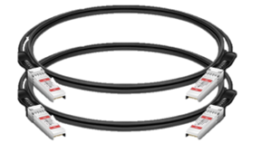
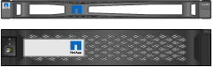
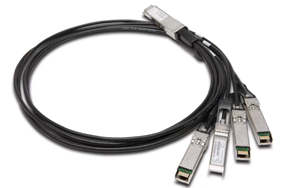

= 打開包裝盒
:allow-uri-read: 
:icons: font
:imagesdir: ../media/

[role="lead"]
安裝 StorageGRID 應用裝置之前、請先打開所有包裝盒的包裝、並將內容物與裝箱單上的物品進行比較。

[role="tabbed-block"]
====
.SG100 與 SG1000
--
* *硬體*
+
SG100 或 SG1000::
+
--
image::../media/sg6000_cn_front_without_bezel.gif[前置磁碟機：SG 100或SG1000服務應用裝置]

--
附說明的軌道套件::
+
--
image::../media/rail_kit.gif[軌道套件]

--

* * 電源線 *
+

TIP: 您的機櫃可能有特殊的電源線、您可以使用這些電源線、而非產品隨附的電源線。

+
適用於您所在國家 / 地區的兩條電源線::
+
--
image::../media/power_cords.gif[電源線]

--

--
.SG110 和 SG1100
--
* *硬體*
+
SG110 或 SG1100::
+
--
image::../media/sgf6112_front_with_ssds.png[前置磁碟機 SG110 和 SG1100 應用裝置]

--
附說明的軌道套件::
+
--
image::../media/rail_kit.gif[軌道套件]

--
前擋板::
+
--
image::../media/sgf_6112_front_bezel.png[前擋板]

--

* * 電源線 *
+

TIP: 您的機櫃可能有特殊的電源線、您可以使用這些電源線、而非產品隨附的電源線。

+
適用於您所在國家 / 地區的兩條電源線::
+
--
image::../media/power_cords.gif[電源線]

--

--
.SG5700
--
* *硬體*
+
SG5712 應用裝置、安裝 12 個磁碟機::
+
--
image::../media/de212c_table_size.gif[SG5712 2U應用裝置]

--
SG5760 應用裝置、未安裝磁碟機::
+
--
image::../media/de460c_table_size.gif[SG5760 4U 應用裝置]

--
產品前擋板::
+
--
image::../media/sg5700_front_bezels.gif[SG5712與SG5760的擋板]

--
附說明的軌道套件::
+
--
image::../media/rail_kit.gif[軌道套件]

--
SG5760 ： 60 個磁碟機::
+
--
image::../media/sg5760_drive.gif[磁碟機]

--
SG5760 ：握把::
+
--
image::../media/handles.gif[SG5760處理]

--
SG5760 ：用於方孔機架安裝的後支架和鎖緊螺帽::
+
--
image::../media/back_brackets_table_size.gif[SG5760的背板和鎖緊螺帽]

--

* * 纜線與連接器 *
+

TIP: 您的機櫃可能有特殊的電源線、您可以使用這些電源線、而非產品隨附的電源線。

+
適用於您所在國家 / 地區的兩條電源線::
+
--
image::../media/power_cords.gif[電源線]

--
光纖纜線和 SFP 收發器::
+
--
image::../media/fc_cable_and_sfp.gif[光纖纜線與SFP]

** 兩條光纖纜線用於FC互連連接埠
** 八個SFP+收發器、可與四個16Gb/s FC互連連接埠和四個10-GbE網路連接埠相容

--

--
.SG5800
--
* *硬體*
+
SG5812 應用裝置、安裝 12 個磁碟機::
+
--
image::../media/de212c_table_size.gif[SG5812 2U 應用裝置]

--
SG5860 應用裝置、未安裝磁碟機::
+
--
image::../media/de460c_table_size.gif[SG5860 4U 應用裝置]

--
產品前擋板::
+
--
image::../media/sg5700_front_bezels.gif[面板為 SG5812 和 SG5860]

NOTE: 您的擋板看起來可能不同。

--
附說明的軌道套件::
+
--
image::../media/rail_kit.gif[軌道套件]

--
SG5860 ： 60 個 NL-SAS 磁碟機::
+
--
image::../media/sg5760_drive.gif[磁碟機]

--
SG5860 ：握把::
+
--
image::../media/handles.gif[SG5860 握把]

--
SG5860 ：用於方孔機架安裝的後支架和鎖緊螺帽::
+
--
image::../media/back_brackets_table_size.gif[SG5860 的後支架和鎖緊螺帽]

--

* * 纜線與連接器 *
+

TIP: 您的機櫃可能有特殊的電源線、您可以使用這些電源線、而非產品隨附的電源線。

+
適用於您所在國家 / 地區的兩條電源線::
+
--
image::../media/power_cords.gif[電源線]

--
兩條 25GbE SFP28 纜線、用於控制器互連（ iSCSI ）::
+
--

--

--
.SG6000
--
* * SG6060 硬體 *
+
SG6000-CN.控制器::
+
--
image::../media/sg6000_cn_front_without_bezel.gif[SG6000-CN.控制器]

--
E2860 控制器機櫃、未安裝磁碟機::
+
--
image::../media/de460c_table_size.gif[SG5760 4U 應用裝置]

--
兩個前擋板::
+
--
image::../media/sg6000_front_bezels_for_table.gif[前擋板]

--
附說明的兩個軌道套件::
+
--
image::../media/rail_kit.gif[軌道套件]

--
60 個磁碟機（ 2 個 SSD 和 58 個 NL-SAS ）::
+
--
image::../media/sg5760_drive.gif[磁碟機]

--
四個控制點::
+
--
image::../media/handles.gif[SG5760處理]

--
用於方孔機架安裝的後支架和鎖緊螺帽::
+
--
image::../media/back_brackets_table_size.gif[SG5760的背板和鎖緊螺帽]

--

* * SG6060 擴充機櫃 *
+
未安裝磁碟機的擴充機櫃::
+
--
image::../media/de460c_table_size.gif[SG5760 4U 應用裝置]

--
前擋板::
+
--
image::../media/front_bezel_for_table_de460c.gif[前擋板DE460C]

--
60 個 NL-SAS 磁碟機::
+
--
image::../media/sg5760_drive.gif[磁碟機]

--
附說明的一種軌道套件::
+
--
image::../media/rail_kit.gif[軌道套件]

--
四個控制點::
+
--
image::../media/handles.gif[SG5760處理]

--
用於方孔機架安裝的後支架和鎖緊螺帽::
+
--
image::../media/back_brackets_table_size.gif[SG5760的背板和鎖緊螺帽]

--

* *SGF6024 硬體 *
+
SG6000-CN.控制器::
+
--
image::../media/sg6000_cn_front_without_bezel.gif[SG6000-CN.控制器]

--
EF570 快閃陣列、安裝 24 個固態（ Flash ）磁碟機::
+
--
image::../media/de224c_with_drives.gif[EF570控制器機櫃]

--
兩個前擋板::
+
--

--
附說明的兩個軌道套件::
+
--
image::../media/rail_kit.gif[軌道套件]

--
機櫃端蓋::
+
--
image::../media/endcaps.png[端點]

--

* * 纜線與連接器 *
+

TIP: 您的機櫃可能有特殊的電源線、您可以使用這些電源線、而非產品隨附的電源線。

+
適用於您所在國家 / 地區的四條電源線::
+
--
image::../media/power_cords.gif[電源線]

--
光纖纜線和 SFP 收發器::
+
--
image::../media/fc_cable_and_sfp.gif[光纖纜線與SFP]

** 四條光纖纜線用於FC互連連接埠
** 四個SFP+收發器、支援16Gb/s FC

--
選用：兩條 SAS 纜線、用於連接每個 SG6060 擴充機櫃::
+
--
image::../media/sas_cable.gif[SAS纜線]

--

--
.SG6100
--
* * SG6160 硬體 *
+
SG6100-CN 控制器::
+
--
image::../media/sg6000_cn_front_without_bezel.gif[SG6100-CN 控制器]

--
E4000 控制器機櫃、未安裝磁碟機::
+
--
image::../media/de460c_table_size.gif[SG5860 4U 應用裝置]

--
兩個前擋板::
+
--
image::../media/sg6000_front_bezels_for_table.gif[前擋板]

NOTE: 您的擋板看起來可能不同。

--
附說明的兩個軌道套件::
+
--
image::../media/rail_kit.gif[軌道套件]

--
60 個 NL-SAS 磁碟機::
+
--
image::../media/sg5760_drive.gif[磁碟機]

--
四個控制點::
+
--
image::../media/handles.gif[SG5860 握把]

--
用於方孔機架安裝的後支架和鎖緊螺帽::
+
--
image::../media/back_brackets_table_size.gif[SG5860 的後支架和鎖緊螺帽]

--
一條 100 GbE 至 4x25GbE 中斷互連纜線::
+
--

--
適用於您所在國家 / 地區的四條電源線::
+
--
image::../media/power_cords.gif[電源線]

--

* * SG6160 擴充機櫃 *
+
未安裝磁碟機的擴充機櫃::
+
--
image::../media/de460c_table_size.gif[SG5860 4U 應用裝置]

--
前擋板::
+
--
image::../media/front_bezel_for_table_de460c.gif[前擋板DE460C]

--
60 個 NL-SAS 磁碟機::
+
--
image::../media/sg5760_drive.gif[磁碟機]

--
附說明的一種軌道套件::
+
--
image::../media/rail_kit.gif[軌道套件]

--
四個控制點::
+
--
image::../media/handles.gif[SG5860 握把]

--
用於方孔機架安裝的後支架和鎖緊螺帽::
+
--
image::../media/back_brackets_table_size.gif[SG5860 的後支架和鎖緊螺帽]

--

* * SGF6112 硬體 *
+
SGF6112::
+
--
image::../media/sgf6112_front_with_ssds.png[前置磁碟機 SGF6112 應用裝置]

--
附說明的軌道套件::
+
--
image::../media/rail_kit.gif[軌道套件]

--
前擋板::
+
--
image::../media/sgf_6112_front_bezel.png[前擋板]

--

* * 電源線 *
+

TIP: 您的機櫃可能有特殊的電源線、您可以使用這些電源線、而非產品隨附的電源線。

+
適用於您所在國家 / 地區的兩條電源線::
+
--
image::../media/power_cords.gif[電源線]

--

--
====