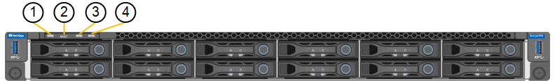

= 檢視狀態指示燈和代碼
:allow-uri-read: 
:icons: font
:imagesdir: ../media/

[role="lead"]
設備和控制器包含可協助您判斷應用裝置元件狀態的指示燈。

[role="tabbed-block"]
====
.SG100 與 SG1000
--
此應用裝置內含的指示燈可協助您判斷應用裝置控制器和兩個 SSD 的狀態：

* <<appliance_indicators_SG100_1000,產品指示燈和按鈕>>
* <<general_boot_codes_SG100_1000,一般開機代碼>>
* <<ssd_indicators_SG100_1000,SSD指示燈>>

請使用此資訊來提供協助 link:troubleshooting-hardware-installation-sg100-and-sg1000.html["疑難排解 SG100 和 SG1000 硬體安裝"]。

[[appliance_indicators_SG100_1000]]
產品指示燈和按鈕::
+
--
下圖顯示 SG100 和 SG1000 上的狀態指示燈和按鈕。

[cols="1a,2a,2a"]
|===
| 標註 | 顯示 | 州/省 

 a| 
1.
 a| 
電源按鈕
 a| 
* 藍色：產品電源已開啟。
* 關：產品電源已關閉。

 a| 
2.
 a| 
重設按鈕
 a| 
使用此按鈕可執行控制器的硬重設。

 a| 
3.
 a| 
識別按鈕
 a| 
此按鈕可設定為「Blink（亮起）」、「On（亮起）」或「Off（關閉）」。

* 藍色、閃爍：表示設備位於機櫃或機架中。
* 藍色、恆亮：識別機櫃或機架中的設備。
* 不亮：機櫃或機架中無法識別產品的外觀。

 a| 
4.
 a| 
警示LED
 a| 
* 呈黃色持續亮起：發生錯誤。
+
* 注意： * 若要檢視開機與錯誤代碼、 link:accessing-bmc-interface.html["存取 BMC 介面"]。

* 不亮：不存在錯誤。

|===
--

[[general_boot_codes_SG100_1000]]
一般開機代碼::
+
--
在開機期間或硬重設裝置後、會發生下列情況：

. 底板管理控制器（BMC）會記錄開機順序的代碼、包括發生的任何錯誤。
. 電源按鈕會亮起。
. 如果開機期間發生任何錯誤、警示LED會亮起。
+
若要檢視開機和錯誤代碼、 link:accessing-bmc-interface.html["存取 BMC 介面"]。

--

[[ssd_indicators_SG100_1000]]
SSD指示燈::
+
--
下圖顯示 SG100 和 SG1000 上的 SSD 指示燈。

image::../media/ssd_indicators.png[SSD指示燈]

[cols="1a,2a,2a"]
|===
| LED | 顯示 | 州/省 

 a| 
1.
 a| 
磁碟機狀態/故障
 a| 
* 藍色（固態）：磁碟機已上線
* 琥珀色（固態）：磁碟機故障
* 琥珀色（閃爍）：磁碟機定位器指示燈亮起
* 不亮：插槽已空

 a| 
2.
 a| 
磁碟機作用中
 a| 
藍色（正在閃爍）：正在存取磁碟機

|===
--

--
.SG110 和 SG1100
--
此應用裝置內含的指示燈可協助您判斷應用裝置控制器和 SSD 的狀態：

* <<appliance_indicators,產品指示燈和按鈕>>
* <<general_boot_codes,一般開機代碼>>
* <<ssd_indicators,SSD指示燈>>

請使用此資訊來提供協助 link:troubleshooting-hardware-installation-sg110-and-sg1100.html["SG110 和 SG1100 硬體安裝疑難排解"]。

[[appliance_indicators]]
產品指示燈和按鈕::
+
--
下圖顯示 SG110 和 SG1100 設備上的指示燈和按鈕。

image::../media/sgf6112_front_indicators.png[正面指示燈 - SG110 和 SG1100]

[cols="1a,2a,3a"]
|===
| 標註 | 顯示 | 州/省 

 a| 
1.
 a| 
電源按鈕
 a| 
* 藍色：產品電源已開啟。
* 關：產品電源已關閉。

 a| 
2.
 a| 
重設按鈕
 a| 
使用此按鈕可執行控制器的硬重設。

 a| 
3.
 a| 
識別按鈕
 a| 
使用 BMC 時、此按鈕可設定為閃爍、開啟（穩定）或關閉。

* 藍色、閃爍：表示設備位於機櫃或機架中。
* 藍色、恆亮：識別機櫃或機架中的設備。
* 不亮：機櫃或機架中無法識別產品的外觀。

 a| 
4.
 a| 
狀態 LED
 a| 
* 呈黃色持續亮起：發生錯誤。
+
* 注意： * 若要檢視開機與錯誤代碼、 link:accessing-bmc-interface.html["存取 BMC 介面"]。

* 不亮：不存在錯誤。

 a| 
5.
 a| 
PFR
 a| 
SG110 和 SG1100 設備並未使用此燈號、因此燈號會持續熄滅。

|===
--

[[general_boot_codes]]
一般開機代碼::
+
--
在開機期間或硬重設裝置後、會發生下列情況：

. 底板管理控制器（BMC）會記錄開機順序的代碼、包括發生的任何錯誤。
. 電源按鈕會亮起。
. 如果開機期間發生任何錯誤、警示LED會亮起。
+
若要檢視開機和錯誤代碼、 link:accessing-bmc-interface.html["存取 BMC 介面"]。

--

[[ssd_indicators]]
SSD指示燈::
+
--
下圖顯示 SG110 和 SG1100 應用裝置上的 SSD 指示燈。

image::../media/ssd_indicators.png[SSD指示燈]

[cols="1a,2a,2a"]
|===
| LED | 顯示 | 州/省 

 a| 
1.
 a| 
磁碟機狀態/故障
 a| 
* 藍色（固態）：磁碟機已上線
* 琥珀色（固態）：磁碟機故障
* 不亮：插槽已空

 a| 
2.
 a| 
磁碟機作用中
 a| 
藍色（正在閃爍）：正在存取磁碟機

|===
--

--
.SG5700
--
應用裝置控制器包含可協助您判斷應用裝置控制器狀態的指示燈：

* <<boot_codes_sg5700,SG5700 開機狀態代碼>>
* <<status_indicators_e5700sg_controller,E5700SG控制器上的狀態指示燈>>
* <<general_boot_codes_sg5700,一般開機代碼>>
* <<boot_codes_e5700sg_controller,E5700SG控制器開機代碼>>
* <<error_codes_e5700sg_controller,E5700SG控制器錯誤代碼>>

請使用此資訊來提供協助 link:troubleshooting-hardware-installation.html["SG5700 硬體安裝疑難排解"]。

[[boot_codes_sg5700]]
SG5700 開機狀態代碼::
+
--
每個控制器上的七段顯示會在設備開機時顯示狀態和錯誤代碼。

E2800控制器和E5700SG控制器會顯示不同的狀態和錯誤代碼。

若要瞭解這些程式碼的意義、請參閱下列資源：

[cols="1a,2a"]
|===
| 控制器 | 參考資料 

 a| 
E2800 控制器
 a| 
_E5700與E2800系統監控指南_

* 附註： * E 系列 E5700 控制器所列的代碼不適用於應用裝置中的 E5700SG 控制器。

 a| 
E5700SG控制器
 a| 
「E5700SG控制器上的狀態指示燈」

|===
--

.步驟
. 在開機期間、檢視七段顯示器上顯示的代碼、以監控進度。
+
** E2800控制器上的七區段顯示會顯示重複順序* OS*、* SD*、 `*_blank_*` 表示正在執行每日開始處理。
** E5700SG控制器上的七段顯示屏顯示一系列代碼，以* AA*和* FF*結尾。

. 控制器開機後、確認七區段顯示顯示如下：
+
image::../media/seven_segment_display_codes.gif[控制器開機後會顯示七段。]

+
[cols="1a,2a"]
|===
| 控制器 | 七區段顯示 

 a| 
E2800 控制器
 a| 
顯示99、這是E系列控制器機櫃的預設ID。

 a| 
E5700SG控制器
 a| 
顯示*何*、接著重複兩個數字的順序。

[listing]
----
HO -- IP address for Admin Network -- IP address for Grid Network HO
----
在順序中、第一組數字是控制器管理連接埠1的DHCP指派IP位址。此位址用於將控制器連線至管理網路StorageGRID 以供執行。第二組數字是DHCP指派的IP位址、用於將應用裝置連線至Grid Network以供StorageGRID 支援。

*注意：*如果無法使用DHCP指派IP位址、則會顯示0．0．0．0。

|===
. 如果七區段顯示其他值、請參閱 link:troubleshooting-hardware-installation.html["硬體安裝疑難排解（ SG6000 或 SG5700 ）"] 並確認您已正確完成安裝步驟。如果您無法解決問題、請聯絡技術支援部門。

[[status_indicators_e5700sg_controller]]
E5700SG控制器上的狀態指示燈::
+
--
E5700SG控制器上的七段顯示器和LED會在設備開機和硬體初始化期間顯示狀態和錯誤代碼。您可以使用這些顯示器來判斷狀態並疑難排解錯誤。

在啟動完「VMware應用程式安裝程式」之後StorageGRID 、您應該定期檢閱E5700SG控制器上的狀態指示燈。

下圖顯示 E5700SG 控制器上的狀態指示燈。

image::../media/e5700sg_leds.gif[E5700SG控制器上的狀態指示燈]

[cols="1a,2a,2a"]
|===
| 標註 | 顯示 | 說明 

 a| 
1.
 a| 
注意LED
 a| 
黃色：控制器故障、需要操作員注意、或找不到安裝指令碼。

不亮：控制器正常運作。

 a| 
2.
 a| 
七區段顯示
 a| 
顯示診斷代碼

七段顯示順序可讓您瞭解錯誤及應用裝置的運作狀態。

 a| 
3.
 a| 
擴充連接埠注意LED
 a| 
黃色：由於應用裝置不使用擴充連接埠、因此這些LED會一直呈黃色（未建立連結）。

 a| 
4.
 a| 
主機連接埠連結狀態LED
 a| 
綠色：連結已啟動。

不亮：連結中斷。

 a| 
5.
 a| 
乙太網路連結狀態LED
 a| 
綠色：建立連結。

不亮：未建立連結。

 a| 
6.
 a| 
乙太網路活動LED
 a| 
綠色：管理連接埠與所連接裝置（例如乙太網路交換器）之間的連結已開啟。

不亮：控制器與連線裝置之間沒有連結。

呈綠色持續亮起：有乙太網路活動。

|===
--

[[general_boot_codes_sg5700]]
一般開機代碼::
+
--
在開機期間或硬重設裝置後、會發生下列情況：

. E5700SG控制器上的七區段顯示幕會顯示一般的代碼順序、而非控制器特有的代碼順序。一般順序以代碼AA和FF結束。
. 出現E5700SG控制器專屬的開機代碼。

--

[[boot_codes_e5700sg_controller]]
E5700SG控制器開機代碼::
+
--
在設備正常開機期間、E5700SG控制器上的七段顯示器會依照所列順序顯示下列代碼：

[cols="1a,3a"]
|===
| 程式碼 | 表示 

 a| 
嗨
 a| 
主開機指令碼已啟動。

 a| 
PP
 a| 
系統正在檢查是否需要更新FPGA。

 a| 
HP
 a| 
系統正在檢查10/25-GbE控制器韌體是否需要更新。

 a| 
經常預算
 a| 
套用韌體更新後、系統正在重新開機。

 a| 
FP
 a| 
硬體子系統韌體更新檢查已完成。控制器之間的通訊服務正在啟動。

 a| 
他
 a| 
系統正在等待與E2800控制器連線、並與SANtricity 該作業系統同步。

*注意：*如果此開機程序未超過此階段、請檢查兩個控制器之間的連線。

 a| 
硬拷貝
 a| 
系統正在檢查現有StorageGRID 的安裝資料。

 a| 
好
 a| 
執行中的是此應用程式。StorageGRID

 a| 
HA
 a| 
執行中。StorageGRID

|===
--

[[error_codes_e5700sg_controller]]
E5700SG控制器錯誤代碼::
+
--
這些代碼代表當設備開機時、E5700SG控制器上可能會顯示的錯誤狀況。如果發生特定的低層硬體錯誤、則會顯示其他兩位數的十六進位代碼。如果上述任一代碼持續超過一或兩秒鐘、或您無法依照其中一項規定的疑難排解程序來解決錯誤、請聯絡技術支援部門。

[cols="1a,3a"]
|===
| 程式碼 | 表示 

 a| 
22
 a| 
在任何開機裝置上找不到主要開機記錄。

 a| 
23
 a| 
內部快閃磁碟未連線。

 a| 
2A 、 2B
 a| 
匯流排卡住、無法讀取DIMM SPD資料。

 a| 
40.
 a| 
無效的DIMM。

 a| 
41
 a| 
無效的DIMM。

 a| 
42
 a| 
記憶體測試失敗。

 a| 
51
 a| 
SPD讀取失敗。

 a| 
92 至 96
 a| 
PCI匯流排初始化。

 a| 
從A0到A3.
 a| 
SATA磁碟機初始化。

 a| 
AB
 a| 
替代開機代碼。

 a| 
AE
 a| 
開機作業系統：

 a| 
企業
 a| 
DDR4訓練失敗。

 a| 
E8.
 a| 
未安裝記憶體。

 a| 
歐盟
 a| 
找不到安裝指令碼。

 a| 
EP
 a| 
與E2800控制器的安裝或通訊失敗。

|===
--

.相關資訊
* https://mysupport.netapp.com/site/global/dashboard["NetApp支援"^]
* https://library.netapp.com/ecmdocs/ECMLP2588751/html/frameset.html["E5700與E2800系統監控指南"^]

--
.SG6000
--
SG6000 應用裝置控制器包含可協助您判斷應用裝置控制器狀態的指示燈：

* <<status_indicators_sg6000cn,SG6000-CN 控制器上的狀態指示燈和按鈕>>
* <<general_boot_codes_sg6000,一般開機代碼>>
* <<boot_codes_sg6000_storage_controller,SG6000 儲存控制器的開機狀態代碼>>

請使用此資訊來提供協助 link:troubleshooting-hardware-installation.html["SG6000 安裝疑難排解"]。

[[status_indicators_sg6000cn]]
SG6000-CN 控制器上的狀態指示燈和按鈕::
+
--
SG6000-CN-控制器包含可協助您判斷控制器狀態的指示燈、包括下列指示燈和按鈕。

下圖顯示 SG6000-CN 控制器上的狀態指示燈和按鈕。

[cols="1a,2a,3a"]
|===
| 標註 | 顯示 | 說明 

 a| 
1.
 a| 
電源按鈕
 a| 
* 藍色：控制器已開啟電源。
* 不亮：控制器已關機。

 a| 
2.
 a| 
重設按鈕
 a| 
_無指標_

使用此按鈕可執行控制器的硬重設。

 a| 
3.
 a| 
識別按鈕
 a| 
* 呈藍色或持續亮起：識別機櫃或機架中的控制器。
* 不亮：控制器無法在機櫃或機架中識別。

此按鈕可設定為「Blink（亮起）」、「On（亮起）」或「Off（關閉）」。

 a| 
4.
 a| 
警示LED
 a| 
* 黃色：發生錯誤。
+
* 注意： * 若要檢視開機與錯誤代碼、 link:accessing-bmc-interface.html["存取 BMC 介面"]。

* 不亮：不存在錯誤。

|===
--

[[general_boot_codes_sg6000]]
一般開機代碼::
+
--
在開機期間或SG6000-CN-控制器硬重設之後、會發生下列情況：

. 底板管理控制器（BMC）會記錄開機順序的代碼、包括發生的任何錯誤。
. 電源按鈕會亮起。
. 如果開機期間發生任何錯誤、警示LED會亮起。
+
若要檢視開機和錯誤代碼、 link:accessing-bmc-interface.html["存取 BMC 介面"]。

--

[[boot_codes_sg6000_storage_controller]]
SG6000 儲存控制器的開機狀態代碼::
+
--
每個儲存控制器都有七段顯示、可在控制器開機時提供狀態代碼。E2800控制器和EF570控制器的狀態代碼相同。

如需這些代碼的說明、請參閱儲存控制器類型的E系列系統監控資訊。

--

.步驟
. 在開機期間、檢視每個儲存控制器七段顯示器上顯示的代碼、以監控進度。
+
每個儲存控制器上的七區段顯示會顯示重複順序* OS*、* SD*、 `*_blank_*` 表示控制器正在執行一天開始的處理。

. 控制器開機後、確認每個儲存控制器顯示99、這是E系列控制器機櫃的預設ID。
+
請確定兩個儲存控制器都顯示此值、如本例E2800控制器所示。

+
image::../media/seven_segment_display_codes_for_e2800.gif[E2800的七區段顯示代碼]

. 如果其中一個或兩個控制器顯示其他值、請參閱 link:troubleshooting-hardware-installation.html["硬體安裝疑難排解（ SG6000 或 SG5700 ）"] 並確認您已正確完成安裝步驟。如果您無法解決問題、請聯絡技術支援部門。

.相關資訊
* https://mysupport.netapp.com/site/global/dashboard["NetApp支援"^]
* link:../sg6000/power-sg6000-cn-controller-off-on.html#power-on-sg6000-cn-controller-and-verify-operation["開啟SG6000-CN-控制器電源、並確認運作正常"]

--
.SG6100
--
此應用裝置內含的指示燈可協助您判斷應用裝置控制器和 SSD 的狀態：

* <<appliance_indicators_SG6100,產品指示燈和按鈕>>
* <<general_boot_codes_SG6100,一般開機代碼>>
* <<ssd_indicators_SG6100,SSD指示燈>>

請使用此資訊來提供協助 link:troubleshooting-hardware-installation-sg6100.html["SG6100 硬體安裝疑難排解"]。

[[appliance_indicators_SG6100]]
產品指示燈和按鈕::
+
--
下圖顯示 SGF6112 應用裝置上的指示燈和按鈕。

image::../media/sgf6112_front_indicators.png[正面指示燈 - SGF6112]

[cols="1a,2a,3a"]
|===
| 標註 | 顯示 | 州/省 

 a| 
1.
 a| 
電源按鈕
 a| 
* 藍色：產品電源已開啟。
* 關：產品電源已關閉。

 a| 
2.
 a| 
重設按鈕
 a| 
使用此按鈕可執行控制器的硬重設。

 a| 
3.
 a| 
識別按鈕
 a| 
使用 BMC 時、此按鈕可設定為閃爍、開啟（穩定）或關閉。

* 藍色、閃爍：表示設備位於機櫃或機架中。
* 藍色、恆亮：識別機櫃或機架中的設備。
* 不亮：機櫃或機架中無法識別產品的外觀。

 a| 
4.
 a| 
狀態 LED
 a| 
* 呈黃色持續亮起：發生錯誤。
+
* 注意： * 若要檢視開機與錯誤代碼、 link:accessing-bmc-interface.html["存取 BMC 介面"]。

* 不亮：不存在錯誤。

 a| 
5.
 a| 
PFR
 a| 
SGF6112 產品並未使用此燈號、且燈號會持續熄滅。

|===
--

[[general_boot_codes_SG6100]]
一般開機代碼::
+
--
在開機期間或硬重設裝置後、會發生下列情況：

. 底板管理控制器（BMC）會記錄開機順序的代碼、包括發生的任何錯誤。
. 電源按鈕會亮起。
. 如果開機期間發生任何錯誤、警示LED會亮起。
+
若要檢視開機和錯誤代碼、 link:accessing-bmc-interface.html["存取 BMC 介面"]。

--

[[ssd_indicators_SG6100]]
SSD指示燈::
+
--
下圖顯示 SGF6112 應用裝置上的 SSD 指示燈。

image::../media/ssd_indicators.png[SSD指示燈]

[cols="1a,2a,2a"]
|===
| LED | 顯示 | 州/省 

 a| 
1.
 a| 
磁碟機狀態/故障
 a| 
* 藍色（固態）：磁碟機已上線
* 琥珀色（固態）：磁碟機故障
* 不亮：插槽已空

* 附註： * 如果新的正常運作 SSD 插入正在運作的 SGF6112 StorageGRID 節點、 SSD 上的 LED 應會開始閃爍、但一旦系統判斷磁碟機有足夠容量且正常運作、就會停止閃爍。

 a| 
2.
 a| 
磁碟機作用中
 a| 
藍色（正在閃爍）：正在存取磁碟機

|===
--

--
====