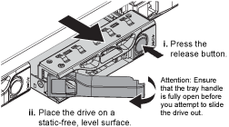

= 更換 SG110 或 SG1100 中的磁碟機
:allow-uri-read: 
:icons: font
:imagesdir: ../media/

[role="lead"]
SG110 和 SG1100 服務應用裝置包含兩個 SSD 磁碟機。磁碟機使用RAID1進行鏡射、以提供備援功能。如果其中一個磁碟機故障、您必須儘快更換、以確保備援。

.開始之前
* 您有 link:locating-sg110-and-sg1100-in-data-center.html["實際放置設備"]。
* 您已確認哪個磁碟機發生故障、方法是注意磁碟機的左 LED 燈為穩定琥珀色、或使用 Grid Manager 來 link:verify-component-to-replace.html["檢視故障磁碟機所造成的警示"]。
+

IMPORTANT: 請參閱檢視狀態指標以驗證故障的相關資訊。

* 您已取得替換磁碟機。
* 您已獲得適當的電子軟碟保護。

.步驟
. 驗證磁碟機的左側故障 LED 是否為琥珀色、或使用警示中的磁碟機插槽 ID 來找出磁碟機。
+
磁碟機位於機箱中的下列位置（圖示為卸下擋板的機箱正面）：

image::../media/sg1100_front_with_ssds.png[SG110 和 SG1100 磁碟機位置]

. 將防靜電腕帶的綁帶末端包覆在您的腕帶上、並將扣夾末端固定在金屬接地上、以避免產生靜電。
. 打開備用磁碟機的包裝、並將其放在產品附近無靜電且水平的表面上。
+
儲存所有包裝材料。

. 按下故障磁碟機上的釋放按鈕。
+

+
磁碟機上的握把會部分開啟、而磁碟機會從插槽中釋放。

. 打開握把、將磁碟機滑出、然後將其放在無靜電且水平的表面上。
. 在將替換磁碟機插入磁碟機插槽之前、請先按下釋放按鈕。
+
栓鎖會彈開。

+
image::../media/h600s_driveinstall.gif[磁碟機安裝]

. 將替換磁碟機插入插槽、然後關閉磁碟機握把。
+

IMPORTANT: 請勿在關閉握把時過度施力。

+
當磁碟機完全插入時、您會聽到「喀」一聲。

+
更換的磁碟機會自動重建、並使用工作磁碟機中的鏡射資料。  您可以使用Grid Manager來檢查重新建置的狀態。前往 * 節點 * > `*Appliance Node*` >*硬體*。「 Storage RAID Mode 」（儲存 RAID 模式）欄位包含「 Rebuilding 」（重建）訊息、直到磁碟機完全重建為止。

更換零件後、請將故障零件歸還給NetApp、如套件隨附的RMA指示所述。請參閱 https://mysupport.netapp.com/site/info/rma["零件退貨擴大機；更換"^] 頁面以取得更多資訊。
