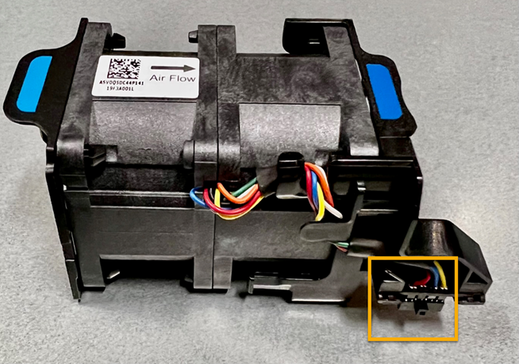
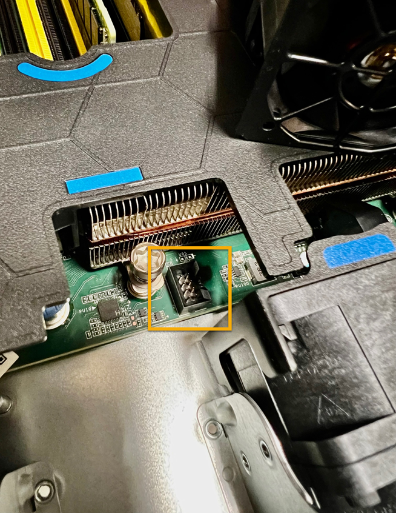

= 更換 SG110 或 SG1100 中的風扇
:allow-uri-read: 
:icons: font
:imagesdir: ../media/

[role="lead"]
SG110 或 SG1100 設備有八個冷卻風扇。如果其中一個風扇故障、您必須儘快更換、以確保產品具有適當的冷卻效果。

.開始之前
* 您擁有正確的更換風扇。
* 您有 link:verify-component-to-replace.html["已確定要更換的風扇的位置"]。
* 您有 link:locating-sg110-and-sg1100-in-data-center.html["實體放置 SG110 或 SG1100 應用裝置"] 您要在資料中心更換風扇的位置。
+

NOTE: 答 link:power-sg110-and-sg1100-off-on.html#shut-down-the-sg110-or-sg1100-appliance["受控制的產品關機"] 從機架中取出產品之前、必須先完成此步驟。

* 您已拔下所有纜線和 link:reinstalling-sg110-and-sg1100-cover.html["已取下產品護蓋"]。
* 您已確認其他風扇已安裝並執行。

.關於這項工作
為避免服務中斷、請確認所有其他儲存節點均已連接至網格、然後再開始更換風扇、或在可接受服務中斷期間的排程維護期間更換風扇。請參閱的相關資訊 https://docs.netapp.com/us-en/storagegrid/monitor/monitoring-system-health.html#monitor-node-connection-states["監控節點連線狀態"^]。

更換風扇時、無法存取應用裝置節點。

圖中所示為產品的風扇、並反白顯示電氣接頭。將產品的頂蓋從產品上卸下後、即可接觸到冷卻風扇。

NOTE: 兩個電源供應器單元中的每個單元都有一個風扇。此程序不包含電源供應器風扇。

.步驟
. 將防靜電腕帶的綁帶末端包覆在您的腕帶上、並將扣夾末端固定在金屬接地上、以避免產生靜電。
. 找到您需要更換的風扇。
+
機箱中的八個風扇位於下列位置（圖示為卸下頂蓋的 StorageGRID 應用裝置前半部）：

+
image::../media/SGF6112-fan-locations.png[風扇位置]

+
|===
|  | 風扇單元 

 a| 
1.
 a| 
FAN_SYS0

 a| 
2.
 a| 
FAN_SYS1

 a| 
3.
 a| 
FAN_SYS2

 a| 
4.
 a| 
FAN_SYS3

 a| 
5.
 a| 
FAN_SYS4

 a| 
6.
 a| 
FAN_SYS5

 a| 
7.
 a| 
FAN_SYS6

 a| 
8.
 a| 
FAN_SYS7

|===
. 使用風扇上的藍色彈片、將故障風扇從機箱中提出。
+
image::../media/fan_removal.png[卸下風扇]

. 將替換風扇滑入機箱的開放式插槽。
+
將風扇上的連接器與電路板上的插座對齊。

. 將風扇的接頭穩固地按入電路板（突出顯示插槽）。
+

.完成後
. link:reinstalling-sg110-and-sg1100-cover.html["將頂蓋裝回產品上"]，然後向下按閂鎖以將主機蓋固定到位。
. link:power-sg110-and-sg1100-off-on.html["開啟產品電源"] 並監控應用裝置 LED 和開機代碼。
+
使用BMC介面來監控開機狀態。

. 確認應用裝置節點出現在Grid Manager中、且未顯示任何警示。

更換零件後、請將故障零件歸還給NetApp、如套件隨附的RMA指示所述。請參閱 https://mysupport.netapp.com/site/info/rma["零件退貨擴大機；更換"^] 頁面以取得更多資訊。
