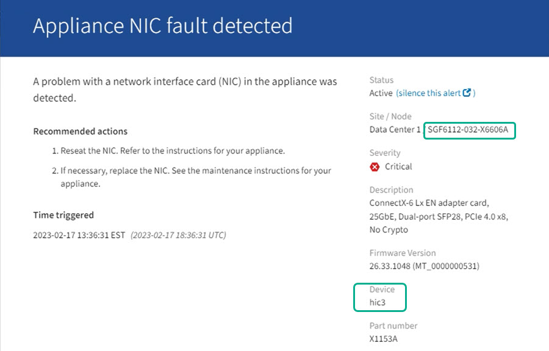

= 驗證要在 SG110 或 SG1100 中更換的元件
:allow-uri-read: 
:icons: font
:imagesdir: ../media/

[role="lead"]
如果您不確定要在應用裝置中更換哪個硬體元件、請完成此程序、以識別產品在資料中心的元件和位置。

.開始之前
* 您擁有需要更換元件的儲存設備序號。
* 您將使用登入Grid Manager https://docs.netapp.com/us-en/storagegrid-118/admin/web-browser-requirements.html["支援的網頁瀏覽器"^]。

.關於這項工作
使用此程序來識別硬體故障的應用裝置、以及哪些可更換硬體元件無法正常運作。可識別以進行更換的元件包括：

* 電源供應器
* 風扇
* 固態硬碟（ SSD ）
* 網路介面卡（ NIC ）
* CMOS 電池

.步驟
. 識別故障元件及其安裝所在應用裝置的名稱。
+
.. 在 Grid Manager 中、選取 * 警示 * > * 目前 * 。
+
「警示」頁面隨即出現。

.. 選取警示以查看警示詳細資料。
+

NOTE: 選取警示、而非警示群組的標題。

.. 記錄故障元件的節點名稱和唯一識別標籤。
+

. 使用需要更換的元件來識別機箱。
+
.. 從Grid Manager中選取* nodes *。
.. 從「節點」頁面的表格中、選取含有故障元件的應用裝置儲存節點名稱。
.. 選取*硬體*索引標籤。
+
請查看 StorageGRID 應用裝置區段中的 * 運算控制器序號 * 。檢查序號是否符合您要更換元件的儲存設備序號。如果序號相符、表示您找到正確的應用裝置。

+
*** 如果 Grid Manager 中的 StorageGRID 應用程式區段未顯示、則選取的節點不是 StorageGRID 應用裝置。從樹狀檢視中選取不同的節點。
*** 如果序號不相符、請從樹狀檢視中選取不同的節點。

. 找到需要更換元件的節點之後、請記下「 StorageGRID 應用裝置」一節中列出的應用裝置 BMC IP 位址。
+
為了協助您在資料中心找到應用裝置、您可以使用 BMC IP 位址來開啟應用裝置識別 LED 。

.相關資訊
link:turning-sg110-and-sg1100-identify-led-on-and-off.html["開啟產品識別 LED"]
