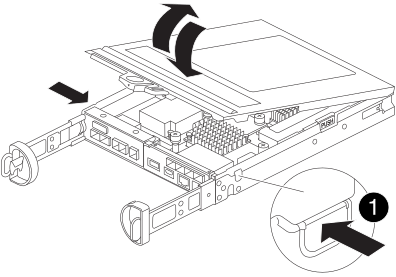
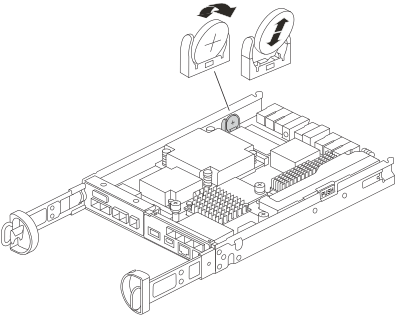

= 更換 SG5800 控制器中的 CMOS 電池
:allow-uri-read: 
:icons: font
:imagesdir: ../media/

[role="lead"]
您可能需要更換 SG5800 控制器中的 CMOS 電池，以便系統的服務和應用程式能夠進行精確的時間同步並繼續正常運作。

.關於這項工作
更換 CMOS 電池時，您將無法存取應用裝置 Storage Node。為避免服務中斷，請在開始更換 CMOS 電池之前確認所有其他 Storage Node 均已連接到網格，或在計劃維護時段期間更換電池（在可接受服務中斷期間）。

== 步驟 1：關閉 SG5800 控制器

.步驟
. 登入網格節點：
+
.. 輸入下列命令： `ssh admin@grid_node_IP`
.. 輸入中所列的密碼 `Passwords.txt` 檔案：
.. 輸入下列命令以切換至root： `su -`
.. 輸入中所列的密碼 `Passwords.txt` 檔案：
+
當您以root登入時、提示會從變更 `$` 至 `#`。

. 關閉 SG5800 控制器：
+
*`shutdown -h now`*

== 步驟 2：從應用裝置中取出控制器

.步驟
. 放置於防靜電腕帶上或採取其他防靜電預防措施。
. 標示纜線、然後拔下纜線和SFP。
+

NOTE: 為防止效能下降，請勿扭曲、折疊、擠壓或踩踏纜線。

. 擠壓CAM握把上的栓鎖直到釋放為止、然後打開右側的CAM握把、即可從產品中釋放控制器。
. 使用兩隻手和CAM握把、將控制器滑出產品。
+

NOTE: 請務必用兩隻手支撐控制器的重量。

. 將控制器模組翻過來，放在平坦穩定的表面上。
. 按下控制器模組側面的藍色按鈕打開蓋子，然後向上旋轉蓋子，將其從控制器模組上取下。
+

== 步驟 3：更換 CMOS 電池

.步驟
. 找到 CMOS 電池。
+

+

NOTE: 您的控制器外觀可能與圖中所示略有不同。但是，CMOS 電池的位置相同。

. 輕輕推動電池並將其從電池座旋轉移開，然後將其從設備中取出。
+

NOTE: 從電池座中取出電池時，請注意電池的極性。電池上標有加號，必須正確安裝在電池座中。電池座附近的加號會指示電池的正確安裝方向。

. 從防靜電運送袋中取出更換電池。
. 找到控制器模組中的空電池座。
. 注意 CMOS 電池的極性,然後將電池傾斜一定角度並向下按壓,將其插入電池座。
. 目視檢查電池，確保其完全安裝在電池座中，且極性正確。
. 重新安裝控制器蓋。

== 步驟 4：將控制器重新安裝到應用裝置中

.步驟
. 將控制器安裝到設備中：
+
.. 將控制器翻轉過來，使可拆卸蓋朝下。
.. 將CAM握把放在開啟位置、將控制器完全滑入產品。
.. 將CAM握把往左移動、將控制器鎖定到位。
.. 重新連接電纜。

. 控制器重新啟動且設備重新加入電網後，確認設備儲存節點出現在電網管理器中且沒有出現警報。

更換零件後、請將故障零件歸還給NetApp、如套件隨附的RMA指示所述。請參閱 https://mysupport.netapp.com/site/info/rma["零件退貨擴大機；更換"] 頁面以取得更多資訊。
