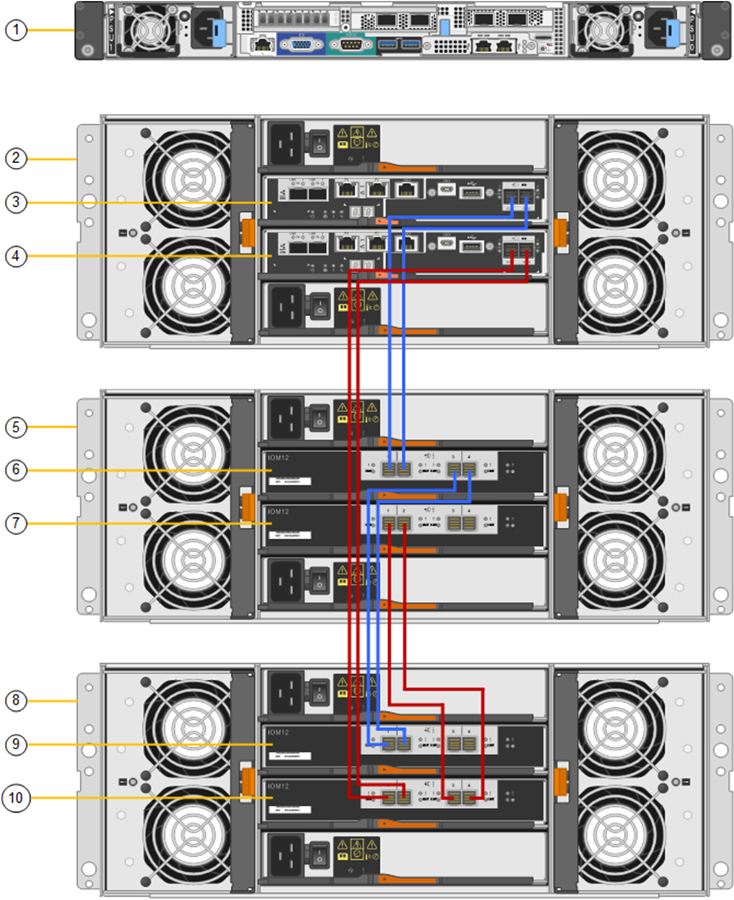

= 新增擴充櫃至已部署的SG6060
:allow-uri-read: 
:icons: font
:imagesdir: ../media/

[role="lead"]
若要增加儲存容量、您可以將一或兩個擴充櫃新增至已部署StorageGRID 於整個系統的SG6060。

.開始之前
* 您必須擁有資源配置通關密碼。
* 您必須執行StorageGRID 的是才能執行更新版本的版本。
* 每個擴充架配有擴充櫃和四條 SAS 纜線。
* 您已將儲存設備實際放置在資料中心新增擴充櫃的位置。
+
link:locating-controller-in-data-center.html["在資料中心找到控制器"]

.關於這項工作
若要新增擴充櫃、請執行下列高階步驟：

* 在機櫃或機架中安裝硬體。
* 將SG6060置於維護模式。
* 將擴充櫃連接至E2860控制器機櫃或其他擴充櫃。
* 使用StorageGRID 《不再使用的應用程式安裝程式」開始擴充
* 請等待新的磁碟區完成設定。

完成一或兩個擴充磁碟櫃的程序、每個應用裝置節點所需的時間應少於一小時。為將停機時間減至最低、下列步驟會指示您在將SG6060置於維護模式之前、先安裝新的擴充櫃和磁碟機。每個應用裝置節點的其餘步驟約需20至30分鐘。

.步驟
. 請依照的指示進行 link:../installconfig/sg6060-installing-60-drive-shelves-into-cabinet-or-rack.html["將 60 個磁碟機櫃安裝到機櫃或機架中"]。
. 請依照的指示進行 link:../installconfig/sg6060-installing-drives.html["安裝磁碟機"]。
. 從Grid Manager、 link:../commonhardware/placing-appliance-into-maintenance-mode.html["將SG6000-CN-控制器置於維護模式"]。
. 如圖所示、將每個擴充櫃連接至E2860控制器機櫃。
+
此圖顯示兩個擴充櫃。如果您只有一個、請將IOM A連接至控制器A、然後將IOM B連接至控制器B

+

+
[cols="1a,2a"]
|===
| 標註 | 說明 

 a| 
1.
 a| 
SG6000-CN

 a| 
2.
 a| 
E2860 控制器機櫃

 a| 
3.
 a| 
控制器A

 a| 
4.
 a| 
控制器B

 a| 
5.
 a| 
擴充櫃1.

 a| 
6.
 a| 
用於擴充櫃1的IOM A

 a| 
7.
 a| 
用於擴充櫃1的IOM B

 a| 
8.
 a| 
擴充機櫃 2.

 a| 
9.
 a| 
IOM A 用於擴充機櫃 2

 a| 
10.
 a| 
IOM B 用於擴充機櫃 2

|===
. 連接電源線、為擴充櫃供電。
+
.. 將電源線分別連接至每個擴充櫃中的兩個電源供應器單元。
.. 將每個擴充櫃中的兩條電源線連接至機櫃或機架中的兩個不同PDU。
.. 開啟每個擴充櫃的兩個電源開關。
+
*** 請勿在開機程序期間關閉電源開關。
*** 擴充櫃中的風扇在初次啟動時可能會非常大聲。開機期間的大聲雜訊是正常現象。

. 監控StorageGRID 《不再使用的應用程式》安裝程式的首頁。
+
大約五分鐘後、擴充櫃就會完成開機、並由系統偵測到。首頁會顯示偵測到的新擴充磁碟櫃數目、並啟用「開始擴充」按鈕。

+
根據現有或新的擴充架的數量，主頁上可能出現的訊息範例：

+
** 頁面頂部顯示的橫幅指示偵測到的擴充架總數。
+
*** 橫幅會指出擴充櫃的總數、無論是設定和部署磁碟櫃、或是新的和未設定的磁碟櫃。
*** 如果未偵測到擴充櫃、則不會顯示橫幅。

** 頁面底部的消息表明擴展已準備好開始。
+
*** 此訊息會指出StorageGRID 正在偵測的新擴充機櫃數目。「附加」表示偵測到磁碟櫃。「'Unconfigured（未設定）'表示機櫃是新的、但尚未使用StorageGRID NetApp應用裝置安裝程式進行設定。
+

NOTE: 此訊息不包含已部署的擴充機櫃。頁面頂端橫幅中的計數會包含這些項目。

*** 如果未偵測到新的擴充機櫃、則不會顯示此訊息。

. 如有必要、請解決首頁訊息中所述的任何問題。
+
例如、使用SANtricity NetApp System Manager解決任何儲存硬體問題。

. 確認主頁上顯示的擴充櫃數量與您要新增的擴充櫃數量相符。
+

NOTE: 如果未偵測到新的擴充磁碟櫃、請確認它們已正確連接纜線並已開啟電源。

. [[start_hending]按一下「*開始擴充*」以設定擴充櫃、並使其可供物件儲存使用。
. 監控擴充櫃組態的進度。
+
進度列會顯示在網頁上、如同在初始安裝期間一樣。

+
組態完成後、應用裝置會自動重新開機、以結束維護模式並重新加入網格。此程序最多可能需要20分鐘。

+

NOTE: 若要在擴充櫃組態失敗時重試、請移至StorageGRID 「精選應用裝置安裝程式」、選取「*進階*>*重新開機控制器*」、然後選取「*重新開機到維護模式*」。節點重新開機後、請重試 <<start_expansion,擴充櫃組態>>。

+
重新啟動完成後，將顯示「*任務*」選項卡，其中顯示重新啟動節點或將裝置置於維護模式的選項。

. 確認應用裝置儲存節點和新擴充櫃的狀態。
+
.. 在 Grid Manager 中、選取 * 節點 * 、並確認應用裝置儲存節點有綠色的核取記號圖示。
+
綠色核取標記圖示表示沒有作用中的警示、而且節點已連線至網格。有關節點圖標的說明，請參閱 https://docs.netapp.com/us-en/storagegrid/monitor/monitoring-system-health.html#monitor-node-connection-states["監控節點連線狀態"^]。

.. 選取「*儲存設備*」索引標籤、確認您新增的每個擴充櫃的「物件儲存設備」表格中都會顯示16個新的物件存放區。
.. 驗證每個新擴充櫃的機櫃狀態是否為「名目」、以及「已設定」的組態狀態。

