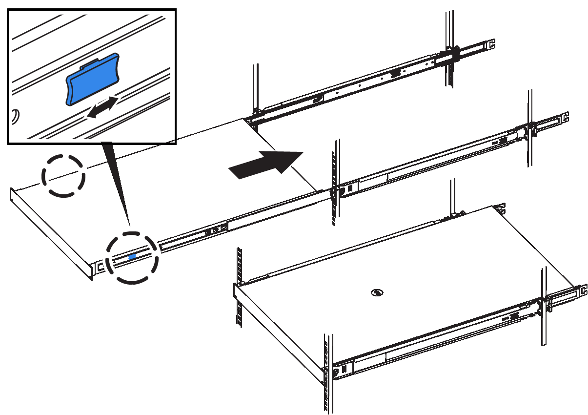

= 將 SG6100-CN 控制器重新放置在機櫃或機架中
:allow-uri-read: 
:icons: font
:imagesdir: ../media/

[role="lead"]
從機櫃或機架中卸下 SG6100-CN 控制器、以拆裝機箱頂蓋或將產品移至不同位置、然後在硬體維護完成時、將控制器重新安裝到機櫃或機架中。

== 從機櫃或機架上卸下 SG6100-cn 控制器

從機櫃或機架中卸下 SG6100-CN 控制器、以存取頂蓋或將控制器移至其他位置。

.開始之前
* 您可以使用標籤來識別連接到 SG6100-CN 控制器的每條纜線。
* 您已實際找到 SG6100-CN 控制器、在其中執行資料中心的維護作業。
+
link:locating-controller-in-data-center.html["在資料中心找到控制器"]

* 您有 link:power-sg6000-cn-controller-off-on.html#shut-down-sg6000-cn-controller["關閉 SG6100-CN 控制器"]。
+

CAUTION: 請勿使用電源開關關閉控制器。

.步驟
. 標示控制器電源線、然後拔下。
. 將防靜電腕帶的綁帶末端包覆在您的腕帶上、並將扣夾末端固定在金屬接地上、以避免產生靜電。
. 標示控制器資料纜線及任何SFP+或SFP28收發器、然後拔下。
+

CAUTION: 為避免效能降低、請勿在纜線上扭轉、摺疊、夾住或踩踏。

. 鬆開控制器前面板上的兩顆緊固螺絲。
+
image::../media/sg6060_rack_retaining_screws.png[SG6160 機架固定螺絲]

. 將 SG6100-CN 控制器向前滑出機架、直到安裝滑軌完全展開、同時聽到兩側的卡榫發出喀噠聲。
+
控制器頂蓋可供存取。

. 選用：如果您要從機櫃或機架中完全移除控制器、請依照滑軌套件的指示、將控制器從滑軌中移除。

== 將 SG6100-cn 控制器重新安裝到機櫃或機架中

硬體維護完成後、將控制器重新安裝到機櫃或機架中。

.開始之前
您已重新安裝控制器護蓋。

link:reinstalling-sg6000-cn-controller-cover.html["重新安裝 SG6100-CN 控制器護蓋"]

.步驟
. 同時按下藍色滑軌、將兩個機架滑軌同時釋放、並將SG6000-CN-控制器滑入機架、直到完全就位。
+
如果您無法進一步移動控制器、請拉動機箱兩側的藍色閂鎖、將控制器完全滑入。

+

+

NOTE: 在您開啟控制器電源之前、請勿連接前擋板。

. 鎖緊控制器前面板上的緊固螺絲、將控制器固定在機架中。
+
image::../media/sg6060_rack_retaining_screws.png[SG6160 機架固定螺絲]

. 將防靜電腕帶的綁帶末端包覆在您的腕帶上、並將扣夾末端固定在金屬接地上、以避免產生靜電。
. 重新連接控制器資料纜線和任何SFP+或SFP28收發器。
+

CAUTION: 為避免效能降低、請勿在纜線上扭轉、摺疊、夾住或踩踏。

+
link:../installconfig/cabling-appliance.html["纜線應用裝置"]

. 重新連接控制器電源線。
+
link:../installconfig/connecting-power-cords-and-applying-power.html["連接電源線並接上電源（ SG6100 ）"]

