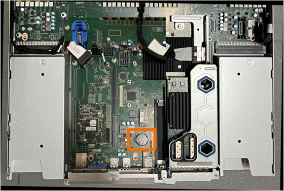
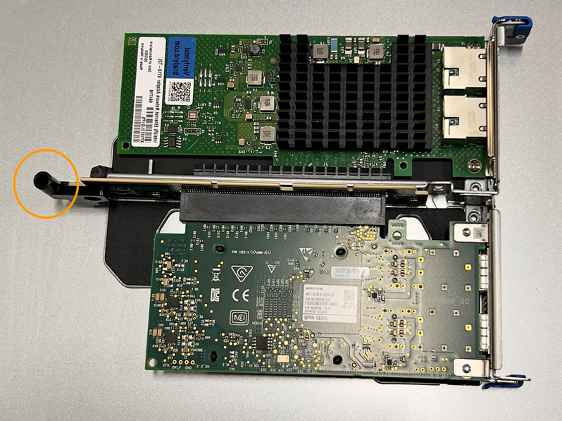

= 更換 SGF6112 或 SG6100-cn CMOS 電池
:allow-uri-read: 
:icons: font
:imagesdir: ../media/

[role="lead"]
請使用此程序更換主機板上的 CMOS 幣式電池。

請使用下列程序：

* 取出 CMOS 電池
* 重新安裝 CMOS 電池

== 取出 CMOS 電池

.開始之前
* 您有 link:verify-component-to-replace.html["已驗證需要更換 CMOS 電池的設備"]。
* 您有 link:locating-sgf6112-in-data-center.html["實體放置 SGF6112 應用裝置或 SG6100-CN 控制器"] 您要在資料中心更換 CMOS 電池的位置。
+

NOTE: 答 link:power-sgf6112-off-on.html#shut-down-the-sgf6112-appliance["受控制的產品關機"] 從機架中取出產品之前、必須先完成此步驟。

* 您已拔下所有纜線和 link:reinstalling-sgf6112-cover.html["已取下產品護蓋"]。

.關於這項工作
為避免服務中斷、請在開始更換 CMOS 電池之前、確認所有其他儲存節點均已連接至網格、或在可接受服務中斷期間的排程維護期間更換電池。請參閱相關資訊 https://docs.netapp.com/us-en/storagegrid-118/monitor/monitoring-system-health.html#monitor-node-connection-states["監控節點連線狀態"^]。

CAUTION: 如果您曾經使用過僅建立一個物件複本的 ILM 規則、則必須在排程維護期間更換電池、因為在此程序期間可能會暫時失去這些物件的存取權。請參閱相關資訊 https://docs.netapp.com/us-en/storagegrid-118/ilm/why-you-should-not-use-single-copy-replication.html["為何不應使用單一複本複寫"^]。

.步驟
. 將防靜電腕帶的綁帶末端包覆在您的腕帶上、並將扣夾末端固定在金屬接地上、以避免產生靜電。
. 找到產品背面的雙插槽擴充卡組件。
+
image::../media/SGF6112-two-slot-riser-position.png[雙插槽擴充卡位置]

. 抓住提昇部件的藍色標記孔、然後小心地將其向上提起。將提升板部件向機箱正面移動，以便將其安裝的 NIC 中的外部連接器清空機箱。
. 將擴充卡放在平坦的防靜電表面上、金屬框架面朝下。
. 將主機板上的 CMOS 電池找到移除的擴充卡組件下方的位置。
+

. 使用手指或塑膠撬起工具、將固定夾（反白顯示）從電池上壓下、即可從插槽中彈出。
+
image::../media/SGF6112-battery-cmos.png[CMOS 電池夾]

. 取出電池並妥善棄置。

== 重新安裝 CMOS 電池

將更換的 CMOS 電池裝入主機板上的插槽。

.開始之前
* 您擁有正確的更換 CMOS 電池（ CR2032 ）。
* 您已移除故障的 CMOS 電池。

.步驟
. 將防靜電腕帶的綁帶末端包覆在您的腕帶上、並將扣夾末端固定在金屬接地上、以避免產生靜電。
. 從其包裝中取出 CMOS 電池。
. 將替換電池按入主機板上的空插槽、使正極（ + ）面朝上、直到電池卡入定位。
. 找到雙插槽擴充卡組件（圈選）上的定位孔、使其與主機板上的導引插針對齊、以確保正確放置擴充卡組件。
+

. 找到主機板上的導引針
+
image::../media/sgf6112_two-slot-riser_guide-pin.png[主機板上的雙插槽擴充卡組件導引插腳]

. 將轉接器組件放入機箱中、確定其對齊主機板上的連接器和導引針。
. 小心地沿著藍色標記的孔洞旁的中心線、將雙插槽立管組件按入定位、直到完全就位。
. 如果您沒有其他維護程序可以在產品中執行、請重新安裝產品護蓋、將產品放回機架、連接纜線並接上電源。
. 如果您更換的應用裝置已啟用 SED 磁碟機的磁碟機加密、則您必須 link:../installconfig/optional-enabling-node-encryption.html#access-an-encrypted-drive["輸入磁碟機加密密碼"] 可在第一次啓動更換設備時訪問加密的驅動器。
. 如果您更換的應用裝置使用金鑰管理伺服器（ KMS ）來管理節點加密的加密金鑰、則可能需要額外的組態、節點才能加入網格。如果節點未自動加入網格、請確定這些組態設定已傳輸至新應用裝置、並手動設定任何沒有預期組態的設定：
+
** link:../installconfig/accessing-storagegrid-appliance-installer.html["設定 StorageGRID 連線"]
** https://docs.netapp.com/us-en/storagegrid-118/admin/kms-overview-of-kms-and-appliance-configuration.html#set-up-the-appliance["設定應用裝置的節點加密"^]

. 登入應用裝置：
+
.. 輸入下列命令： `ssh admin@_grid_node_IP_`
.. 輸入中所列的密碼 `Passwords.txt` 檔案：
.. 輸入下列命令以切換至root： `su -`
.. 輸入中所列的密碼 `Passwords.txt` 檔案：

. 還原應用裝置的 BMC 網路連線能力。有兩種選擇：
+
** 使用靜態 IP 、網路遮罩和閘道
** 使用 DHCP 取得 IP 、網路遮罩和閘道
+
... 若要還原 BMC 組態以使用靜態 IP 、網路遮罩和閘道、請輸入下列命令：
+
`*run-host-command ipmitool lan set 1 ipsrc static*`

+
`*run-host-command ipmitool lan set 1 ipaddr _Appliance_IP_*`

+
`*run-host-command ipmitool lan set 1 netmask _Netmask_IP_*`

+
`*run-host-command ipmitool lan set 1 defgw ipaddr _Default_gateway_*`

... 若要還原 BMC 組態以使用 DHCP 取得 IP 、網路遮罩和閘道、請輸入下列命令：
+
`*run-host-command ipmitool lan set 1 ipsrc dhcp*`

. 還原 BMC 網路連線之後、請連線至 BMC 介面以稽核及還原您可能已套用的任何其他自訂 BMC 組態。例如、您應該確認 SNMP 設陷目的地和電子郵件通知的設定。請參閱 link:../installconfig/configuring-bmc-interface.html["設定 BMC 介面"]。
. 確認應用裝置節點出現在Grid Manager中、且未顯示任何警示。

